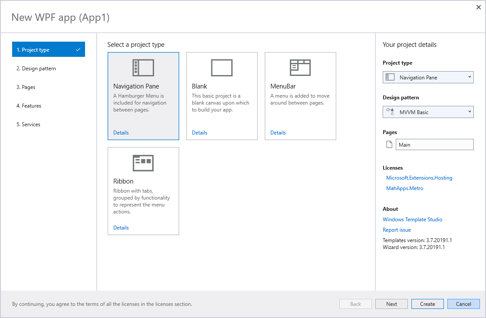

# Windows Template Studio

Windows Template Studio (WinTS) is a Visual Studio 2017 and 2019 Extension that accelerates the creation of new Universal Windows Platform (UWP) and Windows Presentation Foundation (WPF) apps using a wizard-based experience. The resulting project is well-formed, readable code that incorporates great development features while implementing proven patterns and best practices. Sprinkled throughout the generated code we have links Docs, Stack Overflow and blogs to provide useful insights. WinTS supports creating apps in C# or VB.Net.

:heavy_exclamation_mark: WPF Templates are still in development and will be available from version 3.6 onwards. You can get a preview using our dev-nightly version. Find more instructions on installing the dev-nightly at https://github.com/microsoft/WindowsTemplateStudio/blob/dev/docs/getting-started-extension.md#nightly--pre-release-feeds-for-windows-template-studio :heavy_exclamation_mark:

## Build Status

|Branch   |CI                |Test Version|Version|
|:--------|:----------------:|:---------------:|:---------------:|
|master|| ||
|dev||||

|Branch   |Full Tests       |OneByOne Tests       |WACK Tests       |
|:--------|:---------------:|:---------------:|:---------------:|
|master|||
|dev|||

> The builds include test verifications to validate the contributions:
>
> - *CI Build*: Includes all unit test + minimum integration verifications (minimum generation + build + code style rules). Runs every PR requested / PR accepted.
> - *Full Tests*: Includes tests to verify combinations and variations of templates from a project generation point of view and builds the solutions generated to ensure no build time issues found. Runs every PR accepted and takes longer to be completed.
> - *One By One Tests*: Includes tests to verify every template individually from a project generation point of view and builds the solutions generated to ensure no build time issues found. Runs every PR accepted and takes longer to be completed.
> - *Wack Tests*: Includes tests that run the App Certification Kit against the generated projects to ensure there are no issues blocking a submission to the store. Runs once nightly and takes quite a while to complete.

## Features

Windows Template Studio approaches UWP and WPF app creation using the following six attribute sets:

### **Project type**

First, how do you want your app's UI navigation to behave?

- **UWP**: *[Blank](./docs/UWP/projectTypes/blank.md)*, *[Navigation Pane](./docs/UWP/projectTypes/navigationpane.md)*, *[Horizontal Navigation Pane](./docs/UWP/projectTypes/horizontalnavigationpane.md)*, and a *[Menu Bar](./docs/UWP/projectTypes/menubar.md)*.

- **WPF**: *[Blank](./docs/WPF/projectTypes/blank.md)*, *[Navigation Pane](./docs/WPF/projectTypes/navigationpane.md)*, *[Menu Bar](./docs/WPF/projectTypes/menubar.md)* and a *[Ribbon](./docs/WPF/projectTypes/ribbon.md)*.

### **App design pattern**

Next, what coding pattern do you want to use in your project.

- **UWP**: *[Code Behind](./docs/UWP/frameworks/codebehind.md)*, *[MVVM Basic](./docs/UWP/frameworks/mvvmbasic.md)*, *[MVVMLight](./docs/UWP/frameworks/mvvmlight.md)*, *[Caliburn.Micro](./docs/UWP/frameworks/caliburnmicro.md)*, and *[Prism](./docs/UWP/frameworks/prism.md)*.

- **WPF**: *[MVVM Basic](./docs/WPF/frameworks/mvvmbasic.md)*, *[MVVMLight](./docs/WPF/frameworks/mvvmlight.md)* and *[Prism](./docs/WPF/frameworks/prism.md)*.

### **App pages**

To accelerate app creation, we provide a number of app page templates you can use to add common UI pages into your new app. We currently include everything from a *blank page*, to common layouts (*e.g., master/detail, web view*), to pages that implement common patterns (*e.g., app settings*). Use the wizard to add as many of each page as you need, providing a name for each one, and we'll generate them for you.

### **Features**

Specify which capabilities you want to use in your app, and we'll build out the framework for the features into your app, tagging `TODO` items. Here you can add features that enable your app to interact with storage, notifications, layout theming, etc.

### **Services**

Connect to data services, setup cloud connected services for your application, and enforce rules with the [XAML Styler](https://github.com/Xavalon/XamlStyler) extension.

### **Automated Tests**

Lastly, you can include test projects for your application to run unit tests or use Selenium-like UI test automation.

After selecting the items wanted in your app, you can extend the generated code on [UWP](./docs/UWP/getting-started-endusers.md) or [WPF](./docs/WPF/getting-started-endusers.md).

## Documentation

- [Installing the extension](./docs/getting-started-extension.md)
- [Understand the core concepts](./docs/concepts.md)
- [Using WinTS to build UWP apps](./docs/UWP/getting-started-endusers.md)
- [Using WinTS to build WPF apps](./docs/WPF/getting-started-endusers.md)
- [Working on WinTS](./docs/getting-started-developers.md)

## Known issues

- You can't have side-by-side versions (nightly/pre-release/release) of Windows Template Studio VSPackage into a single instance of Visual Studio.

## Feedback, Requests and Roadmap

Please use [GitHub issues](https://github.com/Microsoft/WindowsTemplateStudio/issues) for feedback, questions or comments.

If you have specific feature requests or would like to vote on what others are recommending, please go to the [GitHub issues](https://github.com/Microsoft/WindowsTemplateStudio/issues) section as well.  We would love to see what you are thinking.

Here is what we're currently thinking in our [roadmap](./docs/roadmap.md).

## Contributing

Do you want to contribute? We would love to have you help out. Here are our [contribution guidelines](CONTRIBUTING.md).

## Principles

1. Generated templates will be kept simple.
2. Generated templates are a starting point, not a completed application.
3. Generated templates must be able to compile and run once generated.
4. Generated templates should work on all device families.
5. Templates should have comments to aid developers. This includes links to signup pages for keys, MSDN, blogs and how-to's.  All guidance provide should be validated from either the framework/SDK/library’s creator.
6. All UWP features will be supported for two most recent RTM Windows 10 Updates. Those supported releases are Windows 10 October 2018 Update (version 1809) and Windows 10 April 2018 Update (version 1803).
7. Templates released in production will try to adhere to the design language used in the current release of Windows 10.
8. Code should follow [.NET Core coding style](https://github.com/dotnet/corefx/blob/master/Documentation/coding-guidelines/coding-style.md).

This project has adopted the code of conduct defined by the Contributor Covenant to clarify expected behavior in our community.
For more information see the [.NET Foundation Code of Conduct](https://dotnetfoundation.org/code-of-conduct).

## License

This code is distributed under the terms and conditions of the [MIT license](LICENSE.md).

## Privacy Statement

The extension logs [basic telemetry](./docs/telemetry.md) regarding what is selected in the wizard. Our [Telemetry Data](./docs/telemetryData.md) page has the trends from the telemetry. Please read the [Microsoft privacy statement](http://go.microsoft.com/fwlink/?LinkId=521839) for more information.

## .NET Foundation

This project is supported by the [.NET Foundation](https://dotnetfoundation.org).

## Projects we like and collaborate with

- [Web Template Studio](https://github.com/Microsoft/WebTemplateStudio)
- [Rapid Xaml Toolkit](https://github.com/Microsoft/Rapid-XAML-Toolkit)
- [Windows Community Toolkit](https://github.com/Microsoft/WindowsCommunityToolkit)
- [Fluent XAML Theme Editor](https://github.com/Microsoft/fluent-xaml-theme-editor)
- [XAML Styler](https://github.com/Xavalon/XamlStyler)

## Frameworks and libraries in generated code not created by our team

### Frameworks

- [Caliburn.Micro](https://github.com/Caliburn-Micro/Caliburn.Micro)
- [MVVMLight](https://github.com/lbugnion/mvvmlight)
- [Prism](https://github.com/PrismLibrary/Prism)

### Libraries

- [Microsoft AppCenter SDK](https://github.com/Microsoft/AppCenter-SDK-DotNet)
- [Microsoft Store Services SDK](https://marketplace.visualstudio.com/items?itemName=AdMediator.MicrosoftStoreServicesSDK)
- [Microsoft Win2D](https://github.com/Microsoft/Win2D)
- [Newtonsoft.Json](https://github.com/JamesNK/Newtonsoft.Json)
- [Telerik UI For UWP](https://github.com/telerik/UI-For-UWP)
- [Windows Azure Messaging Managed](https://www.nuget.org/packages/WindowsAzure.Messaging.Managed)
- [Windows Community Toolkit](https://github.com/Microsoft/WindowsCommunityToolkit)
