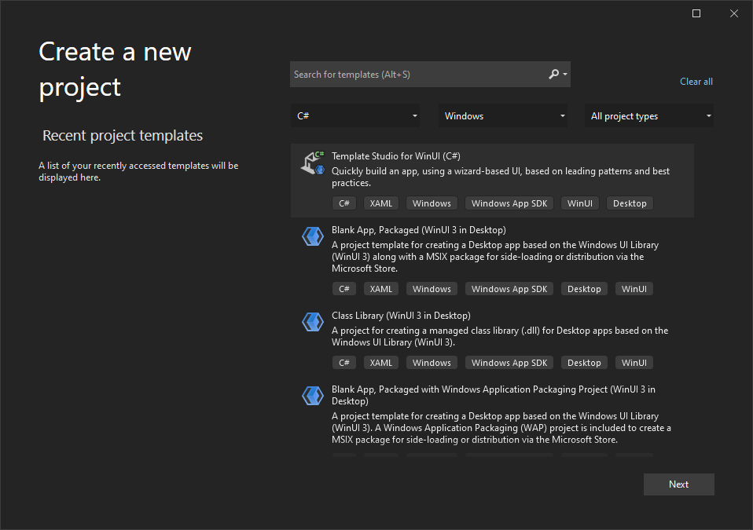
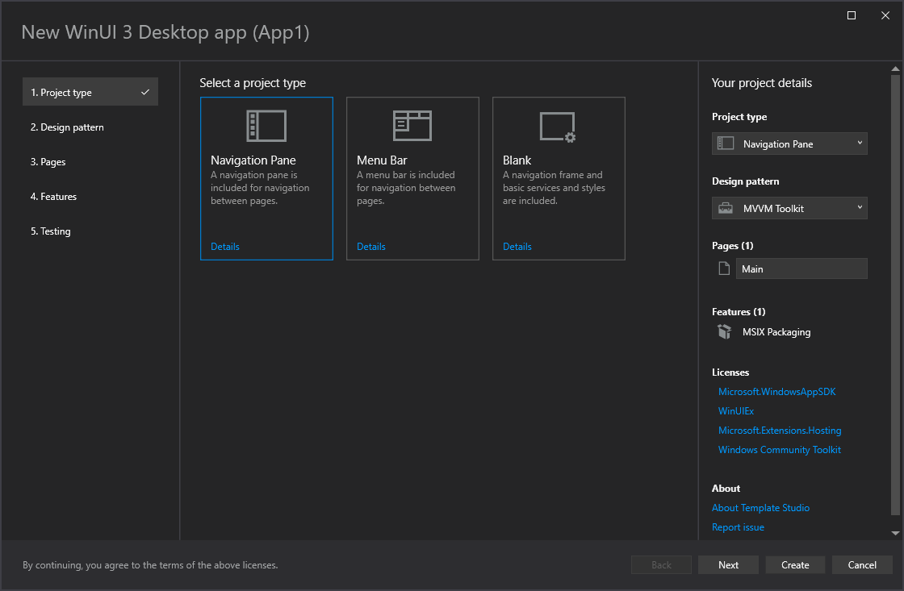
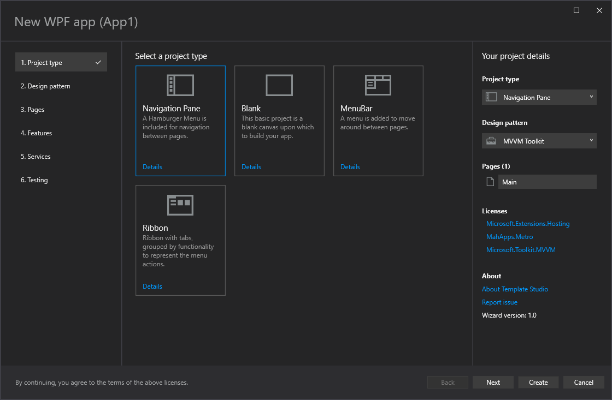
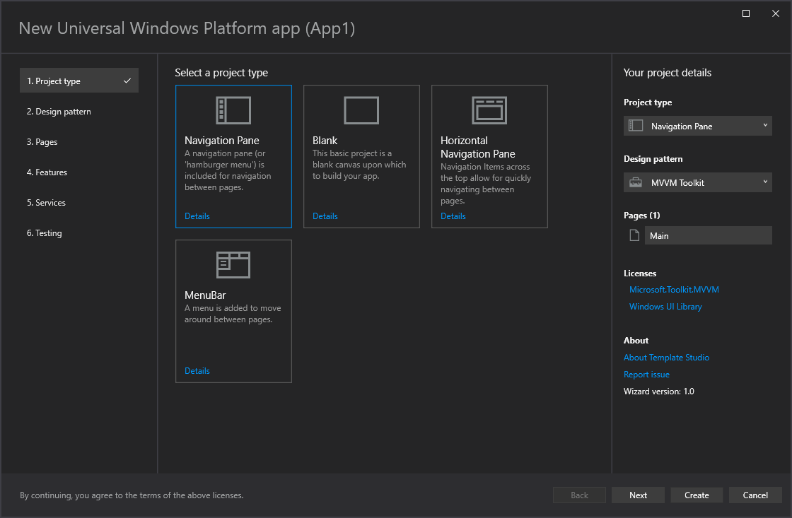

# Template Studio

Template Studio is a suite of Visual Studio 2022 extensions that accelerate the creation of new WinUI 3, WPF, and UWP apps using a wizard-based experience.

  * [Template Studio for WinUI (C#)](https://marketplace.visualstudio.com/items?itemName=TemplateStudio.TemplateStudioForWinUICs)
  * Template Studio for WinUI (C++) (FUTURE)
  * [Template Studio for WPF](https://marketplace.visualstudio.com/items?itemName=TemplateStudio.TemplateStudioForWPF)
  * [Template Studio for UWP](https://marketplace.visualstudio.com/items?itemName=TemplateStudio.TemplateStudioForUWP)

Projects created with these extensions contain well-formed, readable code and incorporate the latest development features while implementing proven patterns and leading practices. The generated code includes links to documentation and TODO comments that provide useful insight and guidance for turning the generated projects into production applications.

To get started, install the appropriate extension, then select the corresponding Template Studio project template when creating a new project in Visual Studio. Name your project, then click Create to launch the Template Studio wizard.

<figcaption>VS New Project Dialog</figcaption>

<figcaption>Template Studio for WinUI (C#)</figcaption>

<figcaption>Template Studio for WPF</figcaption>

<figcaption>Template Studio for UWP</figcaption>

## Build Status

|                  |CI                |Nightly           |
|:--------|:----------------:|:----------------:|
|WinUI (C#)|||
|WinUI (C++)|||
|WPF|||
|UWP|||
|Shared|||

- CI: Runs for all PRs and integrations and performs basic validation. Executes all tests in the Minimum* Groups.
- Nightly: Runs on a nightly schedule and generates and builds all combinations of project templates in addition to performing more exhaustive tests than CI. Executes all tests in the Build* Groups.

## Features

Template Studio approaches app creation using the following six attribute sets:

### **Project type**

First, how do you want your app's UI navigation to behave?

- **WinUI 3**: *[Blank](./docs/WinUI/projectTypes/blank.md)*, *[Navigation Pane](./docs/WinUI/projectTypes/navigationpane.md)*, *[Menu Bar](./docs/WinUI/projectTypes/menubar.md)*.

- **WPF**: *[Blank](./docs/WPF/projectTypes/blank.md)*, *[Navigation Pane](./docs/WPF/projectTypes/navigationpane.md)*, *[Menu Bar](./docs/WPF/projectTypes/menubar.md)* and a *[Ribbon](./docs/WPF/projectTypes/ribbon.md)*.

- **UWP**: *[Blank](./docs/UWP/projectTypes/blank.md)*, *[Navigation Pane](./docs/UWP/projectTypes/navigationpane.md)*, *[Horizontal Navigation Pane](./docs/UWP/projectTypes/horizontalnavigationpane.md)*, and a *[Menu Bar](./docs/UWP/projectTypes/menubar.md)*.

### **App design pattern**

Next, what coding pattern do you want to use in your project.

- **WinUI 3**: *[MVVM Toolkit](./docs/WinUI/frameworks/mvvmtoolkit.md)*.

- **WPF**: *[MVVM Toolkit](./docs/WPF/frameworks/mvvmtoolkit.md)*, *[Code Behind](./docs/WPF/frameworks/codebehind.md)*, and *[Prism](./docs/WPF/frameworks/prism.md)*.

- **UWP**: *[MVVM Toolkit](./docs/UWP/frameworks/mvvmtoolkit.md)*, *[Code Behind](./docs/UWP/frameworks/codebehind.md)*, and *[Prism](./docs/UWP/frameworks/prism.md)*.

### **App pages**

To accelerate app creation, we provide a number of app page templates you can use to add common UI pages into your new app. We currently include everything from a *blank page*, to common layouts (*e.g., list/detail, web view*), to pages that implement common patterns (*e.g., app settings*). Use the wizard to add as many of each page as you need, providing a name for each one, and we'll generate them for you.

### **Features**

Specify which capabilities you want to use in your app, and we'll build out the framework for the features into your app, tagging `TODO` items. Here you can add features that enable your app to interact with storage, notifications, layout theming, etc.

### **Services**

Connect to data services, setup cloud connected services for your application, and enforce rules with the [XAML Styler](https://github.com/Xavalon/XamlStyler) extension.

### **Automated Tests**

Lastly, you can include test projects for your application to run unit tests or use Selenium-like UI test automation.

After selecting the items wanted in your app, you can extend the generated code on [UWP](./docs/UWP/getting-started-endusers.md), [WPF](./docs/WPF/getting-started-endusers.md) or [WinUI 3](./docs/WinUI/readme.md).

## Documentation

- [Installing the extension](./docs/getting-started-extension.md)
- [Using TS to build UWP apps](./docs/UWP/getting-started-endusers.md)
- [Using TS to build WPF apps](./docs/WPF/getting-started-endusers.md)
- [Using TS to build WinUI 3 in Desktop apps](./docs/WinUI/readme.md)
- [Working on TS](/CONTRIBUTING.md)

## Known issues

- TODO

## Feedback, Requests and Roadmap

Please use [GitHub issues](https://github.com/microsoft/TemplateStudio/issues) for feedback, questions or comments.

If you have specific feature requests or would like to vote on what others are recommending, please go to the [GitHub issues](https://github.com/microsoft/TemplateStudio/issues) section as well. We would love to see what you are thinking.

Here is what we're currently thinking in our [roadmap](./docs/roadmap.md).

## Contributing

Do you want to contribute? We would love to have you help out. Here are our [contribution guidelines](CONTRIBUTING.md).

## Principles

1. Generated templates will be kept simple.
2. Generated templates are a starting point, not a completed application.
3. Generated templates must be able to compile and run once generated.
4. Generated templates should work on all device families.
5. Templates should have comments to aid developers. This includes links to signup pages for keys, MSDN, blogs and how-to's.  All guidance provide should be validated from either the framework/SDK/library’s creator.
6. All UWP features will be supported for two most recent RTM Windows 10 Updates. Those supported releases are Windows 10 May 2020 Update (version 2004) and Windows 10 May 2019 Update (version 1903).
7. Templates released in production will try to adhere to the design language used in the current release of Windows 10.
8. Code should follow [.NET Core coding style](https://github.com/dotnet/runtime/blob/main/docs/coding-guidelines/coding-style.md).

This project has adopted the code of conduct defined by the Contributor Covenant to clarify expected behavior in our community.
For more information see the [.NET Foundation Code of Conduct](https://dotnetfoundation.org/code-of-conduct).

## License

This code is distributed under the terms and conditions of the [MIT license](LICENSE.md).

## Privacy Statement

The extension logs [basic telemetry](./docs/telemetry.md) regarding what is selected in the wizard. Our [Telemetry Data](./docs/telemetryData.md) page has the trends from the telemetry. Please read the [Microsoft privacy statement](http://go.microsoft.com/fwlink/?LinkId=521839) for more information.

## .NET Foundation

This project is supported by the [.NET Foundation](https://dotnetfoundation.org).

## Projects we like and collaborate with

- [Web Template Studio](https://github.com/Microsoft/WebTemplateStudio)
- [Rapid Xaml Toolkit](https://github.com/Microsoft/Rapid-XAML-Toolkit)
- [Windows Community Toolkit](https://github.com/Microsoft/WindowsCommunityToolkit)
- [Windows UI](https://github.com/microsoft/microsoft-ui-xaml)
- [Windows App SDK](https://github.com/microsoft/WindowsAppSDK)
- [Fluent XAML Theme Editor](https://github.com/Microsoft/fluent-xaml-theme-editor)
- [XAML Styler](https://github.com/Xavalon/XamlStyler)

## Frameworks and libraries in generated code not created by our team

### Frameworks
- [MVVM Toolkit](https://aka.ms/mvvmtoolkit)
- [Prism](https://github.com/PrismLibrary/Prism)
- [Caliburn.Micro](https://github.com/Caliburn-Micro/Caliburn.Micro)
- [MVVMLight](https://github.com/lbugnion/mvvmlight)

### Libraries

- [AdaptiveCards](https://adaptivecards.io/)
- [Appium.WebDriver](https://github.com/appium/appium-dotnet-driver)
- [MahApps.Metro](https://github.com/MahApps/MahApps.Metro)
- [Microsoft AppCenter SDK](https://github.com/Microsoft/AppCenter-SDK-DotNet)
- [Microsoft Authentication Library (MSAL)](https://github.com/AzureAD/microsoft-authentication-library-for-dotnet)
- [Microsoft Store Services SDK](https://marketplace.visualstudio.com/items?itemName=AdMediator.MicrosoftStoreServicesSDK)
- [Microsoft Win2D](https://github.com/Microsoft/Win2D)
- [MSTest V2](https://github.com/microsoft/testfx)
- [Newtonsoft.Json](https://github.com/JamesNK/Newtonsoft.Json)
- [NUnit](https://nunit.org/)
- [Telerik UI For UWP](https://github.com/telerik/UI-For-UWP)
- [Windows Azure Messaging Managed](https://www.nuget.org/packages/WindowsAzure.Messaging.Managed)
- [Windows Community Toolkit](https://github.com/Microsoft/WindowsCommunityToolkit)
- [Windows UI Library](https://github.com/Microsoft/microsoft-ui-xaml)
- [xunit](https://github.com/xunit/xunit)
