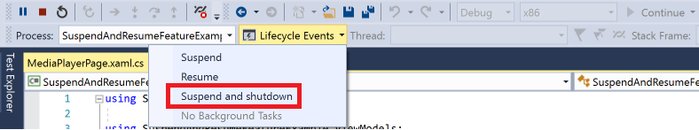

# Suspend and Resume Feature

:heavy_exclamation_mark: There is also a version of [this document with code in C#](./suspend-and-resume.md) :heavy_exclamation_mark: |
---------------------------------------------------------------------------------------------------------------------------------------------------- |

The Suspend And Resume Feature allows you to save App data on suspension and bring your App to the state it was before in case it is terminated during suspension.

## Understanding the code

### SuspendAndResumeService.vb

Before the App enters background state, SuspendAndResumeService fires an OnBackgroundEntering event. You can subscribe to this event from your current Page to save App data.

In case the App is terminated during suspension the previous application state has to be restored during re-launch. The SuspendAndResumeService will navigate to the suspended page and also fires an OnDataRestored event. You can subscribe to this event from your current Page to apply restored data.

To do this SuspendAndResumeService is implemented as ActivationHandler, that handles activation on app launch if the PreviousExecutionState is `ApplicationExecutionState.Terminated`. For more info about ActivationHandlers see [ActivationService & ActivationHandlers](../activation.md).

In case the App is not terminated no data is lost, but you should refresh any online data in the App (e.g. data from online feeds), as this data might be outdated. The SuspendAndResumeService provides a OnResuming event you can subscribe to, to handle this scenario.

### SuspensionState.vb

SuspensionState holds the App data and the SuspensionDate that indicates when this data was stored.

## Using SuspendAndResumeService

In this example we are going to show how to save data on App suspension and restore it in case the App was terminated during suspension.

### 1. Create a new app with two pages

Create a new application using WinTS with ProjectType Navigation Pane. Apart from the Main Page, add a blank page named **Data** and the **Suspend And Resume** feature.

The idea is to store data entered on the Data Page on App suspension, and restore the page state when the App resumes.

### 2. Add a possibility to enter data on the DataPage

To enter data on the DataPage add the following TextBox and backing field.

**`CodeBehind`**

Create a button in DataPage.xaml:

```xml
<TextBox
    Header="Enter text to save:"
    Text="{x:Bind Data, Mode=TwoWay}"
    Width="400"
    HorizontalAlignment="Left"
    VerticalAlignment="Top"  />
```

Add a Data property to DataPage.xaml.vb:

```vb
Private _data As String

Public Property Data As String
    Get
        Return _data
    End Get

    Set
        [Set](_data, Value)
    End Set
End Property
```

**`MVVMBasic, MVVMLight`**

Create a button in DataPage.xaml:

```xml
<TextBox
    Header="Enter text to save:"
    Text="{x:Bind ViewModel.Data, Mode=TwoWay}"
    Width="400"
    HorizontalAlignment="Left"
    VerticalAlignment="Top"  />
```

Add a Data property to DataViewModel.vb:

```vb
Private _data As String

Public Property Data As String
    Get
        Return _data
    End Get

    Set
        [Set](_data, Value)
    End Set
End Property
```

### 2. Subscribe to OnBackgroundEntering and OnDataRestored to save and restore data

Subscribe to the `OnBackgroundEntering` and  `OnDataRestored` events to save and restore the data to `SuspensionState.Data` when the application enters background state or be restored from suspension.

**`CodeBehind`**

Subscribe to the OnBackgroundEntering and OnDataRestored event when navigating to the Page and unsubscribe when navigating from the Page in Data.xaml.vb:

```vb
Protected Overrides Sub OnNavigatedTo(e As NavigationEventArgs)
    MyBase.OnNavigatedTo(e)
    AddHandler Singleton(Of SuspendAndResumeService).Instance.OnBackgroundEntering, AddressOf OnBackgroundEntering
    AddHandler Singleton(Of SuspendAndResumeService).Instance.OnDataRestored, AddressOf OnDataRestored
End Sub

Protected Overrides Sub OnNavigatedFrom(ByVal e As NavigationEventArgs)
    MyBase.OnNavigatedFrom(e)
    RemoveHandler Singleton(Of SuspendAndResumeService).Instance.OnBackgroundEntering, Addressof OnBackgroundEntering
    RemoveHandler Singleton(Of SuspendAndResumeService).Instance.OnDataRestored, Addressof OnDataRestored
End Sub

Private Sub OnBackgroundEntering(sender As Object, e As SuspendAndResumeArgs)
    e.SuspensionState.Data = Data
End Sub

Private Sub OnDataRestored(sender As Object, e As SuspendAndResumeArgs)
    Data = TryCast(e.SuspensionState.Data, String)
End Sub
```

**`MVVMBasic or MVVMLight`**

Subscribe to the OnBackgroundEntering and OnDataRestored events when navigating to the Page and unsubscribe when navigating from the Page in Data.xaml.vb:

```vb
Protected Overrides Sub OnNavigatedTo(e As NavigationEventArgs)
    MyBase.OnNavigatedTo(e)
    AddHandler Singleton(Of SuspendAndResumeService).Instance.OnBackgroundEntering, AddressOf OnBackgroundEntering
    AddHandler Singleton(Of SuspendAndResumeService).Instance.OnDataRestored, AddressOf OnDataRestored
End Sub

Protected Overrides Sub OnNavigatedFrom(ByVal e As NavigationEventArgs)
    MyBase.OnNavigatedFrom(e)
    RemoveHandler Singleton(Of SuspendAndResumeService).Instance.OnBackgroundEntering, Addressof OnBackgroundEntering
    RemoveHandler Singleton(Of SuspendAndResumeService).Instance.OnDataRestored, Addressof OnDataRestored
End Sub

Private Sub OnBackgroundEntering(sender As Object, e As SuspendAndResumeArgs)
    e.SuspensionState.Data = ViewModel.Data
End Sub

Private Sub OnDataRestored(sender As Object, e As SuspendAndResumeArgs)
    ViewModel.Data = TryCast(e.SuspensionState.Data, String)
End Sub
```

### 3. Test from Visual Studio

App suspension with termination can be simulated in Visual Studio using the LifeCycle Event **Suspend and shutdown**. To simulate resume, you just restart the application again.


