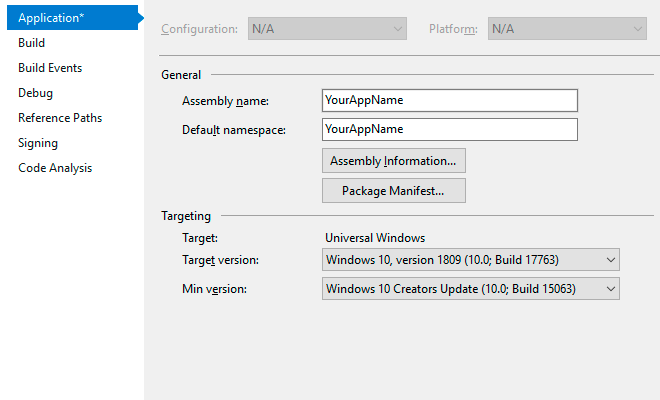

# Update from HamburgerMenu to WinUI NavigationView in Prism

If you have an UWP project created with WinTS with project type **NavigationPane** and framework **Prism**  please follow these steps to update to WinUI NavigationView:

## 1. Update target version in project properties

Windows UI library requires 17763 as target version in the project, to start using Windows UI in your project is necessary that you set 17763 as target version.



## 2. Add the Nuget package reference

Add the Windows UI Library Nuget Package Reference (Microsoft.UI.Xaml):


## 3. Changes in App.xaml

Add the WinUI Xaml Resources dictionary to the MergedDictionaries:

```xml
<ResourceDictionary.MergedDictionaries>

    <!--Add WinUI resources dictionary-->
    <XamlControlsResources  xmlns="using:Microsoft.UI.Xaml.Controls"/>
    <!-- ··· -->
    <!--Other resources dictionaries-->

</ResourceDictionary.MergedDictionaries>
```

## 4. Changes in _Thickness.xaml

Update and add new Margins that will be used in pages.

### Thickness values you will have to update.

```xml
<Thickness x:Key="MediumLeftRightMargin">24,0,24,0</Thickness>
<Thickness x:Key="MediumLeftTopRightBottomMargin">24,24,24,24</Thickness>
```

### Thickness values you will have to add.

```xml
<!--Medium size margins-->
<Thickness x:Key="MediumTopMargin">0,24,0,0</Thickness>
<Thickness x:Key="MediumBottomMargin">0,0,24,0</Thickness>

<!--Small size margins-->
<Thickness x:Key="SmallLeftMargin">12, 0, 0, 0</Thickness>
<Thickness x:Key="SmallTopMargin">0, 12, 0, 0</Thickness>
<Thickness x:Key="SmallTopBottomMargin">0, 12, 0, 12</Thickness>
<Thickness x:Key="SmallLeftRightMargin">12, 0, 12, 0</Thickness>

<!--Extra Small size margins-->
<Thickness x:Key="ExtraSmallTopMargin">0, 8, 0, 0</Thickness>
```

## 5. Add NavigationViewHeaderBehavior.cs

This behavior allows the NavigationView to hide or customize the NavigationViewHeader depending on the page that is shown, you can read more about this behavior [here](../navigationpane.md). Add the following NavigationViewHeaderBehavior class to the Behaviors folder, if your solution doesn't have Behaviors folder you will have to add it.

```csharp
using Microsoft.Xaml.Interactivity;

using Windows.UI.Xaml;
using Windows.UI.Xaml.Controls;
using Windows.UI.Xaml.Navigation;

using WinUI = Microsoft.UI.Xaml.Controls;

namespace YourAppName.Behaviors
{
    public class NavigationViewHeaderBehavior : Behavior<WinUI.NavigationView>
    {
        private static NavigationViewHeaderBehavior _current;
        private Page _currentPage;

        public DataTemplate DefaultHeaderTemplate { get; set; }

        public object DefaultHeader
        {
            get { return GetValue(DefaultHeaderProperty); }
            set { SetValue(DefaultHeaderProperty, value); }
        }

        public static readonly DependencyProperty DefaultHeaderProperty = DependencyProperty.Register("DefaultHeader", typeof(object), typeof(NavigationViewHeaderBehavior), new PropertyMetadata(null, (d, e) => _current.UpdateHeader()));

        public static NavigationViewHeaderMode GetHeaderMode(Page item)
        {
            return (NavigationViewHeaderMode)item.GetValue(HeaderModeProperty);
        }

        public static void SetHeaderMode(Page item, NavigationViewHeaderMode value)
        {
            item.SetValue(HeaderModeProperty, value);
        }

        public static readonly DependencyProperty HeaderModeProperty =
            DependencyProperty.RegisterAttached("HeaderMode", typeof(bool), typeof(NavigationViewHeaderBehavior), new PropertyMetadata(NavigationViewHeaderMode.Always, (d, e) => _current.UpdateHeader()));

        public static object GetHeaderContext(Page item)
        {
            return item.GetValue(HeaderContextProperty);
        }

        public static void SetHeaderContext(Page item, object value)
        {
            item.SetValue(HeaderContextProperty, value);
        }

        public static readonly DependencyProperty HeaderContextProperty =
            DependencyProperty.RegisterAttached("HeaderContext", typeof(object), typeof(NavigationViewHeaderBehavior), new PropertyMetadata(null, (d, e) => _current.UpdateHeader()));

        public static DataTemplate GetHeaderTemplate(Page item)
        {
            return (DataTemplate)item.GetValue(HeaderTemplateProperty);
        }

        public static void SetHeaderTemplate(Page item, DataTemplate value)
        {
            item.SetValue(HeaderTemplateProperty, value);
        }

        public static readonly DependencyProperty HeaderTemplateProperty =
            DependencyProperty.RegisterAttached("HeaderTemplate", typeof(DataTemplate), typeof(NavigationViewHeaderBehavior), new PropertyMetadata(null, (d, e) => _current.UpdateHeaderTemplate()));

        public void Initialize(Frame frame)
        {
            frame.Navigated += OnNavigated;
        }

        protected override void OnAttached()
        {
            base.OnAttached();
            _current = this;
        }

        private void OnNavigated(object sender, NavigationEventArgs e)
        {
            var frame = sender as Frame;
            if (frame.Content is Page page)
            {
                _currentPage = page;

                UpdateHeader();
                UpdateHeaderTemplate();
            }
        }

        private void UpdateHeader()
        {
            if (_currentPage != null)
            {
                var headerMode = GetHeaderMode(_currentPage);
                if (headerMode == NavigationViewHeaderMode.Never)
                {
                    AssociatedObject.Header = null;
                    AssociatedObject.AlwaysShowHeader = false;
                }
                else
                {
                    var headerFromPage = GetHeaderContext(_currentPage);
                    if (headerFromPage != null)
                    {
                        AssociatedObject.Header = headerFromPage;
                    }
                    else
                    {
                        AssociatedObject.Header = DefaultHeader;
                    }

                    if (headerMode == NavigationViewHeaderMode.Always)
                    {
                        AssociatedObject.AlwaysShowHeader = true;
                    }
                    else
                    {
                        AssociatedObject.AlwaysShowHeader = false;
                    }
                }
            }
        }

        private void UpdateHeaderTemplate()
        {
            if (_currentPage != null)
            {
                var headerTemplate = GetHeaderTemplate(_currentPage);
                AssociatedObject.HeaderTemplate = headerTemplate ?? DefaultHeaderTemplate;
            }
        }
    }
}
```

## 6. Add NavigationViewHeaderMode.cs

Add the NavigationViewHeaderBehavior enum to the Behaviors folder.

```csharp
namespace YourAppName.Behaviors
{
    public enum NavigationViewHeaderMode
    {
        Always,
        Never,
        Minimal
    }
}
```

## 7. Add NavHelper.cs

Add this extension class to the **Helpers** folder to the project. This allows the Windows UI NavigationViewItems to contain a Type property that is used for navigation.

```csharp
using System;

using Microsoft.UI.Xaml.Controls;

using Windows.UI.Xaml;


namespace YourAppName.Helpers
{
    public class NavHelper
    {
        public static string GetNavigateTo(NavigationViewItem item)
        {
            return (string)item.GetValue(NavigateToProperty);
        }

        public static void SetNavigateTo(NavigationViewItem item, string value)
        {
            item.SetValue(NavigateToProperty, value);
        }

        public static readonly DependencyProperty NavigateToProperty =
            DependencyProperty.RegisterAttached("NavigateTo", typeof(string), typeof(NavHelper), new PropertyMetadata(null));
    }
}
```

## 8. Changes in ShellPage.xaml

The updated ShellPage will include the WinUI NavigationView and add the MenuItems directly in Xaml. The NavigationViewItems include an extension property that contains the target page type to navigate in the frame.

### XAML code you will have to remove:

- xml namespaces for `fcu`, `cu`, `controls`, and `vm` (viewmodels).
- `NavigationMenuItemDataTemplate` DataTemplate in Page resources.
- `HamburgerMenu` control.

### XAML code you will have to add:

- The following xml namespaces:

```xml
xmlns:winui="using:Microsoft.UI.Xaml.Controls"
xmlns:behaviors="using:YourAppName.Behaviors"
xmlns:helpers="using:YourAppName.Helpers"
```

- `winui:NavigationView` control.
- `winui:NavigationViewItem` MenuItems inside of the `winui:NavigationView`.
- `NavigationViewHeaderBehavior` behavior inside of the `winui:NavigationView`.

The resulting code should look like this:

```xml
<Page
    x:Class="YourAppName.Views.ShellPage"
    xmlns="http://schemas.microsoft.com/winfx/2006/xaml/presentation"
    xmlns:x="http://schemas.microsoft.com/winfx/2006/xaml"
    xmlns:d="http://schemas.microsoft.com/expression/blend/2008"
    xmlns:mc="http://schemas.openxmlformats.org/markup-compatibility/2006"
    xmlns:prismMvvm="using:Prism.Windows.Mvvm"
    prismMvvm:ViewModelLocator.AutoWireViewModel="True"
    xmlns:i="using:Microsoft.Xaml.Interactivity"
    xmlns:ic="using:Microsoft.Xaml.Interactions.Core"
    xmlns:winui="using:Microsoft.UI.Xaml.Controls"
    xmlns:behaviors="using:YourAppName.Behaviors"
    xmlns:helpers="using:YourAppName.Helpers"
    Background="{ThemeResource SystemControlBackgroundAltHighBrush}"
    mc:Ignorable="d">

    <winui:NavigationView
        x:Name="navigationView"
        IsBackButtonVisible="Visible"
        IsBackEnabled="{x:Bind ViewModel.IsBackEnabled, Mode=OneWay}"
        SelectedItem="{x:Bind ViewModel.Selected, Mode=OneWay}"
        IsSettingsVisible="True"
        ItemInvoked="OnItemInvoked"
        Background="{ThemeResource SystemControlBackgroundAltHighBrush}">
        <winui:NavigationView.MenuItems>

            <!-- All your pages -->
            <winui:NavigationViewItem x:Uid="Shell_Sample" Icon="Document" helpers:NavHelper.NavigateTo="Sample" />

        </winui:NavigationView.MenuItems>
        <i:Interaction.Behaviors>
            <behaviors:NavigationViewHeaderBehavior
                x:Name="navigationViewHeaderBehavior"
                DefaultHeader="{x:Bind ViewModel.Selected.Content, Mode=OneWay}">
                <behaviors:NavigationViewHeaderBehavior.DefaultHeaderTemplate>
                    <DataTemplate>
                        <Grid>
                            <TextBlock
                                Text="{Binding}"
                                Style="{ThemeResource TitleTextBlockStyle}"
                                Margin="{StaticResource SmallLeftRightMargin}" />
                        </Grid>
                    </DataTemplate>
                </behaviors:NavigationViewHeaderBehavior.DefaultHeaderTemplate>
            </behaviors:NavigationViewHeaderBehavior>
        </i:Interaction.Behaviors>
        <Grid>
            <Frame x:Name="shellFrame" />
        </Grid>
    </winui:NavigationView>
</Page>
```

## 9. Changes in ShellPage.xaml.cs

### C# code you will have to update (_Implementation below_):

- `SetRootFrame` method implementation.

The resulting code should look like this:

```csharp
using YourAppName.ViewModels;
using Windows.UI.Xaml.Controls;

namespace YourAppName.Views
{
    public sealed partial class ShellPage : Page
    {
        private ShellViewModel ViewModel => DataContext as ShellViewModel;

        public Frame ShellFrame => shellFrame;

        public ShellPage()
        {
            InitializeComponent();
        }

        public void SetRootFrame(Frame frame)
        {
            shellFrame.Content = frame;
            ViewModel.Initialize(frame);
        }

        private void OnItemInvoked(WinUI.NavigationView sender, WinUI.NavigationViewItemInvokedEventArgs args)
        {
            // Workaround for Issue https://github.com/Microsoft/WindowsTemplateStudio/issues/2774
            // Using EventTriggerBehavior does not work on WinUI NavigationView ItemInvoked event in Release mode.
            ViewModel.ItemInvokedCommand.Execute(args);
        }
    }
}
```

## 10. Changes in ShellViewModel.cs

ShellViewModel's complexity will be reduced significantly, these are the changes that you will have to implement on the class.

### C# code you will have to remove:

- private the following const properties: `Panoramic`, `Wide`, `Narrow`, `WideStateMinWindowWidth`, `PanoramicStateMinWindowWidth`.
- `_isPaneOpen` and `IsPaneOpen` properties.
- `_displayMode` and `DisplayMode` properties.
- `_primaryItems` and `PrimaryItems` properties.
- `_secondaryItems` and `SecondaryItems` properties.
- `OpenPaneCommand`, `ItemSelectedCommand` and `StateChangedCommand`.
- `GoToState`, `InitializeState`, `PopulateNavItems`, `ChangeSelected`, `ItemSelected` and `Navigate` methods.
- private fields `_lastSelectedItem``
- Remove unused using statements.

### C# code you will have to add _(implementation below)_:

- Add the following new usings statement:

```csharp
using WinUI = Microsoft.UI.Xaml.Controls;
```

- Add `_navigationView`, `AltLeftKeyboardAccelerator`, `BackKeyboardAccelerator`, `_isBackEnabled`, `IsBackEnabled`, `ItemInvokedCommand` members.

- `OnItemInvoked`, `OnBackRequested` and `IsMenuItemForPageType` methods.

### C# code you will have to update _(implementation below)_:

- `Selected` property DataType from `object` to `WinUI.NavigationViewItem`.
- Class constructor with the implementation below.
- `Initialize` and `Frame_Navigated` methods with the implementation below.

The resulting code should look like this:

```csharp
using System;
using System.Linq;
using System.Windows.Input;

using Prism.Commands;
using Prism.Windows.Mvvm;
using Prism.Windows.Navigation;

using YourAppName.Helpers;
using YourAppName.Views;

using Windows.UI.Xaml.Controls;
using Windows.UI.Xaml.Navigation;

using WinUI = Microsoft.UI.Xaml.Controls;

namespace YourAppName.ViewModels
{
    public class ShellViewModel : ViewModelBase
    {
        private static INavigationService _navigationService;
        private WinUI.NavigationView _navigationView;
        private bool _isBackEnabled;
        private WinUI.NavigationViewItem _selected;

        public ICommand ItemInvokedCommand { get; }

        public bool IsBackEnabled
        {
            get { return _isBackEnabled; }
            set { SetProperty(ref _isBackEnabled, value); }
        }

        public WinUI.NavigationViewItem Selected
        {
            get { return _selected; }
            set { SetProperty(ref _selected, value); }
        }

        public ShellViewModel(INavigationService navigationServiceInstance)
        {
            _navigationService = navigationServiceInstance;
            ItemInvokedCommand = new DelegateCommand<WinUI.NavigationViewItemInvokedEventArgs>(OnItemInvoked);
        }

        public void Initialize(Frame frame, WinUI.NavigationView navigationView)
        {
            _navigationView = navigationView;
            frame.Navigated += Frame_Navigated;
            _navigationView.BackRequested += OnBackRequested;
        }

        private void OnItemInvoked(WinUI.NavigationViewItemInvokedEventArgs args)
        {
            if (args.IsSettingsInvoked)
            {
                _navigationService.Navigate("Settings", null);
                return;
            }

            var item = _navigationView.MenuItems
                            .OfType<WinUI.NavigationViewItem>()
                            .First(menuItem => (string)menuItem.Content == (string)args.InvokedItem);
            var pageKey = item.GetValue(NavHelper.NavigateToProperty) as string;
            _navigationService.Navigate(pageKey, null);
        }

        private void Frame_Navigated(object sender, NavigationEventArgs e)
        {
            IsBackEnabled = _navigationService.CanGoBack();
            if (e.SourcePageType == typeof(SettingsPage))
            {
                Selected = _navigationView.SettingsItem as WinUI.NavigationViewItem;
                return;
            }

            Selected = _navigationView.MenuItems
                            .OfType<WinUI.NavigationViewItem>()
                            .FirstOrDefault(menuItem => IsMenuItemForPageType(menuItem, e.SourcePageType));
        }

        private void OnBackRequested(WinUI.NavigationView sender, WinUI.NavigationViewBackRequestedEventArgs args)
        {
            _navigationService.GoBack();
        }

        private bool IsMenuItemForPageType(WinUI.NavigationViewItem menuItem, Type sourcePageType)
        {
            var sourcePageKey = sourcePageType.Name;
            sourcePageKey = sourcePageKey.Substring(0, sourcePageKey.Length - 4);
            var pageKey = menuItem.GetValue(NavHelper.NavigateToProperty) as string;
            return pageKey == sourcePageKey;
        }
    }
}
```

## 11. Remove ShellNavigationItem.cs

ShellNavigationItem from ViewModels folder is no longer used and you should remove it from the project.

## 12. Update XAML code for all pages

The pages do no longer need the TitlePage TextBlock and the Adaptive triggers, because the page title will be displayed on the NavigationView HeaderTemplate and the responsive behaviors will be added by NavigationView control.

### XAML code you will have to remove:

- **xmln namespaces** for fcu and cu.
- Textblock **TitlePage**
- ContentArea Grid **RowDefinitions**
- VisualStateManager **VisualStateGroups**.
- **Grid.Row="1"** property  in the content Grid.

The resulting code should look like this:

```xml
<Page
    x:Class="SampleApp.Views.MainPage"
    xmlns="http://schemas.microsoft.com/winfx/2006/xaml/presentation"
    xmlns:x="http://schemas.microsoft.com/winfx/2006/xaml"
    xmlns:d="http://schemas.microsoft.com/expression/blend/2008"
    xmlns:mc="http://schemas.openxmlformats.org/markup-compatibility/2006"
    Style="{StaticResource PageStyle}"
    mc:Ignorable="d">
    <Grid
        x:Name="ContentArea"
        Margin="{StaticResource MediumLeftRightMargin}">
        <Grid
            Background="{ThemeResource SystemControlPageBackgroundChromeLowBrush}">
            <!--The SystemControlPageBackgroundChromeLowBrush background represents where you should place your content.
                Place your content here.-->
        </Grid>
    </Grid>
</Page>
```

## 13. Update Navigation View item name for all pages in Resources.resw

As NavigationItems and their names are defined in xaml now, you need to add `.Content` to each of the navigation view item names.
(_for example `Shell_Main` should be changed to `Shell_Main.Content`_)

## 14. Settings Page

If your project contains a SettingsPage you must perform the following steps:

- On **ShellPage.xaml** change **IsSettingsVisible** property to true.
- On **ShellViewModel.cs** go to **OnItemInvoked** method and add to the beginning:

```csharp
if (args.IsSettingsInvoked)
{
    NavigationService.Navigate(typeof(SettingsPage));
    return;
}
```

- On **ShellViewModel.cs** go to **Frame_Navigated** method and add to the beginning:

```csharp
if (e.SourcePageType == typeof(SettingsPage))
{
    Selected = _navigationView.SettingsItem as NavigationViewItem;
    return;
}
```

## 14. Changes en App.xaml.cs

### C# code you will have to add _(implementation below)_:

- `OnCreateDeviceGestureService` method.

```csharp
protected override IDeviceGestureService OnCreateDeviceGestureService()
{
    var service = base.OnCreateDeviceGestureService();
    service.UseTitleBarBackButton = false;
    return service;
}
```
