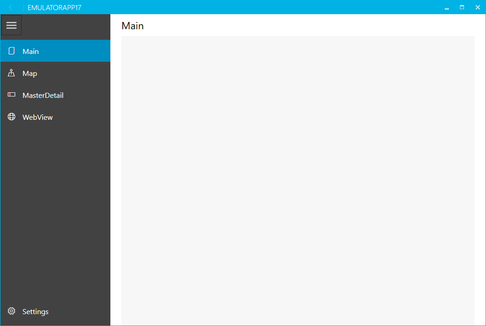

# Navigation pane project type

This project includes a Hamburger Menu from [MahApps.Metro](../mahapps-metro.md) nuget package at the side of the screen, for navigation between pages.

This style is popular in mobile apps but also works well on larger screens. The menu can be expanded or collapsed by clicking on the hamburger button. The menu shows items with an icon and text. The menu can show the icon, or show the icon and text.

## Modifying the menu items

The menu can be modified in the following ways.

* Change the icon for an HamburgerMenuGlyphItem in the menu.
* Change the text for an HamburgerMenuGlyphItem in the menu.

### Change the icon for an item

By default every HamburgerMenuGlyphItem is displayed with the symbol for a document (hex code uE8A5).
When every item has the same icon it is hard to differentiate between them when the HamburgerMenu is collapsed. In almost all cases you will want to change the icon used.



Navigate to `ViewModels/ShellViewModel.cs` and change the `MenuItems` property.

The code below shows the symbols used to create the app shown in the image above.

```csharp
// TODO WTS: Change the icons and titles for all HamburgerMenuItems here.
public ObservableCollection<HamburgerMenuItem> MenuItems { get; } = new ObservableCollection<HamburgerMenuItem>()
{
    new HamburgerMenuGlyphItem() { Label = Resources.ShellMainPage, Glyph = "\uE8A5", TargetPageType = typeof(MainViewModel) },
    new HamburgerMenuGlyphItem() { Label = Resources.ShellMapPage, Glyph = "\uE707", TargetPageType = typeof(MapViewModel) },
    new HamburgerMenuGlyphItem() { Label = Resources.ShellMasterDetailPage, Glyph = "\uE90C", TargetPageType = typeof(MasterDetailViewModel) },
    new HamburgerMenuGlyphItem() { Label = Resources.ShellWebViewPage, Glyph = "\uE774", TargetPageType = typeof(WebViewViewModel) },
};
```

### Change the text for an item

The text for a shell HamburgerMenuGlyphItem comes from the localized string resources. For each page item, i.e. `MainPage` Strings/Resources.resx has a value `ShellMainPage`. Change the value in the resources file to alter what is displayed in the HamburgerMenu.

Navigation pane projects use [MahApps.Metro](../mahapps-metro.md) to add modern styles to the user interface.