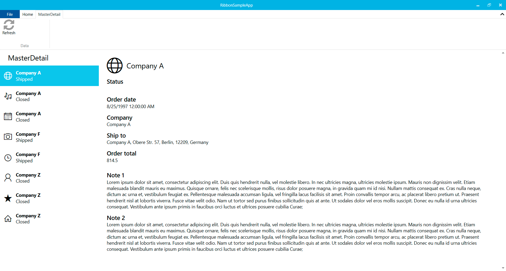
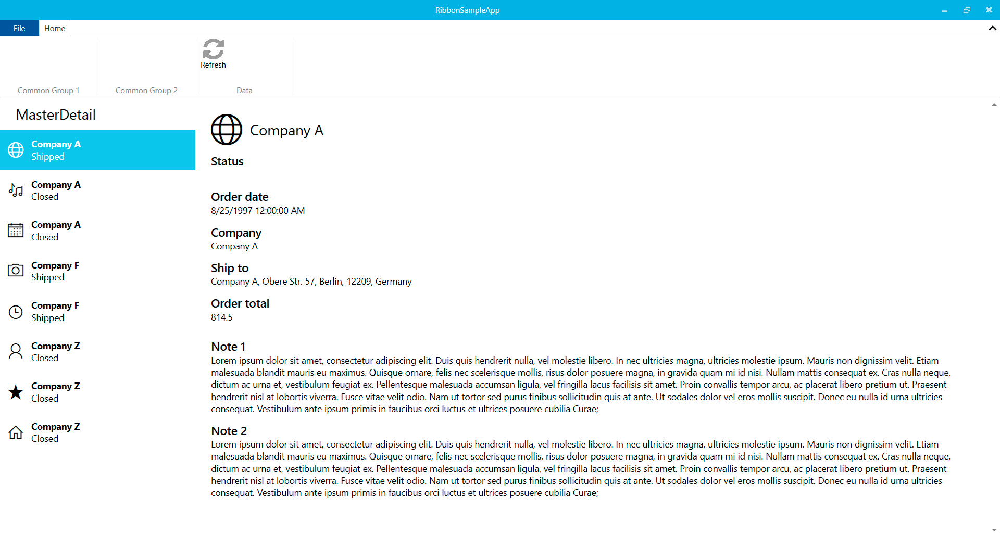

# Ribbon project type

Adds a ribbon control from `Fluent.Ribbon` nuget package which consists of several tabs, grouped by functionality to represent the menu actions of an application.

Ribbon control is placed on the `ShellWindow` and the DataContext of this Ribbon control is the `ShellViewModel`, but most of times, the ribbon tabs should be configured from active pages, to solve this Ribbon projects has infrastructure to add Ribbon tabs from pages and also add Groups to the main tab in the Ribbon control.

This doc covers how to add these options from a MasterDetail page in a Ribbon project.

## Add Ribbon Tabs from a page

The `RibbonTabsBehavior` placed on the Ribbon control in `ShellWindow` allows Ribbon control to add and remove tabs listening Navigation events, the first thing we need to do is initialize this behavior with the `NavigationService` on `ShellWindow` constructor.

```csharp
public ShellWindow(IPageService pageService, ShellViewModel viewModel, INavigationService navigationService)
{
    InitializeComponent();
    DataContext = viewModel;
    navigationBehavior.Initialize(pageService);
    tabsBehavior.Initialize(navigationService);
}
```

We should add a `RibbonPageConfiguration` in `MasterDetailPage.xaml`, see comments in line.

```xml
<Page
    x:Class="RibbonSampleApp.Views.MasterDetailPage"
    Style="{DynamicResource MahApps.Styles.Page}"
    xmlns="http://schemas.microsoft.com/winfx/2006/xaml/presentation"
    xmlns:x="http://schemas.microsoft.com/winfx/2006/xaml"
    xmlns:mc="http://schemas.openxmlformats.org/markup-compatibility/2006"
    xmlns:d="http://schemas.microsoft.com/expression/blend/2008"
    xmlns:strings="clr-namespace:RibbonSampleApp.Strings"
    xmlns:behaviors="clr-namespace:RibbonSampleApp.Behaviors"
    xmlns:Fluent="urn:fluent-ribbon"
    mc:Ignorable="d"
    d:DesignHeight="450" d:DesignWidth="800">
    <!--We should add behaviors and Fluent namespaces-->
    <behaviors:RibbonTabsBehavior.PageConfiguration>
        <behaviors:RibbonPageConfiguration>
            <behaviors:RibbonPageConfiguration.Tabs>
                <Fluent:RibbonTabItem
                    x:Name="ribbonTabItem"
                    Fluent:KeyTip="A"
                    Header="MasterDetail"
                    behaviors:RibbonTabsBehavior.IsTabFromPage="True">
                    <!--IsTabFromPage helps RibbonTabsBehavior to know Tabs to add and remove from pages on navigation events-->
                    <Fluent:RibbonGroupBox
                        State="Large"
                        MinWidth="150"
                        Header="Data">
                        <Fluent:Button
                            Header="Refresh"
                            Size="Large"
                            LargeIcon="Images\Refresh.png"
                            Icon="Images\Refresh.png"
                            Command="{Binding RefreshCommand}" />
                            <!--Icons should be added to the project as resources (Properties -> Build Action)-->
                    </Fluent:RibbonGroupBox>
                </Fluent:RibbonTabItem>
            </behaviors:RibbonPageConfiguration.Tabs>
        </behaviors:RibbonPageConfiguration>
    </behaviors:RibbonTabsBehavior.PageConfiguration>
    <Page.Resources>
        <!--Page Resources-->
    </Page.Resources>
    <Page.Content>
        <Grid>
            <!--Page content-->
        </Grid>
    </Page.Content>
</Page>
```

You also need to set ribbonTabItem DataContext to ViewModel from page constructor.

```csharp
public MasterDetailPage(MasterDetailViewModel viewModel)
{
    InitializeComponent();
    DataContext = viewModel;
    ribbonTabItem.DataContext = viewModel;
}
```




## Add Ribbon Home Tab groups from a page

We should add a `RibbonPageConfiguration` in `MasterDetailPage.xaml`, see comments in line.

```xml
<Page
    x:Class="RibbonSampleApp.Views.MasterDetailPage"
    Style="{DynamicResource MahApps.Styles.Page}"
    xmlns="http://schemas.microsoft.com/winfx/2006/xaml/presentation"
    xmlns:x="http://schemas.microsoft.com/winfx/2006/xaml"
    xmlns:mc="http://schemas.openxmlformats.org/markup-compatibility/2006"
    xmlns:d="http://schemas.microsoft.com/expression/blend/2008"
    xmlns:strings="clr-namespace:RibbonSampleApp.Strings"
    xmlns:behaviors="clr-namespace:RibbonSampleApp.Behaviors"
    xmlns:Fluent="urn:fluent-ribbon"
    mc:Ignorable="d"
    d:DesignHeight="450" d:DesignWidth="800">
    <!--We should add behaviors and Fluent namespaces-->
    <behaviors:RibbonTabsBehavior.PageConfiguration>
        <behaviors:RibbonPageConfiguration>
            <behaviors:RibbonPageConfiguration.HomeGroups>
                <Fluent:RibbonGroupBox
                    x:Name="groupBox"
                    State="Large"
                    MinWidth="150"
                    Header="Data"
                    behaviors:RibbonTabsBehavior.IsGroupFromPage="True">
                    <!--IsGroupFromPage helps RibbonTabsBehavior to know Home Groups to add and remove from pages on navigation events-->
                    <Fluent:Button
                        Header="Refresh"
                        Size="Large"
                        LargeIcon="Images\Refresh.png"
                        Icon="Images\Refresh.png"
                        Command="{Binding RefreshCommand}" />
                        <!--Icons should be added to the project as resources (Properties -> Build Action)-->
                </Fluent:RibbonGroupBox>
            </behaviors:RibbonPageConfiguration.HomeGroups>
        </behaviors:RibbonPageConfiguration>
    </behaviors:RibbonTabsBehavior.PageConfiguration>
    <Page.Resources>
        <!--Page Resources-->
    </Page.Resources>
    <Page.Content>
        <Grid>
            <!--Page content-->
        </Grid>
    </Page.Content>
</Page>
```

You also need to set groupBox DataContext to ViewModel from page constructor.

**MVVVM Basic**

```csharp
public MasterDetailPage(MasterDetailViewModel viewModel)
{
    InitializeComponent();
    DataContext = viewModel;
    groupBox.DataContext = viewModel;
}
```

**MVVVM Light or Prism**

```csharp
public MasterDetailPage()
{
    InitializeComponent();
    groupBox.DataContext = DataContext;
}
```



In both samples we need to create the `RefreshCommand` in `MasterDetailViewModel.cs`. Use `RelayCommand` in MVVMBasic and MVVMLight and `DelegateCommand` in Prism.

```csharp
private ICommand _refreshCommand;

public ICommand RefreshCommand => _refreshCommand ?? (_refreshCommand = new RelayCommand(OnRefresh));

private void OnRefresh()
{
    // TODO: Add here your refresh data code.
}
```

## Navigation in Ribbon projects

### 1. Navigate

Ribbon projects are configured to allow showing pages in two different ways. The main way to navigate is using the Navigate method on the NavigationService, this method shows the page passed as a parameter in the main area (all space at the bottom of the ribbon menu).

### 2. Show in Backstage

Additionally, you can add pages that will be shown in the Ribbon Backstage, adding BackstageTabItem and setting the Tag with the Page identifier that you want to navigate to. The BackstageTabNavigationBehavior indicates to the Ribbon Backstage how to show that pages as navigable items.

### 4. Open in a new window

Shows a page in a separate Window. This is done with the help of the MultiView feature. You should use the OpenInNewWindow method in the WindowManagerService class. (Except in Prism where you should use the Prism dialog service.) You should add a dependency injection to this service in the ShellViewModel constructor.

### 5. Open in a dialog

Shows a page in a dialog over the app window with a button on the bottom to dismiss the dialog. You should use the OpenInDialog method in the WindowManagerService class. (Except in Prism where you should use the Prism DialogService.) You should add a dependency injection to this service in the ShellViewModel constructor.

Ribbon projects use [MahApps.Metro](../mahapps-metro.md) to add modern styles to the user interface.
View `Fluent.Ribbon` license [here](https://www.nuget.org/packages/Fluent.Ribbon/7.0.0/license).