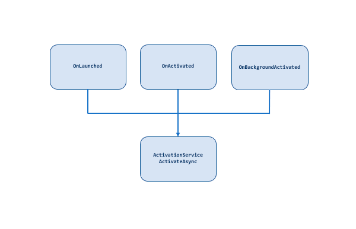
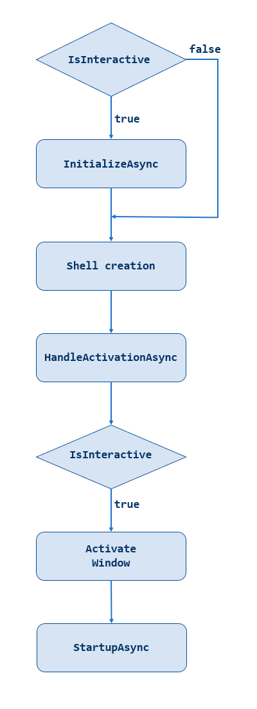
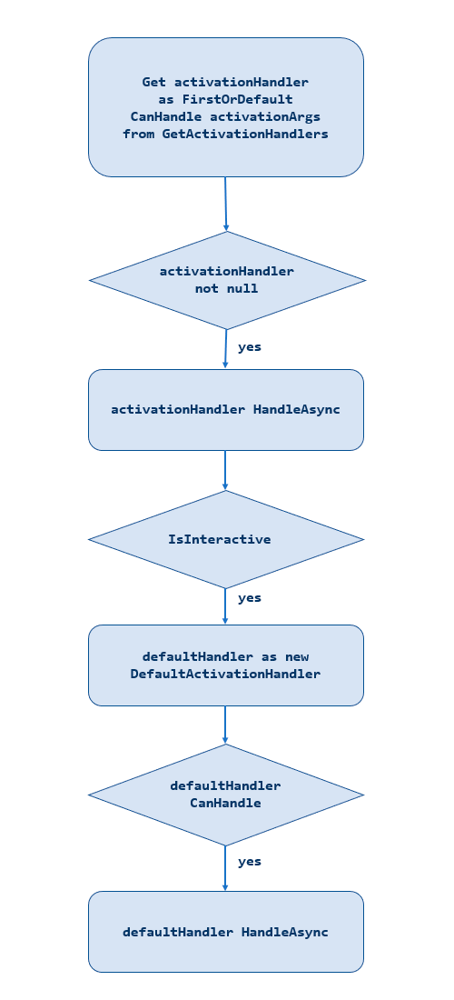
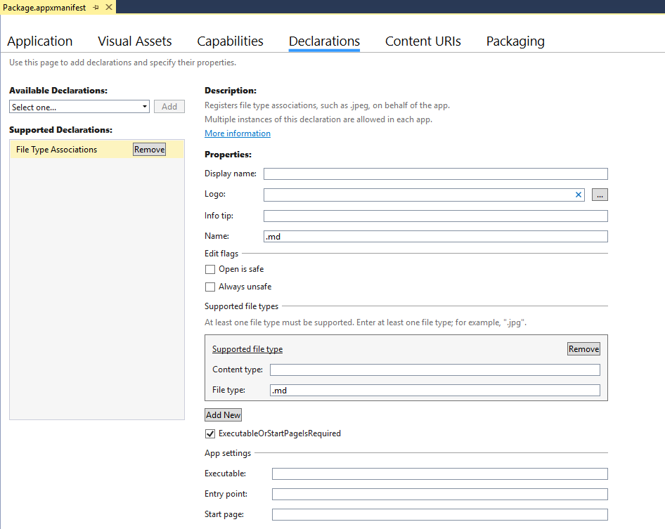

# ActivationService & ActivationHandlers

:heavy_exclamation_mark: There is also a version of [this document with code in C#](./activation.md) :heavy_exclamation_mark: |
-------------------------------------------------------------------------------------------------------------------------------------------- |

## ActivationService

The ActivationService is in charge of handling the applications initialization and activation.

With the method `ActivateAsync()` it has one common entry point that is called from the app lifecycle events `OnLaunched`, `OnActivated` and `OnBackgroundActivated`.
For more information on application lifecycle and its events see [Windows 10 universal Windows platform (UWP) app lifecycle](https://docs.microsoft.com/windows/uwp/launch-resume/app-lifecycle).

## ActivationHandlers

For choosing the concrete type of activation the ActivationService relies on ActivationHandlers, that are registered in the method `GetActivationHandlers()`.

Each class in the application that can handle application activation should derive from the abstract class `ActivationHandler<T>` (T is the type of ActivationEventArguments the class can handle) and implement the method HandleInternalAsync().
The method `HandleInternalAsync()` is where the actual activation takes place.
The virtual method `CanHandleInternal()` checks if the incoming activation arguments are of the type the ActivationHandler can manage. It can be overwritten to establish further conditions based on the ActivationEventArguments.

### ActivationHandlers sample

We'll have look at the SchemeActivationHandler, added by DeepLink feature, to see how activation works in detail:

```vb
Protected Overrides Function CanHandleInternal(args As ProtocolActivatedEventArgs) As Boolean
    ' If your app has multiple handlers of ProtocolActivationEventArgs
    ' use this method to determine which to use. (possibly checking args.Uri.Scheme)
    Return True
End Function

' By default, this handler expects URIs of the format 'wtsapp:sample?paramName1=paramValue1&paramName2=paramValue2'
Protected Overrides Async Function HandleInternalAsync(args As ProtocolActivatedEventArgs) As Task
    ' Create data from activation Uri in ProtocolActivatedEventArgs
    Dim data = New SchemeActivationData(args.Uri)
    If data.IsValid Then
        NavigationService.Navigate(data.PageType, data.Parameters)
    End If
    Await Task.CompletedTask
End Function
```

The `CanHandleInternal()` method was overwritten here and it returns true by default, devs can use args to add extra validations in scenarios with multiple ProtocolActivationEventArgs.

The `HandleInternalAsync()` method gets the ActivationData from argument's Uri and uses the PageType and Parameters to navigate.

## Activation in depth

### Activation flow

The following flowchart shows the Activation proccess that starts with one of the app lifecycle event and ends with the StartupAsync call.

### Lifecycle event  `OnLaunched`, `OnActivated` or `OnBackgroundActivated`

Activation starts from one of the app lifecycle events: `OnLaunched`, `OnActivated` or `OnBackgroundActivated`. All call a common entry point for activation in ActivationService.ActivateAsync().



### ActivateAsync

The first calls in ActivateAsync are InitializeAsync() and the ShellCreation in case you activation is interactive. If you added an Identity feature to your app, code for Identity configuration and SilentLogin will be included here too.

After this first block, HandleActivation is called (more details below).



**IsInteractive**

Interactions with the app window and navigations are only available when the activation arguments extend from IActivatedEventArgs. An example for non-interactive activation is activation from a background Task.

**InitializeAsync**

InitializeAsync contains services initialization for services that are going to be used as ActivationHandler. This method is called before the window is activated. Only code that needs to be executed before app activation should be places here, as the splash screen is shown while this code is executed.

**StartupAsync**

StartupAsync contains initializations of other classes that do not need to happen before app activation and start's processes that will be run after the Window is activated.

### HandleActivation

HandleActivation method gets the first ActivationHandler that can handle the arguments of the current activation. Before that creates a DefaultActivationHandler and execute if it possible (when no one ActivationHandler was selected or the selected ActivationHandler does not realize a Navigation).



## Sample: Add activation from File Association

We are going to create a new ActivationHandler to understand how to extend the ActivationService in our project. In this case, we are going to add a markdown files (.md) reader to our app.

The following code is thought to be added in a WinTS MVVM Basic app.

For viewing the markdown a MarkdownTextBlock from the [Windows Community Toolkit](https://github.com/Microsoft/WindowsCommunityToolkit) is used.

### 1. Add Page and ViewModel to show the opened file

Add the following files to your project

**Views/MarkdownPage.xaml**

```xml
<Page
    x:Class="YourAppName.Views.MarkdownPage"
    xmlns="http://schemas.microsoft.com/winfx/2006/xaml/presentation"
    xmlns:x="http://schemas.microsoft.com/winfx/2006/xaml"
    xmlns:d="http://schemas.microsoft.com/expression/blend/2008"
    xmlns:mc="http://schemas.openxmlformats.org/markup-compatibility/2006"
    xmlns:controls="using:Microsoft.Toolkit.Uwp.UI.Controls"
    mc:Ignorable="d">
    <Grid
        x:Name="ContentArea">

        <Grid.RowDefinitions>
            <RowDefinition x:Name="TitleRow" Height="48"/>
            <RowDefinition Height="*"/>
        </Grid.RowDefinitions>

        <TextBlock
            x:Name="TitlePage"
            x:Uid="Markdown_Title"
            FontSize="28" FontWeight="SemiLight"
            TextTrimming="CharacterEllipsis"
            TextWrapping="NoWrap" VerticalAlignment="Center"
            Margin="24,0,24,7"/>

        <Grid Grid.Row="1" >
            <ScrollViewer
                Margin="12"
                BorderBrush="{ThemeResource AppBarBorderThemeBrush}"
                BorderThickness="2"
                HorizontalScrollBarVisibility="Disabled"
                VerticalScrollBarVisibility="Visible">
                <controls:MarkdownTextBlock
                    x:Name="UiMarkdownText"
                    Padding="24,12,24,12"
                    Foreground="Black"
                    Background="White"
                    LinkClicked="UiMarkdownText_LinkClicked"
                    Text="{x:Bind ViewModel.Text, Mode=TwoWay}" />
            </ScrollViewer>
        </Grid>
    </Grid>
</Page>
```

**Views/MarkdownPage.xaml.vb**

```vb
Imports YourAppName.ViewModels
Imports Microsoft.Toolkit.Uwp.UI.Controls
Imports Windows.Storage
Imports Windows.System

Namespace Views
    Public NotInheritable Partial Class MarkdownPage
        Inherits Page

        property ViewModel as MarkdownViewModel = New MarkdownViewModel

        Protected Overrides Async Sub OnNavigatedTo(e As NavigationEventArgs)
            MyBase.OnNavigatedTo(e)
            If Not e.Parameter Is Nothing Then
                Dim file = TryCast(e.Parameter, StorageFile)
                Dim text = Await FileIO.ReadTextAsync(file)
                ViewModel.Text = text
            End If
        End Sub

        Private Async Sub UiMarkdownText_LinkClicked(sender As Object, e As LinkClickedEventArgs)
            Await Launcher.LaunchUriAsync(New Uri(e.Link))
        End Sub
    End Class
End Namespace
```

**ViewModels/MarkdownViewModel.vb**

```vb
Imports YourAppName.Helpers

Namespace ViewModels
    Public Class MarkdownViewModel
        Inherits Observable

        Private _text As String

        Public Property SharedData As String
            Get
                Return _text
            End Get
            Set
                [Set](_text, Value)
            End Set
        End Property

        Public Sub New()
        End Sub
    End Class
End Namespace
```

**Strings/en-us/Resources.resw**

You also should add a string resource for Markdown Title.

```xml
<data name="Markdown_Title.Text" xml:space="preserve">
    <value>Markdown</value>
</data>
```

### 2. Set up File Association Activation

Add a file type association declaration in the application manifest, to allow the App to be shown as a default handler for markdown files.



Handle the file activation event by implementing the override of OnFileActivated:

**App.xaml.vb**

```vb
Protected Overrides Async Sub OnFileActivated(args As FileActivatedEventArgs)
    MyBase.OnFileActivated(args)
    Await ActivationService.ActivateAsync(args)
End Sub
```

### 3. Add a FileAssociationService

Add a FileAssociationService to your project that handles activation from files. It derives from `ApplicationHandler<T>`.
As it manages activation by File​Activated​Event​Args the signature would be:

**FileAssociationService**

```vb
Imports YourAppName.Activation
Imports YourAppName.Services
Imports YourAppName.Views

Friend Class FileAssociationService
    Inherits ActivationHandler(Of FileActivatedEventArgs)

End Class
```

Override `HandleInternalAsync()`, to evaluate the event args, and take action:

```vb
Imports YourAppName.Activation
Imports YourAppName.Services
Imports YourAppName.Views

Friend Class FileAssociationService
    Inherits ActivationHandler(Of FileActivatedEventArgs)

    Protected Overrides Async Function HandleInternalAsync(args As FileActivatedEventArgs) As Task
        Dim File = args.Files.FirstOrDefault()
        NavigationService.Navigate(GetType(MarkdownPage), File)
        Await Task.CompletedTask
    End Function
End Class
```

### 4. Add the FileAssociationService to ActivationService

Last but not least, we'll have to add our new FileAssociationService to the ActivationHandlers registered in the ActivationService:

**ActivationService**

```vb
Private Iterator Function GetActivationHandlers() As IEnumerable(Of ActivationHandler)
    Yield Singleton(Of FileAssociationService).Instance
End Function
```

---

## Learn more

- [Using and extending the generated app](./getting-started-endusers.md)
- [Handling navigation within the app](./navigation.md)
- [Adapt the app for specific platforms](./platform-specific-recommendations.md)
- [All docs](./readme.md)
