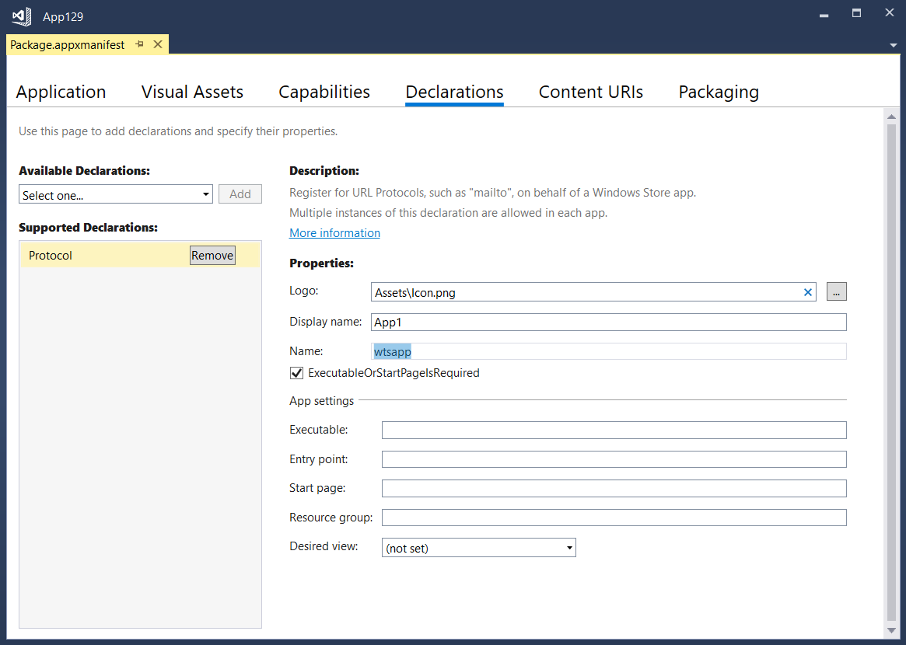

# Deep Linking Activation

The custom Deep Linking feature builds upon the [ActivationService](../activation.md). Prism apps handle activation in the App.xaml.cs.

## Change the protocol from the default name

When the feature is added it sets the supported scheme (or protocol) to `wtsapp`. **You need to change this** as is appropriate to your app. To do this:

- Open Package.appxmanifest
- Select 'Declarations'
- Choose the 'Protocol' declaration if not already selected.
- Change the name as appropriate. (highlighted in image below)

You also have to update the constant **ProtocolName** in **Activation/SchemeActivationData.cs** file.

The protocol name you specify MUST meet these rules:

- Be a string between 2 and 39 characters in length
- Contain only numbers, lowercased letters, dots ('.'), pluses('+'), or hyphens ('-').
- The string can't start with a dot ('.').
- It cannot be a reserved value. ([list of reserved scheme names](https://docs.microsoft.com/windows/uwp/launch-resume/reserved-uri-scheme-names#reserved-uri-scheme-names))

## Understanding the code

Deep linking handles activation using the `SchemeActivationHandler.cs` class. Prism apps handle activation in the `OnActivateApplicationAsync` method in the `App.xaml.cs`. By default the handler expects URIs of the format _wtsapp:sample?paramName1=paramValue1&paramName2=paramValue2_.

To map from URI to Page/ViewModel and parameters, the class `SchemeActivationData.cs` is used. To do this mapping it relies on the property `_activationPages` in `SchemeActivationConfig.cs`. You should add here all pages that can be opened using deep linking with the corresponding uri path.

The deep linking feature also adds a sample page (SchemeActivationSamplePage.xaml) that will show if you activate your app using `wtsapp:sample?paramName1=paramValue1&paramName2=paramValue2`.

## Debugging the app being launched via the URI

- In project properties, go to the **Debug** tab and check the option 'Do no launch, but debug my code when it starts'

- Press F5 to start debugging your app
- Then, in Microsoft Edge, open a new tab and type in `wtsapp:sample?paramName1=paramValue1` (or adjust depending on any changes you've made.) You could also launch it from another app using `LaunchUriAsync()` but for testing this is easier.
- Your app will launch in debug mode and you can debug it like normal.

## Supporting multiple protocols

If you wish to support multiple custom protocols handled by different ActivationHandlers then in the `CanHandleInternal` method of the `SchemeActivationHandler` you will need to check the value of `args.Uri.Scheme` as well as the ActivationKind. This will allow you to have different handlers for each protocol.

## Other points of note

- The default behavior of the code is that if the app is already running when launched from a Uri but it doesn't go to a specific page, it will just remain on the page that is currently displayed. To alter this behavior remove the check against `PreviousExecutionState` in `SchemeActivationHandler.HandleInternalAsync`.
- Related to the above, if the app is already running and displaying the sample page and you launch another Uri that points to the sample page the original version of the sample page will remain displayed. This is because you would not normally want multiple copies of the same page on the back stack. If in your app you would like to navigate to a copy of the page that is currently displayed but with different arguments passed to it, remove the conditional check in `NavigationService.Navigate`. (Note that this doesn't apply to projects using MVVM Light.)
