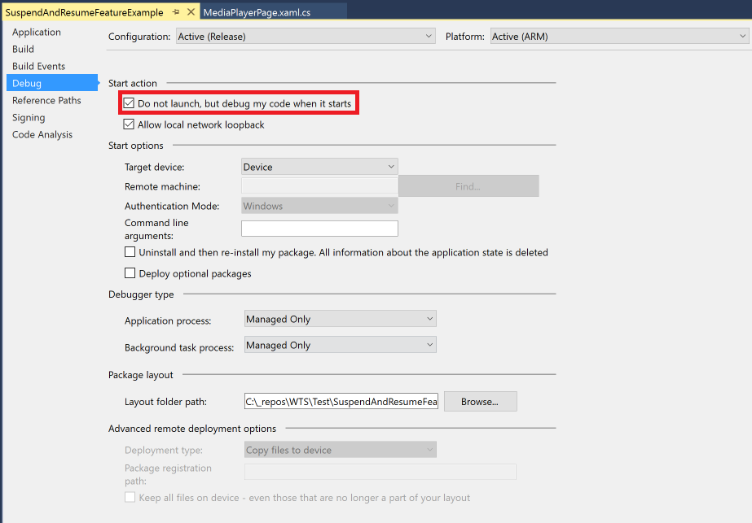

## Sample: Suspend and Resume Feature

:heavy_exclamation_mark: There is also a version of [this document with code samples in VB.Net](./suspend-and-resume.vb.md) :heavy_exclamation_mark: |
---------------------------------------------------------------------------------------------------------------------------------------------------- |

We created a sample application that implements the suspend and resume feature. The application plays a sample video file and saves the current position of the video when the app is suspended. After the application resumes, the video playback continues from the same position it was before suspension.
You can find the samples here: [Suspend and resume samples](/samples/suspendandresume).

Since the implementation of this feature is different depending on the framework, we created two different samples. One of them uses MVVM Basic (which uses the same implementation as Code Behind) and the other one uses MVVM Light. The applications were created using Windows Template Studio with the following configurations:

* Project Type: Blank
* Framework: MVVM Basic (1) and MVVM Light (2)
* Pages: Media Player Page (Main Page was removed)

### Subscribe/Unsubscribe to OnBackgroundEntering Events

To detect when the application goes to suspend status, we need to subscribe to OnBackgroundEntering events. In MVVM Basic we will use the page for this, subscribing to these events in OnNavigatedTo, and unsubscribing from them in OnNavigatedFrom, as follows:

```csharp
protected override void OnNavigatedTo(NavigationEventArgs e)
{
    base.OnNavigatedTo(e);
    mpe.MediaPlayer.PlaybackSession.PlaybackStateChanged += PlaybackSession_PlaybackStateChanged;
    Singleton<SuspendAndResumeService>.Instance.OnBackgroundEntering += OnBackgroundEntering;
}

protected override void OnNavigatedFrom(NavigationEventArgs e)
{
    base.OnNavigatedFrom(e);
    mpe.MediaPlayer.Pause();
    mpe.MediaPlayer.PlaybackSession.PlaybackStateChanged -= PlaybackSession_PlaybackStateChanged;
    Singleton<SuspendAndResumeService>.Instance.OnBackgroundEntering -= OnBackgroundEntering;
}
```

However, in MVVM Light we need to handle the subscriptions in the ViewModel. Hence, we will create a method for each of the actions in the ViewModel (SubscribeToOnBackgroundEntering and UnsubscribeFromOnBackgroundEntering) and call them from the page, in the same place we subscribed and unsubscribed in MVVM Basic. Note that we are also passing the variable we want to save in the SuspensionState to the ViewModel in this step:

```csharp
protected override void OnNavigatedTo(NavigationEventArgs e)
{
    base.OnNavigatedTo(e);
    mpe.MediaPlayer.PlaybackSession.PlaybackStateChanged += PlaybackSession_PlaybackStateChanged;

    ViewModel.SubscribeToOnBackgroundEntering(mpe.MediaPlayer.PlaybackSession);
}

protected override void OnNavigatedFrom(NavigationEventArgs e)
{
    base.OnNavigatedFrom(e);
    mpe.MediaPlayer.Pause();
    mpe.MediaPlayer.PlaybackSession.PlaybackStateChanged -= PlaybackSession_PlaybackStateChanged;

    ViewModel.UnsubscribeFromOnBackgroundEntering();
}
```

Let's take a look at the definition of the methods we just called, in the ViewModel:

```csharp
private MediaPlaybackSession _playbackSession;

internal void SubscribeToOnBackgroundEntering(MediaPlaybackSession playbackSession)
{
    _playbackSession = playbackSession;
    Singleton<SuspendAndResumeService>.Instance.OnBackgroundEntering += OnBackgroundEntering;
}

internal void UnsubscribeFromOnBackgroundEntering()
{
    Singleton<SuspendAndResumeService>.Instance.OnBackgroundEntering -= OnBackgroundEntering;
}
```

### Implement OnBackgroundEntering

We will also need to implement OnBackgroundEntering to save the current playback position of the video. This Position is a TimeSpan variable that we will save in OnBackgroundEnteringEventArgs.SuspensionState.Data. In MVVM Basic we will implement this method directly in the page:

```csharp
private void OnBackgroundEntering(object sender, OnBackgroundEnteringEventArgs e)
{
    e.SuspensionState.Data = mpe.MediaPlayer.PlaybackSession.Position;
}
```

In MVVM Light we will implement it in the ViewModel, using the property _playbackSession that we defined in the previous step:

```csharp
private void OnBackgroundEntering(object sender, OnBackgroundEnteringEventArgs e)
{
    e.SuspensionState.Data = _playbackSession.Position;
}
```

### Implement Suspend and Resume feature actions

Finally, we will modify OnNavigatedTo to evaluate the suspensionState.Data, recover the playback Position if there is one and set it as the current playback position when the application resumes. Since Data is an object, we will need to Parse it to a TimeSpan. This step is exactly the same in MVVM Basic and MVVM Light:

```csharp
protected override void OnNavigatedTo(NavigationEventArgs e)
{
    SuspensionState suspensionState = e.Parameter as SuspensionState;
    if (suspensionState != null)
    {
        bool success = TimeSpan.TryParse(suspensionState.Data?.ToString(), out TimeSpan position);
        if (success)
        {
            mpe.MediaPlayer.PlaybackSession.Position = position;
        }
    }
    base.OnNavigatedTo(e);
    mpe.MediaPlayer.PlaybackSession.PlaybackStateChanged += PlaybackSession_PlaybackStateChanged;
    Singleton<SuspendAndResumeService>.Instance.OnBackgroundEntering += OnBackgroundEntering;
}
```

### Modify Project Debug Properties

To debug this project in order to test the suspend and resume feature we just implemented, we need to modify the project's properties. In the Start Action section of the Debug properties we will check "Do not launch, but debug my code when it starts".



### Debug Project

To debug the project and verify whether the suspend and resume feature works, we will need to manually force the suspension state in the application while debugging. To do so, we will have to debug the project first, and manually open the application from the Windows Menu (remember that we changed the debug properties of the project). Afterwards, we will have to Suspend and Shutdown the application using the Debug Location toolbox. The next step will be to manually reopen the application from the Windows Menu, and we will check that the video playback resumes at the same point that it was before we forced the suspension.


