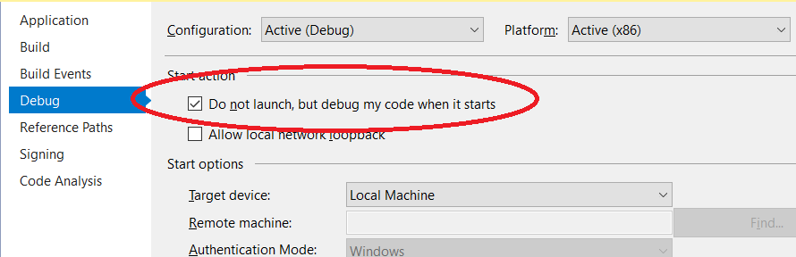

# URI Scheme Activation

The custom URI scheme feature builds upon the [ActivationService](../activation.md).

## Change the protocol from the default name

When the feature is added it sets the supported scheme (or protocol) to `wtsapp`. **You need to change this** as is appropriate to your app. To do this:

- Open Package.appxmanifest
- Select 'Declarations'
- Choose the 'Protocol' declaration if not already selected.
- Change the name as appropriate. (highlighted in image below)

The protocol name you specify MUST meet these rules:

- Be a string between 2 and 39 characters in length
- Contain only numbers, lowercased letters, dots ('.'), pluses('+'), or hyphens ('-').
- The string can't start with a dot ('.').
- It cannot be a reserved value. ([list of reserved scheme names](https://docs.microsoft.com/en-us/windows/uwp/launch-resume/reserved-uri-scheme-names#reserved-uri-scheme-names))

## Debugging the app being launched via the URI

- In project properties, go to the **Debug** tab and check the option 'Do no launch, but debug my code when it starts'

- Press F5 to start debugging your app
- Then, in Edge, open a new tab and type in `wtsapp:sample?secret=mine` (or adjust depending on any changes you've made.) You could also launch it from another app using `LaunchUriAsync()` but for testing this is easier.
- Your app will launch in debug mode and you can debug it like normal.

## Supporting multiple protocols

If you wish to support multiple custom protocols handled by different ActivationHandlers then in the `CanHandleInternal` method of the `SchemeActivationHandler` you will need to check the value of `args.Uri.Scheme` as well as the ActivationKind. This will allow you to have different handlers for each protocol.
