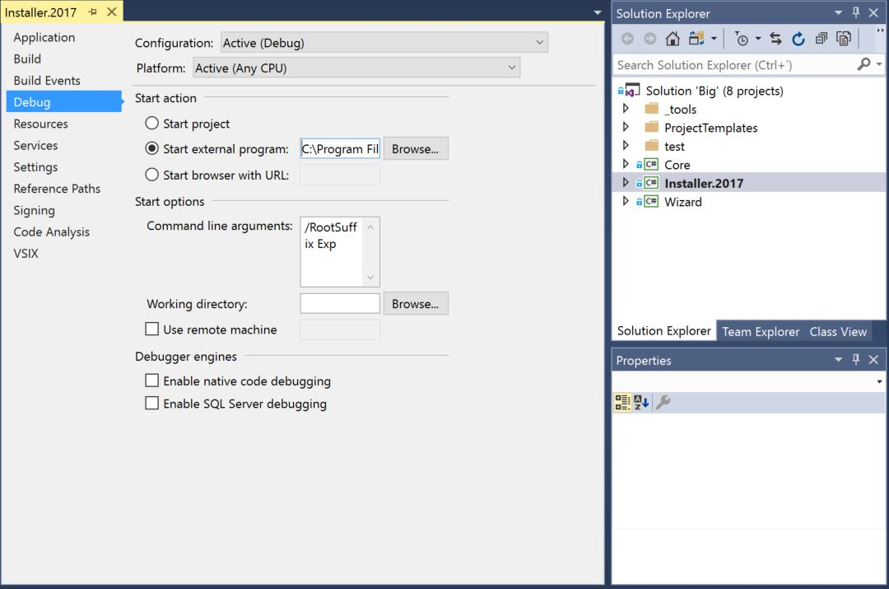
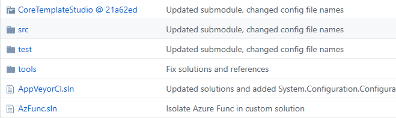

# Getting started with the generator codebase

If you are authoring templates for Windows Template Studio, or interested in [contributing](../CONTRIBUTING.md) to this repo, then you are likely interested in how to use the latest version of this code. The required steps are outlined below.

If you just want to take advantage from Windows Template Studio extension, check the [Getting Started with the Extension](getting-started-extension.md) page.

## Repo Solutions

Under the [code](../code/) folder, the repo have different solutions to aid developers get focused on certain development areas:

- **Big.sln**: This is the solution which contains all the projects available, including test projects.
- **Installer.sln**: This solution is focused on the Visual Studio extension, have the extension project and all the dependencies and is thought to run the extension in the Visual Studio Experimental IDE.
- **UI.sln**: This solution is focused in the user interface, that is, the Wizard itself. Using this solution (by executing the VsEmulator project) you can launch the Windows Template Studio wizard in a more lightweight way since it does not deploy the extension to the VS experimental instance.
- **Test.sln**: This solution is used to work with the project integration tests.

## Running the Extension Locally

First of all, be sure you are running [Visual Studio 2017 or 2019](https://www.visualstudio.com/downloads/) (Any version works)

1. Clone this repo to your local machine
1. Open the solution [Big.sln](../code/)
1. Set the project "Installer" as StartUp Project for the solution. This is the Visual Studio Extension project for Windows Template Studio.
1. Configure the "Installer" project to launch the [Visual Studio Experimental instance](https://msdn.microsoft.com/library/bb166560(v=vs.140).aspx) when run.
   1. Open the "Installer" project properties.
   1. Go to "Debug" properties.
   1. In "Start Action", select "Start external program" and browse for your Visual Studio executable (devenv.exe), typically in the path "C:\Program Files (x86)\Microsoft Visual Studio\2017\*YOUR_VS_EDITION*\Common7\IDE\" or C:\Program Files (x86)\Microsoft Visual Studio\2019\*YOUR_VS_EDITION*\Common7\IDE\"
   1. In the "Start options", for the "Command line arguments" set the following: "/RootSuffix Exp
   1. Save the changes.
    
    *The project configuration should looks like this*
1. Build the solution.
1. Start debugging (F5) or start without debugging (Ctrl+F5).

With this steps, the Windows Template Studio Extension is deployed to a new instance of Visual Studio (the experimental instance). Now you can go to "File -> New Project..." to launch the Wizard.

The extension wizard, when runs locally, uses the local [templates folder](../templates) as source for the Templates Repository.

## Using the UI.sln solution

To speed up the execution and development experience, we have created a [VsEmulator application](../src/test) which can be used to launch and test the Windows Template Studio Wizard. This application, as well as the Wizard assembly, are available thru the UI.sln solution. To use it, follow this steps:

1. Open the UI.sln solution
1. Set the "test\VsEmulator" project as "StartUp"
1. Start debugging (F5) or start without debugging (Ctrl+F5).

Using this solution while authoring templates or improving the Wizard have the following advantages:

1. Speed up the development since it does not deploy the VSIX to the VS Experimental instance every time you build.
1. Simple and lightweight run / debug experience since it does not require to launch another instance of Visual Studio.

So we encourage to use this solution for the general template authoring or code development and, once you are done, make some final local tests using the Installer.sln or Big.sln solution.

### Accesible UI

Both the UI and the templates (generated code) must be accesible by definition. If you are going to collaborate in this space, please, be sure you have verified all accesibility rules defined in [Accessibility checklist](accesibility.md).

## Inside the Code folder

Following are described the contents for each folder:

- [_tools](../code/_tools): tooling required for testing / validations.
- [src](../code/src): solution source code
  - [Installer](../code/src/Installer): This is the Visual Studio Extension project. Enables the installation of the extension to enable the access to the Windows Template Studio Project Template and ensures that all required assets are deployed with it.
  - [ProjectTemplates](../code/src/ProjectTemplates): This folder contains the [Visual Studio Project Templates](https://msdn.microsoft.com/library/ms247121.aspx) deployed with the extension to enable the "File --> New Project..." experience. There are separate templates for the C# and Visual basic versions of the template.
  - [UI](../code/src/UI): This project handles the generation as well as the UI dialogs required by the generation workflow.
- [test](../code/test)
  - [Fakes](../code/test/Fakes): Common test elements.
  - [Templates.Test](../code/test/Templates.Test): Contains integration automated test for the Templates. This project scans the Templates folder and ensure that every template is generating and building properly.
  - [UI.Test](../code/test/UI.Test): Contains unit test for UI assembly.
  - [VsEmulator](../code/test/VsEmulator): test application able to run End-To-End the generation using the local templates repository without deploying the VSIX to VS Experimental instance.

## Test execution

The following list shows which tests are executed in which build. Within the Templates.Test project we use the trait ExecutionSet to specify which tests are run.

- AppVeyor 'CIBuild' Build (CI):
  - Core.Tests
  - UI.Test
  - Templates.Tests
    - ExecutionSet=MinimumCodebehind
    - ExecutionSet=MinimumMVVMLight
    - ExecutionSet=MinimumMVVMBasic
    - ExecutionSet=MinimumCaliburnMicro
    - ExecutionSet=MinimumPrism
    - ExecutionSet=TemplateValidation

- VSO 'Templates.Test.Full' Build (Full Tests):
  - Core.Tests
  - UI.Tests
  - Templates.Test
    - ExecutionSet=MinimumCodebehind
    - ExecutionSet=MinimumMVVMLight
    - ExecutionSet=MinimumMVVMBasic
    - ExecutionSet=MinimumCaliburnMicro
    - ExecutionSet=MinimumPrism
    - ExecutionSet=BuildVBStyle
    - ExecutionSet=TemplateValidation
    - ExecutionSet=BuildRightClickWithLegacy
    - ExecutionSet=BuildMVVMBasic
    - ExecutionSet=BuildCodeBehind
    - ExecutionSet=BuildMVVMLight
    - ExecutionSet=BuildCaliburnMicro
    - ExecutionSet=BuildPrism

- VSO 'Templates.Test.OneByOne' Build (OneByOne Tests):
  - Templates.Test
    - ExecutionSet=BuildOneByOneMVVMBasic
    - ExecutionSet=BuildOneByOneCodeBehind
    - ExecutionSet=BuildOneByOneMVVMLight
    - ExecutionSet=BuildOneByOneCaliburnMicro
    - ExecutionSet=BuildOneByOnePrism

- VSO 'Templates.Test.Wack' Build (Wack Tests):
  - Templates.Test
    - ExecutionSet=LongRunning

To shorten test execution time traits in Templates.Test are run parallel using this [script](../_build/ParallelTestExecution.ps1).
To execute this script locally use the following powershell command:

`<wts directory>\_build\ParallelTestExecution.ps1 -testRunner $(UserProfile)\.nuget\packages\xunit.runner.console\2.4.1\tools\net47\xunit.console.exe -testLibrary <wts directory>\Code\test\Templates.Test\bin\Analyze\Microsoft.Templates.Test.dll -traits 'ExecutionSet=BuildMinimum', 'ExecutionSet=BuildStyleCop', 'ExecutionSet=TemplateValidation' -outputDir <output directory>`

where

- `<wts directory>` : Directory where WinTS is cloned
- `<output directory>`: Directory where test xml result files will be generated

## Core

Windows Template Studio relies on Core Template Studio for template synchronization and template composition, generation and postaction. Core Template Studio has it's own Github repository [github.com/Microsoft/CoreTemplateStudio](https://github.com/Microsoft/CoreTemplateStudio) as it is shared with the sister project Web Template Studio [github.com/Microsoft/WebTemplateStudio](https://github.com/Microsoft/WebTemplateStudio).

Core Template Studio is integrated into Windows Template Studio using a git submodule under the folder (`../code/CoreTemplateStudio`).
The submodule points to a specific commit in Core Template Studio, that you can see in github:

When you clone WinTS you have to run two commands: `git submodule init` and `git submodule update` to fetch all the data from Core Template Studio.
When fetching changes, also execute `git submodule update` after doing `git fetch` to be sure you're submodule is up to date.

Changes on Core Template Studio should be done on the Core Template Studio repos.
In WinTS, to update the submodule to the most recent commit, you have to run the command: `git submodule update --remote`.

---

## Learn more

- [Understanding and authoring Templates](./templates.md)
- [Recording usage Telemetry](./telemetry.md)
- [Ensuring generated code is accessible](./accessibility.md)
- [All docs](./readme.md)
