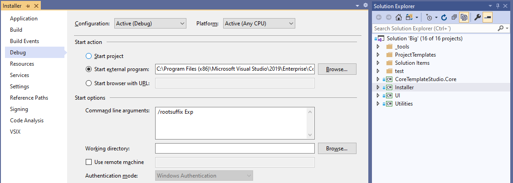

# Getting started with the generator codebase

If you are authoring templates for *Template Studio*, or interested in [contributing](../CONTRIBUTING.md) to this repo, then you are likely interested in how to use the latest version of this code. The required steps are outlined below.

If you just want to take advantage from *Template Studio* extension, check the [Getting Started with the Extension](getting-started-extension.md) page.

## Repo Solutions

Under the [code](../code/) folder, the repo has different solutions to aid developers get focused on certain development areas:

- **Big.sln**: This is the solution which contains all the projects available, including test projects.
- **Installer.sln**: This solution is focused on the Visual Studio extension, it has the extension project and all the dependencies and is thought to run the extension in the Visual Studio Experimental IDE.
- **UI.sln**: This solution is focused in the user interface, that is, the Wizard itself. Using this solution (by executing the VsEmulator project) you can launch the *Template Studio* wizard in a more lightweight way since it does not deploy the extension to the VS experimental instance.
- **Test.sln**: This solution is used to work with the project integration tests.

## Running the Extension Locally

First of all, be sure you are running [Visual Studio 2019](https://www.visualstudio.com/downloads/) (Any version starting from 16.2 works)

1. Clone this repo to your local machine
2. Open the solution [Big.sln](../code/)
3. Set the project `Installer` as `Startup project` for the solution. This is the Visual Studio Extension project for *Template Studio*.
4. Configure the `Installer` project to launch the [Visual Studio Experimental instance](https://msdn.microsoft.com/library/bb166560(v=vs.140).aspx) when run.

   - Open the `Installer` project properties.
   - Go to `Debug` properties.
   - In `Start Action`, select `Start external program` and browse for your Visual Studio executable (`devenv.exe`), typically in the path `C:\Program Files (x86)\Microsoft Visual Studio\2019\*YOUR_VS_EDITION*\Common7\IDE\`
   - In the `Start options`, for the `Command line arguments` set the following: `/RootSuffix Exp`
   - Save the changes.
    
    *The project configuration should looks like this*
5. Build the solution.
6. Start debugging (`F5`) or start without debugging (`Ctrl+F5`).

With this steps, the *Template Studio* Extension is deployed to a new instance of Visual Studio (the experimental instance). Now you can go to `File -> New Project...` to create a new project or open a project created with *Template Studio* and right click on the main project and choose any of the options provided on the `Template Studio` context menu.

The entry points for project creation are the different project templates in the [ProjectTemplates folder](../code/src/ProjectTemplates).
The default experience for *Template Studio* is project generation using a wizard-based experience. The Wizard is invoked by all project templates that end with `Solution` using the `SolutionWizard` class from the `UI`project.
There are a few other project templates (in the WinUI folder) that do not (yet) allow any user configuration, those project templates create the project using vstemplate generation without showing the Wizard.
The entry point for right click additions is the RelayCommandPackage from the `Installer` project.

When running inside Visual Studio the `VSGenShell` and the `VSStyleValuesProvider` are used for integration with Visual Studio Shell and Styles.

When running locally, the local [templates folder](../templates) is used as source for the Templates Repository.

## Using the UI.sln solution

To speed up the execution and development experience, we have created a [VsEmulator application](../src/test) which can be used to launch and test the *Template Studio* Wizard. This application, as well as the Wizard assembly, are available thru the `UI.sln` solution. To use it, follow this steps:

1. Open the `UI.sln` solution
2. Set the `test\VsEmulator` project as `Startup Project`
3. Start debugging (`F5`) or start without debugging (`Ctrl+F5`).

Using this solution while authoring templates or improving the Wizard have the following advantages:

1. Speed up the development since it does not deploy the `VSIX` to the VS Experimental instance every time you build.
2. Simple and lightweight run / debug experience since it does not require to launch another instance of Visual Studio.

When running outside of Visual Studio the `FakeGenShell` and the `FakeStyleValuesProvider` are used to mock the Visual Studio Shell and Styles.

We encourage to use this solution for the general template authoring or code development and, once you are done, make some final local tests using the `Installer.sln` or `Big.sln` solution.

### Accessible UI

Both the UI and the templates (generated code) must be accessible by definition. If you are going to collaborate in this space, please, be sure you have verified all accessibility rules defined in [Accessibility checklist](accessibility.md).

## Inside the Code folder

Following are described the contents for each folder:

- [tools](../code/tools): tooling required for testing / validations.
- [src](../code/src): solution source code
  - [Installer](../code/src/Installer): This is the Visual Studio Extension project. Enables the installation of the extension to enable the access to the *Template Studio* Project Template and ensures that all required assets are deployed with it.
  - [ItemTemplates](../code/src/ItemTemplates): This folder contains the [Visual Studio Item Templates](https://msdn.microsoft.com/library/ms247121.aspx) deployed with the extension to enable the `Add --> New Item...` experience on WinUI 3 projects.
  - [ProjectTemplates](../code/src/ProjectTemplates): This folder contains the [Visual Studio Project Templates](https://msdn.microsoft.com/library/ms247121.aspx) deployed with the extension to enable the `File --> New Project...` experience. There are separate templates for **UWP (C# and Visual Basic)**, **WPF** and **WinUI 3 (C# and C++)**.
  - [UI](../code/src/UI): This project handles the generation as well as the UI dialogs required by the generation workflow.
- [test](../code/test)
  - [Fakes](../code/test/Fakes): Common test elements.
  - [Templates.Test](../code/test/Templates.Test): Contains integration automated test for the Templates. This project scans the Templates folder and ensure that every template is generating and building properly.
  - [UI.Test](../code/test/UI.Test): Contains unit tests for UI assembly.
  - [VsEmulator](../code/test/VsEmulator): Test application able to run End-To-End the generation using the local templates repository without deploying the VSIX to VS Experimental instance.

## Test execution

The following list shows which tests are executed in which build. Within the `Templates.Test` project we use the trait ExecutionSet to specify which tests are run.

- VSO 'PRBuild' Build (PR):
  - Core.Tests
  - UI.Test
  - VSTemplates.Test
  - Templates.Tests
    - ExecutionSet=MinimumCodebehind
    - ExecutionSet=MinimumMVVMLight
    - ExecutionSet=MinimumMVVMBasic
    - ExecutionSet=MinimumMVVMToolkit
    - ExecutionSet=MinimumCaliburnMicro
    - ExecutionSet=MinimumPrism
    - ExecutionSet=MinimumCodeBehindWpf
    - ExecutionSet=MinimumMVVMLightWPF
    - ExecutionSet=MinimumMVVMBasicWPF
    - ExecutionSet=MinimumMVVMToolkitWPF
    - ExecutionSet=MinimumPrismWPF
    - ExecutionSet=MinimumMVVMToolkitWinUI
    - ExecutionSet=MinimumNoneWinUI
    - ExecutionSet=TemplateValidation

- VSO 'CIBuild' Build (CI):
  - Core.Tests
  - Utilities.Test
  - VSTemplates.Test

- VSO 'Templates.Test.Full' Build (Full Tests):
  - Core.Tests
  - UI.Tests
  - VSTemplates.Test
  - Templates.Test
    - ExecutionSet=MinimumCodebehind
    - ExecutionSet=MinimumMVVMLight
    - ExecutionSet=MinimumMVVMBasic
    - ExecutionSet=MinimumMVVMToolkit
    - ExecutionSet=MinimumCaliburnMicro
    - ExecutionSet=MinimumPrism
    - ExecutionSet=MinimumCodeBehindWpf
    - ExecutionSet=MinimumMVVMLightWPF
    - ExecutionSet=MinimumMVVMBasicWPF
    - ExecutionSet=MinimumMVVMToolkitWPF
    - ExecutionSet=MinimumPrismWPF
    - ExecutionSet=BuildVBStyle
    - ExecutionSet=TemplateValidation
    - ExecutionSet=BuildRightClickWithLegacy
    - ExecutionSet=BuildMVVMBasic
    - ExecutionSet=BuildMVVMToolkit
    - ExecutionSet=BuildCodeBehind
    - ExecutionSet=BuildMVVMLight
    - ExecutionSet=BuildCaliburnMicro
    - ExecutionSet=BuildPrism
    - ExecutionSet=BuildCodeBehindWpf
    - ExecutionSet=BuildMVVMBasicWpf
    - ExecutionSet=BuildMVVMToolkitWPF
    - ExecutionSet=BuildPrismWpf
    - ExecutionSet=BuildMVVMLightWpf
    - ExecutionSet=BuildRightClickWithLegacyWpf
    - ExecutionSet=BuildMVVMToolkitWinUI
    - ExecutionSet=BuildNoneWinUI

- VSO 'Templates.Test.OneByOne' Build (OneByOne Tests):
  - Templates.Test
    - ExecutionSet=BuildOneByOneMVVMBasic
    - ExecutionSet=BuildOneByOneMVVMToolkit
    - ExecutionSet=BuildOneByOneCodeBehind
    - ExecutionSet=BuildOneByOneMVVMLight
    - ExecutionSet=BuildOneByOneCaliburnMicro
    - ExecutionSet=BuildOneByOnePrism
    - ExecutionSet=BuildOneByOneCodeBehindWpf
    - ExecutionSet=BuildOneByOneMVVMBasicWpf
    - ExecutionSet=BuildOneByOneMVVMToolkitWpf
    - ExecutionSet=BuildOneByOneMVVMLightWpf
    - ExecutionSet=BuildOneByOnePrismWpf
    - ExecutionSet=BuildOneByOneMVVMToolkitWinUI

- VSO 'Templates.Test.Wack' Build (Wack Tests):
    - Templates.Test
    - ExecutionSet=LongRunning
    - ExecutionSet=LongRunningWPF
    - ExecutionSet=LongRunningWinUI

The tests run for each of the above builds are also in the ExecutionSets '_CIBuild', '_Full', '_OneByOne', and '_Wack'.

To shorten test execution time traits in `Templates.Test` are run parallel using this [script](../_build/ParallelTestExecution.ps1).
To execute this script locally use the following powershell command after compiling the `Test.sln`in configuration `Analyze`:

`<ts directory>\_build\ParallelTestExecution.ps1 -testRunner $(UserProfile)\.nuget\packages\xunit.runner.console\2.4.1\tools\net47\xunit.console.exe -testLibrary <ts directory>\Code\test\Templates.Test\bin\Analyze\Microsoft.Templates.Test.dll -traits 'ExecutionSet=MinimumWinUI', 'ExecutionSet=TemplateValidation' -outputDir <output directory>`

where

- `<ts directory>` : Directory where *TS* is cloned
- `<output directory>`: Directory where test xml result files will be generated

## Troubleshooting

When working on Template Studio the following folders are useful to investigate any issue you run into:

### Log File
You can find the log file at `%localAppData%\TS\Logs`. Log files are separated by environment, the diagnostic trace level can be set using the property DiagnosticsTraceLevel in the config.json file.

### Templates Folder
The templates folder is located in the `%localAppData%\TS\Templates\` folder.
When debugging locally this folder will have a shortcut pointing to the templates folder of your repository.
When using the vsix, templates will be extracted from the mstx package to this folder.

### Template Cache
The template cache is located in the `%userprofile%\.templateengine` folder. Template caches are isolated by environment. 

When working locally you need to refresh the template cache to see changes applied to the templates. There is a button to refresh the template cache on the VSEmulator's Main Page and in the Wizard when running in debug. 

When working with the `Installer` you can manually delete the `%localAppData%\TS\Templates\LocalVsixEnv` folder to force a refresh of the cache before the wizard starts.
For example you might need to do so if you rename an existing templates folder, as the template cache holds pointers to the templates folders. 
 

### Folder overview by Environment name

| Environment|	Description |	Templates Folder | Templates Cache |
| --------------- | ----------- | ---------------- | --------------- |
| LocalVSIXEnv | Executing TS using Experimental Instance using `Installer` as startup project | `%localAppData%\TS\Templates\LocalVsixEnv` | `%userprofile%\.templateengine\LocalVsixEnv` |
| LocalEnvTS | Executing TS using `VSEmulator` as startup project | `%localAppData%\TS\Templates\LocalEnvTS` | `%userprofile%\.templateengine\LocalEnvTS` |
| Dev | Dev-nightly version | `%localAppData%\TS\Templates\Dev` | `%userprofile%\.templateengine\Dev` |
| Pre | Pre-release version | `%localAppData%\TS\Templates\Pre` | `%userprofile%\.templateengine\Pre` |
| Pro | Marketplace version | `%localAppData%\TS\Templates\Pro` | `%userprofile%\.templateengine\Pro` |

---

## Learn more

- [Understanding and authoring Templates](./templates.md)
- [Recording usage Telemetry](./telemetry.md)
- [Ensuring generated code is accessible](./accessibility.md)
- [All docs](./readme.md)
