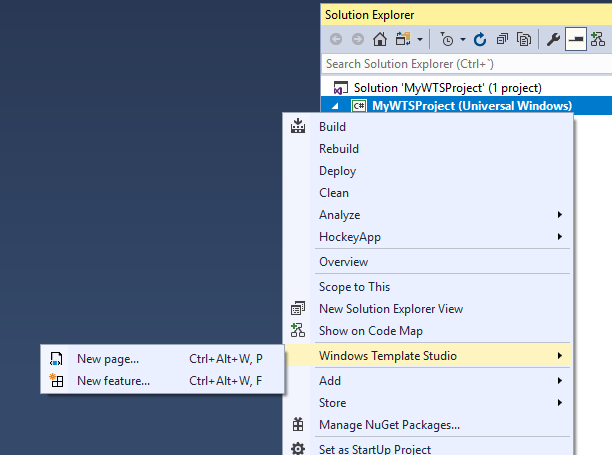
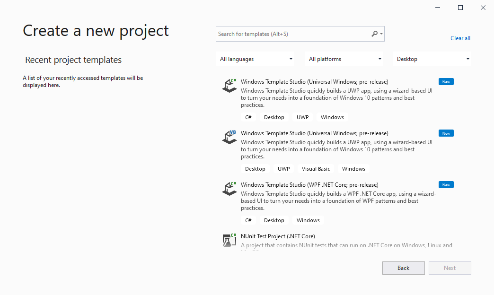

# Installing / Using the extension

## Installing the Visual Studio Extension

### Prerequisits for installing Windows Template Studio

Windows Template Studio (WinTS) installs into your existing Visual Studio development environment. If you're missing any of the below, you can get everything from the [Windows Dev Center Download page](https://developer.microsoft.com/windows/downloads).
- Visual Studio 2019 - Although VS 2019.2 is the minimum version, we recommend using WinTS with the latest Visual Studio Update.
- .NET Framework 4.7.2

### Prerequisites for Universal Windows Platform

- Install `Universal Windows Platform development` workload on Visual Studio 2019 to use UWP templates.
- Windows 10, version 1903 (version 10.0.18362.0) or later.
- Install the Windows SDK Version 10.0.19041.0.

### Prerequisites for WPF

 - Install the `.NET desktop development` workload on Visual Studio 2019 to use WPF (.NET Core) templates.
 - Install the [.NET Core 3.1 SDK](https://dotnet.microsoft.com/download/dotnet-core/3.1).

### Download the extension
You have two ways of acquiring the extension:

 - Inside Visual Studio. Select Extensions -> Manage Extensions.  Select the 'Online' node and search for Windows Template Studio then click **Download**.
 - Direct link and manually install from  [Visual Studio Gallery](https://marketplace.visualstudio.com/items?itemName=WASTeamAccount.WindowsTemplateStudio).

## Public Release instructions

1. Install the Visual Studio Extension for Windows Template Studio by downloading the VSIX from the [Visual Studio Gallery](https://marketplace.visualstudio.com/items?itemName=WASTeamAccount.WindowsTemplateStudio).
2. Once installed, open Visual Studio 2019 and select "Create a new Project" or "File→ New Project" and you should see Windows Template Studio as an option. You can use the search box or the filters to get to the Windows Template Studio project templates.

3. To add pages and features to an existing **Windows Template Studio** project, select the project and choose Windows Template Studio → 'New page', 'New feature', 'New service', or 'New testing project' from the context menu.

For more info on adding new items see [here](newitem.md).

## Nightly / Pre-release feeds for Windows Template Studio

- **Nightly:** <https://www.myget.org/F/windows-template-studio-nightly/vsix/>
- **Pre-release (stable):** <https://www.myget.org/F/windows-template-studio-prerelease/vsix/>

### Nightly / Pre-release instructions

The Pre-release build version allows you to get updates with stable features not officially released yet (so, they are not definitive and may change).

This feed will have stable extension versions so it is not thought to have breaking changes (and can be installed side by side with the official one), anyway, installing this extension is at your own risk.

Open Visual Studio 2019 and go to **Extensions -> Manage Extensions**, then click on **Change your settings for Extensions** *(bottom left of the 'Mange Extensions' window)* and create an Additional Extension Gallery.

Then, go again to **Extensions -> Manage Extensions** and using the recently added online gallery *(added under the 'Online' node)*, download and install the Windows Template Studio extension. Note that you will likely need to restart Visual Studio for the install to complete.

Once installed, you will see a new Project Template which allows you to access to the available templates: Pre-Release version uses the VNext Template Repository.

You can start working with Windows Template Studio by cloning [our repo](https://github.com/Microsoft/WindowsTemplateStudio) and working locally with the code and the available templates.  If you plan to contribute, please follow the [contribution guidelines](../CONTRIBUTING.md)

### Nightly Dev-release

If you want to have updates from in-progress changes.  This feed will have the result of the daily dev-branch integration so expect some instability. This extension can be installed side by side with the official and pre-release, anyway, installing this extension is at your own risk.

---

## Learn more

- [Core concepts](./concepts.md)
- [Using and extending the generated UWP app](./UWP/getting-started-endusers.md)
- [Using and extending the generated WPF app](./WPF/getting-started-endusers.md)
- [Getting started with the WinTS codebase](./getting-started-developers.md)
- [All docs](./readme.md)
