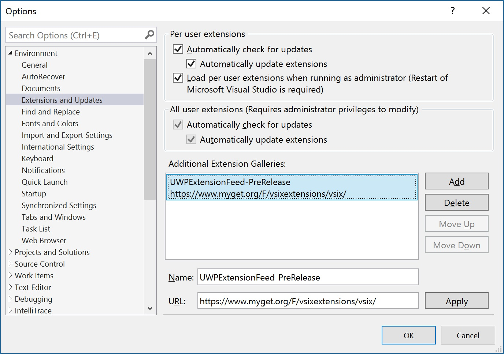
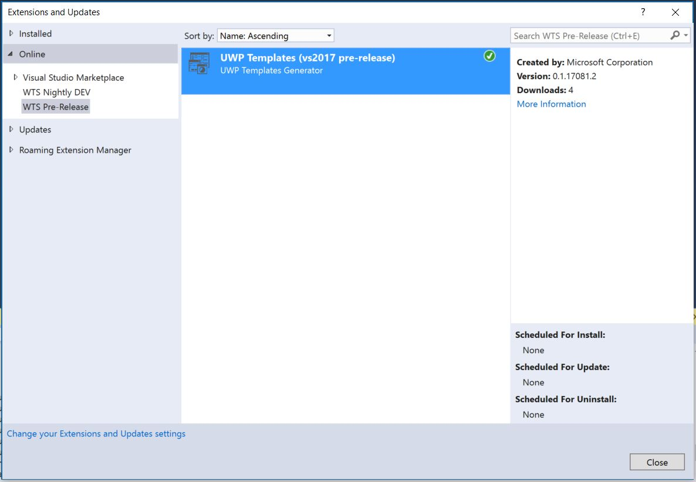
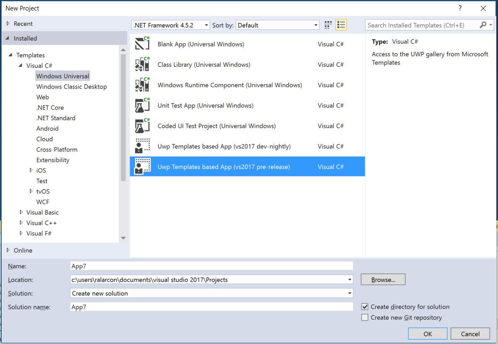

Getting Started
===============
You can take advantage of UWP Community Templates by installing our Visual Studio Extension or by cloning the repo and working locally with the code and the available templates. If you plan to contribute, please follow the [contribution guidelines](https://github.com/Microsoft/UWPCommunityTemplates/blob/master/contributing.md).  

You can install the UWP Community Templates Visual Studio Extension (pre-release nightly version) configuring the following extensions feed https://www.myget.org/F/vsixextensions/vsix/. Follow detailed installation instructions [below](#the-project).

You can download the official extension from the [Visual Studio Gallery](https://visualstudiogallery.msdn.microsoft.com/) (coming soon).

We are currently targeting Visual Studio 2017 RC.

We mainly handle the following areas or concepts:
* Templates
* Generation
* Templates Repository
* Visual Studio Extension

## Main concepts
### What is a Template?
A template is just code with some metadata. The metadata will contain the template information: name, description, licensing, remarks, programming language, type, guids, etc. The template definition is based on [dotnet Template Engine](https://github.com/dotnet/templating).

There are three different types of templates:
* **Project Template**: to create Apps. Any project created with Visual Studio can be a template. Project templates must be working projects (must build and run).
* **Page Template**: will contain the files needed to add a page to a certain App.
* **Feature Templates**: will contain to add features to a certain App.

### What is the Generation process?
The generation is the process executed to create actual code from a selected template. That is, the process to create the real Visual Studio project (thought to be an App), or to create the XAML Page and its code behind, or the code to add/enable certain feature.

As well as templates, the generation is based on [dotnet Template Engine](https://github.com/dotnet/templating) code generation.

### What is the Template Repository?
The Templates Repository is the place where we will gather all templates and will make them available for the community (hosted on a CDN). We will have two repositories publicly available:
* Master: The stable and public version of the templates.
* VNext: The ongoing version of the templates.

### What is the Visual Studio Extension?
UWP App developers can take advantage of the UWP Community Templates by installing our Visual Studio extension. This extension will allow developers to create Apps, add pages and/or add features to existing apps based on the available Templates from the public Repository. 

The UWP Community Templates Visual Studio Extension (pre-release nightly build) version is published [here](). The stable public version will be published through the [Visual Studio Gallery](https://visualstudiogallery.msdn.microsoft.com/) when ready.

## Installing the Visual Studio Extension
### Pre-release nightly build version
Open Visual Studio 2017 and go to Tools -> Extensions & Updates, then click on "Change your Extensions and Updates settings" and create an Additional Extension Gallery using https://www.myget.org/F/vsixextensions/vsix/ as Url.

Then, go again to Tools -> Extensions & Updates and using the recently added online gallery, install the Uwp Community Extension.

Once installed, you will see a new Project Template which allows you to access to the available templates: Pre-Release version uses the VNext Template Repository.

### Official release version.
Coming soon.

## The Project
### Main components
* [Core](../code/src): This assembly contains the core elements to enable the generation of templates. Deals with the location of the templates, the synchronization of the content and the  
* [Vsix](../code/src): This is the Visual Studio Extension project. Enables the access to the commands and the project templates and ensures that all required assets are deployed with it.
* [Wizard](../code/src): This project handles the generation orchestration as well as the UI dialogs required to handle the workflow.
* [Vspt](../code/src): This folder contains the [Visual Studio Project Templates](https://msdn.microsoft.com/library/ms247121.aspx) deployed with the extension.

### Test projects
There are different test projects in the solution:
* [Core.Test](../code/test/): Contains unit test for the Core assembly.
* [Templates.Test](../code/test/): Contains integration automated test for the Templates. This project scans the Templates folder and ensure that every template is generating and building properly.
* [Wizard.TestApp](../code/test/): test application able to run End-To-End the generation using the local templates repository.

### Build and Test
Clone the repo and you should can start working with UWP Community Templates. All projects must build and run without any special configuration.

We are targeting Visual Studio 2017 RC (Community or higher) but all except the Visual Studio Extension project can build in Visual Studio 2015. 

There are two main entry points in the code:
* [Wizard.TestApp](../code/test/): This is a test application project which is able to run End-To-End the generation using the local templates repository. It can read the Templates folder and generate code based on the contents. This test application is thought to be able to launch and interact with the extension UI without having to run the Visual Studio Experimental instance (in other words, much more lightweight). 

* [Vsix](../code/src): This is the Visual Studio Extension project. You can run it from your working Visual Studio instance and will launch the [Visual Studio Experimental instance](https://msdn.microsoft.com/library/bb166560(v=vs.140).aspx) with the extension deployed to it without interfering with your working instance. The extension is configured to run against the CDN by default.

## Authoring Templates
Coming soon.

