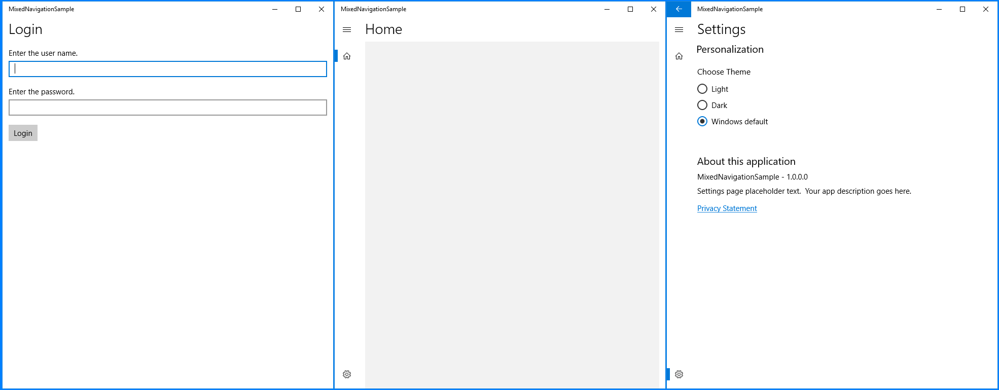

# App navigation

## NavigationService
The NavigationService is in charge of handling the navigation between app pages.

NavigationService has different implementation depending on the selected framework.
- **CodeBehind and MVVMBasic**
  - NavigationService is defined as a static class that uses Navigate method to navigate between pages using the target page type as a parameter.
- **MVVMLight**
  - ViewModelLocator creates the NavigationService instance and registers it with the instances container (SimpleIoC instances container). NavigationServices needs to register the ViewModel associated with each page to be able to navigate using the ViewModel as a parameter.

```csharp
private NavigationServiceEx _navigationService = new NavigationServiceEx();

public ViewModelLocator()
{
    ServiceLocator.SetLocatorProvider(() => SimpleIoc.Default);

    Register<HomeViewModel, HomePage>();
    SimpleIoc.Default.Register(() => _navigationService);
}
```

## Navigation initialization
**App.xaml.cs** creates the **ActivationService** including the current App instance, the default navigation target type (page type for CodeBehind and MVVMBasic or ViewModel type for MVVMLight) and also allows to set any UIElement as a **navigation shell**. If shell is null, current window content will be initialized as a Frame.

Default navigation target will be passed to DefaultLaunchActivationHandler to set de default page.

```csharp
protected override async Task HandleInternalAsync(LaunchActivatedEventArgs args)
{
    // When the navigation stack isn't restored navigate to the first page,
    // configuring the new page by passing required information as a navigation
    // parameter
    NavigationService.Navigate(_navElement, args.Arguments);

    await Task.CompletedTask;
}
```

## Understanding navigation on each project type
**Navigation** paradigm has any differences between different project types.
- **Blank** project type setups Window.Current.Content as a new Frame and navigates to the HomePage by default. NavigationService will do future navigations on this frame.
- **Navigation Pane** project type setups Window.Current.Content as a new ShellPage instance. This ShellPage will set NavigationService frame to an inner frame handled by NavigationPane and NavigationService will do future navigations on this frame.
You can find more on configuring code generated with this project type [here](./projectTypes/navigationpane.md).
- **Pivot and Tabs** project type setups Window.Current.Content as a new Frame and navigates to PivotPage that contains a PivotControl, this PivotControl contains one PivotItem for each page. PivotItems contains a header text and a Frame set to configurated page. On this project type, NavigationService has not the responsibility to navigate between pivot items, but NavigationService could navigate out of PivotPage if it would be necessary.


## Mixed navigation sample
In this sample we are going to create an app which includes a _startup page_ before navigate to SplitView shell page.
The following code is related to [MVVMBasic](../samples/navigation/MixedNavigationSample.MVVMBasic) framework, versions for [MVVMLight](../samples/navigation/MixedNavigationSample.MVVMLight) and [CodeBehind](../samples/navigation/MixedNavigationSample.CodeBehind) frameworks are available.

- Step 1. Navigate to Start Page on App.xaml.cs
```csharp
private ActivationService CreateActivationService()
{
  //This is the default navigation for a NavigationPane project type
  //return new ActivationService(this, typeof(Views.HomePage), new Views.ShellPage());

  //We are going to initialize navigation to a StartPage
  return new ActivationService(this, typeof(Views.StartPage));            
}
```
- Step 2. Navigate to a ShellPage (Shell page will replace NavigationService Frame to a custom Frame) and then navigate to HomePage
```csharp
public class StartViewModel : Observable
{
  public ICommand StartCommand { get; set; }

  public StartViewModel()
  {
    StartCommand = new RelayCommand(OnStart);
  }

  private void OnStart()
  {
    //Navigating to a ShellPage, this will replaces NavigationService frame for an inner frame to change navigation handling.
    NavigationService.Navigate<Views.ShellPage>();

    //Navigating now to a HomePage, this will be the first navigation on a NavigationPane menu
    NavigationService.Navigate<Views.HomePage>();
  }
}
```

Here is the navigation flow on this sample:



This sample is based on Windows Template Studio 1.3 release.