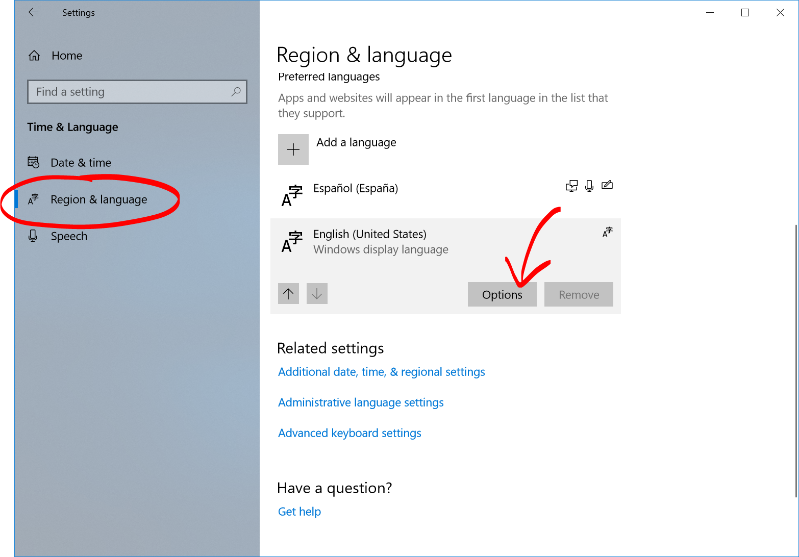
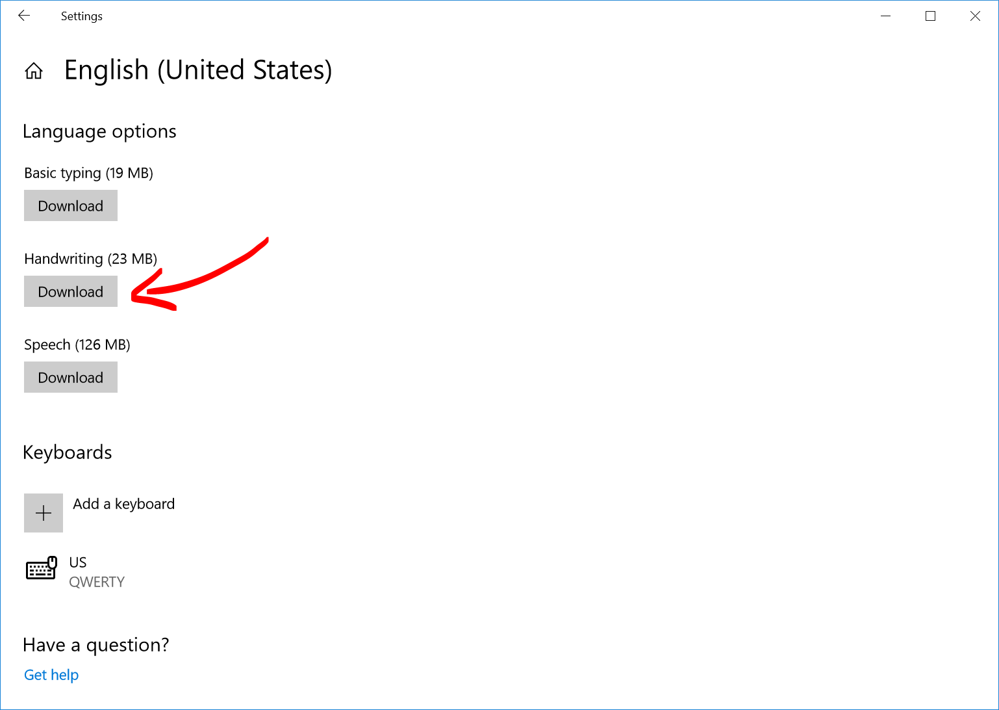
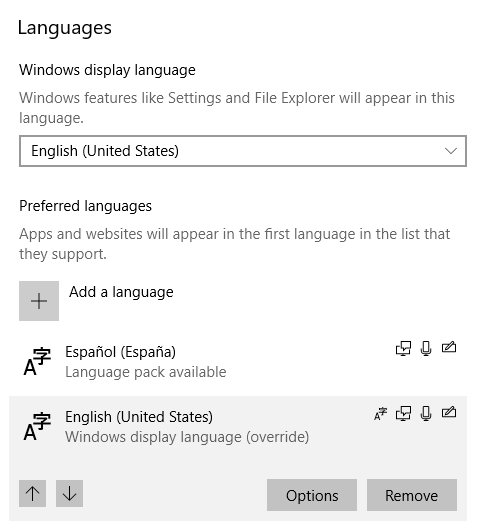

# Ink Pages documentation

## Feature Overview

WinTS includes three ink pages for different scenarios. The pages  include functionality that initially is most interesting for the pages purpose. As functionality is implemented in services, you can easily integrate functionality from one page into another.

Here is an overview of what is implemented where:

| |Ink Draw|Ink Smart Canvas|Ink Draw Picture|
|:--|:---:|:---:|:---:|
|Lasso selection|x|x| |
|Node selection||x||
|Move selection|x|x| |
|Copy/Paste|x| | ||
|Undo/Redo|x|x||
|Load/Save ink file|x|x|
|Open image|||x|
|Export as image|x| |x|
|Zoom|x ||x|
|Transform text/shape||x|

## More info

If you want to learn more about Windows Ink for UWP you can visit the official documentation:

- [Pen interactions and Windows Ink in UWP apps](https://docs.microsoft.com/windows/uwp/design/input/pen-and-stylus-interactions)
- [Inking controls](https://docs.microsoft.com/windows/uwp/design/controls-and-patterns/inking-controls)

You can also see the examples developed by Microsoft:

- [SimpleInk Example](https://github.com/Microsoft/Windows-universal-samples/tree/master/Samples/SimpleInk)
- [ComplexInk Example](https://github.com/Microsoft/Windows-universal-samples/tree/master/Samples/ComplexInk)

## Install Handwriting Recognition

InkAnalyzer (used in Smart Canvas Ink page) requires installation of Handwriting recognition in the active input language to recognize words. To install this, please follow these steps:

- Open Windows Settings and select Time & Language option.

- Select Region and Language. In the languages list, expand the language of which you want to recognize text and click on the Options button.

- In the Handwriting section, click on the download button and the download process will begin.

- Return to the previous window and verify that the Handwriting option has been installed correctly.

