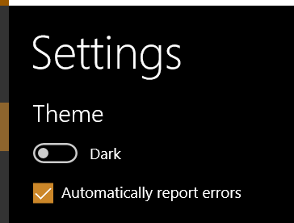

# Settings Page (Code Behind)

:heavy_exclamation_mark: There is also a version of [this document with code samples in C#](./settings-codebehind.md) :heavy_exclamation_mark: |
---------------------------------------------------------------------------------------------------------------------------------------------- |

By default the settings page contains a single boolean setting to track whether the app should be displayed with the Light or Dark theme.

## Add another boolean setting

Add the following below the `StackPanel` containing the `RadioButton`s in **SettingsView.xaml**

```xml
<CheckBox IsChecked="{x:Bind IsAutoErrorReportingEnabled, Mode=OneWay}"
          x:Uid="Settings_EnableAutoErrorReporting"
          Checked="CheckBoxChecked"
          Unchecked="CheckBoxUnchecked"
          Margin="0,8,0,0" />
```

Add an entry to **Strings/en-us/Resources.resw**

Name: **Settings_EnableAutoErrorReporting.Content**

Value: **Automatically report errors**

When run it will now look like this:



But if you try and run it now you will get build errors as the code behind file hasn't been updated to add the new property and event handlers.

### Update the code behind file

If using the Blank or NavigationView project types.

In **SettingsPage.xaml.vb**, change the `OnNavigatedTo` method to be like this

```vb
Protected Overrides Async Sub OnNavigatedTo(ByVal e As NavigationEventArgs)
    Initialize()
    IsAutoErrorReportingEnabled = Await Windows.Storage.ApplicationData.Current.LocalSettings.ReadAsync(Of Boolean)(NameOf(IsAutoErrorReportingEnabled))
End Sub
```

If using the Pivot&Tabs project type.

In **SettingsPage.xaml.vb**, change the `OnLoaded` and `Initialize` methods to be like this

```vb
Private Async Sub OnLoaded(ByVal sender As Object, ByVal e As RoutedEventArgs)
    Await InitializeAsync()
End Sub

Private Async Function InitializeAsync() As Task
    VersionDescription = GetVersionDescription()
    IsAutoErrorReportingEnabled = Await Windows.Storage.ApplicationData.Current.LocalSettings.ReadAsync(Of Boolean)(NameOf(IsAutoErrorReportingEnabled))
End Function
```

For all project types, also add the following to **SettingsPage.xaml.vb**.

```vb
Imports {YourAppName}.Helpers

Private _isAutoErrorReportingEnabled As Boolean

Public Property IsAutoErrorReportingEnabled As Boolean?
    Get
        Return _isAutoErrorReportingEnabled
    End Get

    Set(ByVal value As Boolean?)
        [Set](_isAutoErrorReportingEnabled, CBool(value))
    End Set
End Property

Private Async Sub CheckBoxChecked(ByVal sender As Object, ByVal e As Windows.UI.Xaml.RoutedEventArgs)
    Await Windows.Storage.ApplicationData.Current.LocalSettings.SaveAsync(NameOf(IsAutoErrorReportingEnabled), True)
End Sub

Private Async Sub CheckBoxUnchecked(ByVal sender As Object, ByVal e As Windows.UI.Xaml.RoutedEventArgs)
    Await Windows.Storage.ApplicationData.Current.LocalSettings.SaveAsync(NameOf(IsAutoErrorReportingEnabled), False)
End Sub
```

### Accessing the setting from elsewhere in the app

If you want to access the property elsewhere in the app, the easiest way to do this is to read the setting directly. The code below reads the value into a variable called `isEnabled` which you can then query as needed.

```vb
Dim isEnabled = Await Helpers.SettingsStorageExtensions.ReadAsync(Of Boolean)(Windows.Storage.ApplicationData.Current.LocalSettings, "IsAutoErrorReportingEnabled")
```
