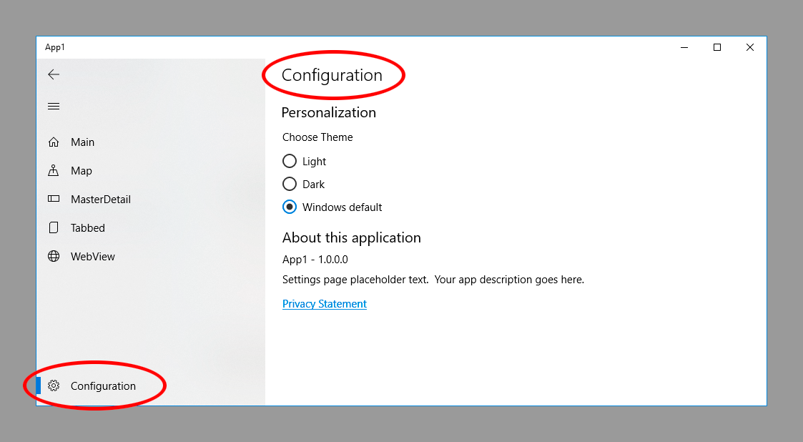

# Navigation Pane

:heavy_exclamation_mark: There is also a version of [this document with code samples in C#](./navigationpane.md) :heavy_exclamation_mark: |
------------------------------------------------------------------------------------------------------------------------------------------------ |

The navigation pane project type includes a navigation menu displayed in a panel at the side of the screen and which can be expanded with the Hamburger icon.

This document covers:

- [Modifying the menu items](#modifying-the-menu-items)
- [Using the NavigationViewHeaderBehavior](#NavigationViewHeaderBehavior)
- [Invoke code on NavigationView](#invoke-code-on-navigationview)
- [Change the text for Settings](#change-the-text-for-settings)

To update to Win UI Navigation View from Hamburger Menu read the following [document](./updatetonavigationview.md).

To update to Win UI Navigation View from Navigation View read the following [document](./updatetowinuinavigationview.md).

## Modifying the menu items

The menu can be modified in the following ways.

- Change the icon for an NavigationViewItem in the menu.
- Change the text for an NavigationViewItem in the menu.

### Change the icon for an item

By default every NavigationViewItem is displayed with the symbol for a document.
When every item has the same icon it is hard to differentiate between them when the NavigationView is collapsed. In almost all cases you will want to change the icon used.


Navigate to `Views/ShellPage.xaml` and change the `NavigationViewItems` in the `NavigationView MenuItems` property.

The code below shows the symbols used to create the app shown in the image above.

```xml
<winui:NavigationView.MenuItems>
    <!--
    TODO WTS: Change the symbols for each item as appropriate for your app
    More on Segoe UI Symbol icons: https://docs.microsoft.com/windows/uwp/style/segoe-ui-symbol-font
    Or to use an IconElement instead of a Symbol see https://github.com/Microsoft/WindowsTemplateStudio/blob/master/docs/projectTypes/navigationpane.md
    Edit String/en-US/Resources.resw: Add a menu item title for each page
    -->
    <winui:NavigationViewItem x:Uid="Shell_Main" Icon="Home" helpers:NavHelper.NavigateTo="views:MainPage" />
    <winui:NavigationViewItem x:Uid="Shell_Map" Icon="Map" helpers:NavHelper.NavigateTo="views:MapPage" />
    <winui:NavigationViewItem x:Uid="Shell_MasterDetail" Icon="DockLeft" helpers:NavHelper.NavigateTo="views:MasterDetailPage" />
    <winui:NavigationViewItem x:Uid="Shell_Tabbed" Icon="Document" helpers:NavHelper.NavigateTo="views:TabbedPage" />
    <winui:NavigationViewItem x:Uid="Shell_WebView" Icon="Globe" helpers:NavHelper.NavigateTo="views:WebViewPage" />
</winui:NavigationView.MenuItems>
```

The icons are created using the `Windows.UI.Xaml.Controls.Symbol` enumeration. You can view all the symbols available at <https://docs.microsoft.com/uwp/api/windows.ui.xaml.controls.symbol>

You can also set the menu item to use an `IconElement` directly. Like this:

```xml
<winui:NavigationView.MenuItems>
    <winui:NavigationViewItem x:Uid="Shell_Main" helpers:NavHelper.NavigateTo="views:MainPage">
        <winui:NavigationViewItem.Icon>
            <FontIcon FontFamily="Segoe MDL2 Assets" Glyph="&#xE707;" />
        </winui:NavigationViewItem.Icon>
    </winui:NavigationViewItem>
</winui:NavigationView.MenuItems>
```

### Change the text for an item

The text for a shell navigation item comes from the localized string resources. For an item which defines the x:Uid `Shell_Main` the value `Shell_Main.Content` corresponds with an entry in `Resources.resw`. Change the value in the resources file to alter what is displayed in the NavigationView.

## NavigationViewHeaderBehavior

The navigation pane projects add a Behavior to the NavigationView that allows different pages to customize or hide the Header when that page is shown.

### Initial Configuration

The `NavigationViewHeaderBehavior` includes two properties, `DefaultHeader` and `DefaultHeaderTemplate` that will define the content and layout of `NavigationView` `Header` by default.

```xml
<behaviors:NavigationViewHeaderBehavior
    DefaultHeader="{x:Bind ViewModel.Selected.Content, Mode=OneWay}">
    <behaviors:NavigationViewHeaderBehavior.DefaultHeaderTemplate>
        <DataTemplate>
            <Grid>
                <TextBlock
                    Text="{Binding}"
                    Style="{ThemeResource TitleTextBlockStyle}"
                    Margin="{StaticResource SmallLeftRightMargin}" />
            </Grid>
        </DataTemplate>
    </behaviors:NavigationViewHeaderBehavior.DefaultHeaderTemplate>
</behaviors:NavigationViewHeaderBehavior>
```

Each page can overwrite three properties of the `NavigationViewHeaderBehavior`:

- `HeaderMode`: allows you to choose when to display the Header on that page (`Always`, `Minimal`,`Never`), Always is the default value.
- `HeaderContext`: contains the data that will be available for use from the `HeaderTemplate`.
- `HeaderTemplate`: `DataTemplate` that personalizes the layout of the header.

`HeaderMode="Never"` allows the page to hide the `Header` and occupy the whole window. You can see an example of how to use `HeaderMode="Never"` in the MapPage. If you use this mode the NavigationView Buttons will overlap with your content in small window sizes.

`HeaderMode="Minimal"` allows the page to hide the `Header` and occupy the entire window, except when the `NavigationView` hides the navigation pane, with a window width less than `641px`. This mode avoids overlapping of Navigation View buttons with the content.
You can see an example of how to use `HeaderMode="Minimal"` in WebViewPage.

In the following example, we'll see how to modify the `Header` in a `MainPage` in order to add a CommandBar.

```xml
<Page
    x:Class="YourAppName.Views.MainPage"
    xmlns="http://schemas.microsoft.com/winfx/2006/xaml/presentation"
    xmlns:x="http://schemas.microsoft.com/winfx/2006/xaml"
    xmlns:d="http://schemas.microsoft.com/expression/blend/2008"
    xmlns:mc="http://schemas.openxmlformats.org/markup-compatibility/2006"
    xmlns:behaviors="using:YourAppName.Behaviors"
    xmlns:viewModels="using:YourAppName.ViewModels"
    Style="{StaticResource PageStyle}"
    mc:Ignorable="d">

    <behaviors:NavigationViewHeaderBehavior.HeaderTemplate>
        <DataTemplate x:DataType="viewModels:MainViewModel">
            <CommandBar
                Background="{ThemeResource ApplicationPageBackgroundThemeBrush}"
                Foreground="{ThemeResource ApplicationForegroundThemeBrush}">
                <CommandBar.Content>
                    <!--Get MainPageTitle.Text from localized resources-->
                    <TextBlock x:Uid="MainPageTitle" />
                </CommandBar.Content>

                <!--All your AppBar buttons-->
                <!--Get SendAppBarButton.Label from localized resources-->
                <AppBarButton x:Uid="SendAppBarButton" Icon="Send" />

            </CommandBar>
        </DataTemplate>
    </behaviors:NavigationViewHeaderBehavior.HeaderTemplate>

    <Grid
        x:Name="ContentArea"
        Margin="{StaticResource MediumLeftRightMargin}">
        <Grid
            Background="{ThemeResource SystemControlPageBackgroundChromeLowBrush}">
            <!--The SystemControlPageBackgroundChromeLowBrush background represents where you should place your content.
                Place your content here.-->
        </Grid>
    </Grid>
</Page>
```

We are going to associate the `HeaderContext` to the ViewModel of the page in order to use the Command. We will do this from the code of the page.

```vb
Dim headerContextBinding As Binding = new Binding()
headerContextBinding.Source = Me
headerContextBinding.Mode = BindingMode.OneWay

SetBinding(NavigationViewHeaderBehavior.HeaderContextProperty, headerContextBinding
```

You can see an example of an advanced use of `CommandBar` and `NavigationViewHeaderBehavior` in the InkPages in WinTS.

When using MVVMBasic, MVVMLight, Caliburn or Prism, you can use x:Bind to bind properties to your ViewModel, associated to the HeaderContext.

When using CodeBehind, the HeaderContext is associated to the page's code behind file and x:Bind is not working correctly. More info on issue [2711](https://github.com/Microsoft/WindowsTemplateStudio/issues/2711)

We're working on a solution with the NavView team, meanwhile you can use Binding and access the CodeBehind properties through the shellFrame's Content as the Datatemplate is executed in the Context of the NavigationView.

```xml
Text="{Binding Content.PropertyOnCodeBehind, ElementName=shellFrame, Mode=TwoWay}">
```

If you want to be able to add a command bar at ShellPage level, you can add it in the `DefaultHeaderTemplate` of the `NavigationViewHeaderBehavior` (ShellPage.xaml).

**A Note about the above code examples.**

Events and commands are not shown in the above code but can easily be added like any other button click event or command. Note that if using the techniques for adding the bar to every page, the events or commands should be handled by the ShellPageViewModel (or in ShellPage.xaml.vb if using CodeBehind.)

The examples also only show a single `AppBarButton` being added. This is to keep the code sample as simple as possible but you can add any appropriate content to the bar, as [documented here](https://docs.microsoft.com/windows/uwp/controls-and-patterns/app-bars).

## Invoke code on NavigationView

Extending the app to add this functionality requires making two changes.

1. Add a HyperLink in the FooterTemplate.
2. Add a Command to handle code on HyperLink click.

**ShellPage.xaml**

```xml
<winui:NavigationView>
    <winui:NavigationView.PaneFooter>
        <StackPanel>
            <HyperlinkButton
                x:Uid="Shell_ShowInfo"
                Margin="16,0"
                Command="{x:Bind ViewModel.ShowInfoCommand}" />
        </StackPanel>
    </winui:NavigationView.PaneFooter>
</winui:NavigationView>
```

Add a command to run the code in `ShellViewModel.vb` (MVVMBasic or MVVMLight) or `ShellPage.xaml.vb` (CodeBehind)

```vb
     Private _showInfoCommand as ICommand
    Public Property ShowInfoCommand As ICommand
        Get
            Return If(_showInfoCommand, (__InlineAssignHelper(_showInfoCommand, New RelayCommand(OnShowInfo)))
        End Get
    End Property

    Private Sub OnShowInfo()
        'TODO: Run command code
    End Sub
```

## Change the text for Settings

The text label for the Settings page is supplied by the OS. This includes any translations, but it is possible to call this page something else.

Add a new resource with the name `Shell_SettingsItem`. (You can call it anything but it must match what's in the code below and it _must not_ contain a period (.).)

In `Shell.xaml.vb`modify the constructor so it matches this (add the loaded event handler)

```vb
Public Sub New()
    InitializeComponent()
    DataContext = Me
    Initialize()

    AddHandler Me.navigationView.Loaded, Sub(sender, e)
                            TryCast(Me.navigationView.SettingsItem, WinUI.NavigationViewItem).Content = "Shell_SettingsItem".GetLocalized()
                        End Sub
End Sub
```

The above will result in the text you specify being used in the app, like the one below.


