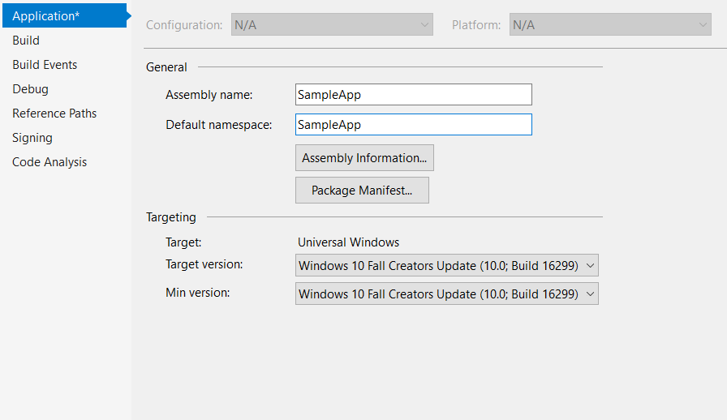

# Update from HamburgerMenu to NavigationView in MVVM Basic
If you have an UWP project created with WTS with project type **NavigationPane** and framework **MVVM Basic**  please follow these steps to update to NavigationView:

## 1. Update min target version in project properties
NavigationView is a Fall Creators Update control, to start using it in your project is neccessary that you set FCU as min version.


## 2. Update ShellPage.xaml
The updated ShellPage will include the NavigationView and add the MenuItems directly in Xaml. The NavigationViewItems include an extension property that contains the target page type to navigate in the frame.

### XAML code you will have to remove:
 - **xmln namespaces** for fcu, cu, controls and vm (viewmodels).
 - DataTemplate **NavigationMenuItemDataTemplate** in Page resources.
 - **HamburgerMenu** control.

### XAML code you will have to add:
- **namespaces**: xmlns:helpers="using:myAppNamespace.Helpers" and xmlns:views="using:myAppNamespace.Views"
 - **NavigationView** control.
 - **MenuItems** inside of the NavigationView.
 - **HeaderTemplate** inside of the NavigationView.

 The resulting code should look like this:

```xml
<Page
    x:Class="SampleApp.Views.ShellPage"
    xmlns="http://schemas.microsoft.com/winfx/2006/xaml/presentation"
    xmlns:x="http://schemas.microsoft.com/winfx/2006/xaml"
    xmlns:d="http://schemas.microsoft.com/expression/blend/2008"
    xmlns:mc="http://schemas.openxmlformats.org/markup-compatibility/2006"
    xmlns:helpers="using:SampleApp.Helpers"
    xmlns:views="using:SampleApp.Views"
    xmlns:ic="using:Microsoft.Xaml.Interactions.Core"
    xmlns:i="using:Microsoft.Xaml.Interactivity"
    mc:Ignorable="d">

    <NavigationView
        x:Name="navigationView"
        SelectedItem="{x:Bind ViewModel.Selected, Mode=OneWay}"
        Header="{x:Bind ViewModel.Selected.Content, Mode=OneWay}"
        IsSettingsVisible="False"
        Background="{ThemeResource SystemControlBackgroundAltHighBrush}">
        <NavigationView.MenuItems>
            <!--
            TODO WTS: Change the symbols for each item as appropriate for your app
            More on Segoe UI Symbol icons: https://docs.microsoft.com/windows/uwp/style/segoe-ui-symbol-font
            Or to use an IconElement instead of a Symbol see https://github.com/Microsoft/WindowsTemplateStudio/blob/master/docs/projectTypes/navigationpane.md
            Edit String/en-US/Resources.resw: Add a menu item title for each page
            -->
            <NavigationViewItem x:Uid="Shell_Main" Icon="Document"  helpers:NavHelper.NavigateTo="views:MainPage" />
        </NavigationView.MenuItems>
        <NavigationView.HeaderTemplate>
            <DataTemplate>
                <TextBlock
                    Style="{StaticResource TitleTextBlockStyle}"
                    Margin="12,0,0,0"
                    VerticalAlignment="Center"
                    Text="{Binding}" />
            </DataTemplate>
        </NavigationView.HeaderTemplate>
        <i:Interaction.Behaviors>
            <ic:EventTriggerBehavior EventName="ItemInvoked">
                <ic:InvokeCommandAction Command="{x:Bind ViewModel.ItemInvokedCommand}" />
            </ic:EventTriggerBehavior>
        </i:Interaction.Behaviors>
        <Grid>
            <Frame x:Name="shellFrame" />
        </Grid>
    </NavigationView>
</Page>
```
## 3. Update ShellPage.xaml.cs
ShellViewModel will need the NavigationView instance (explained below), you will have to add it on initialization.

### C# code you will have to modify:
 - Add the navigationView control to ViewModel initialization.

The resulting code should look like this:
 ```csharp
public sealed partial class ShellPage : Page
{
    public ShellViewModel ViewModel { get; } = new ShellViewModel();

    public ShellPage()
     {
        InitializeComponent();
        HideNavViewBackButton();
        DataContext = ViewModel;
        ViewModel.Initialize(shellFrame, navigationView);
    }

    private void HideNavViewBackButton()
    {
        if (ApiInformation.IsApiContractPresent("Windows.Foundation.UniversalApiContract", 6))
        {
            navigationView.IsBackButtonVisible = NavigationViewBackButtonVisible.Collapsed;
        }
    }
}
```

## 4. Add NavHelper.cs

Add this extension class in the **Helpers** folder to the project. This allows the NavigationViewItems to contain a Type property that is used for navigation.
```csharp
public class NavHelper
{
    public static Type GetNavigateTo(NavigationViewItem item)
    {
        return (Type)item.GetValue(NavigateToProperty);
    }

    public static void SetNavigateTo(NavigationViewItem item, Type value)
    {
        item.SetValue(NavigateToProperty, value);
    }

    public static readonly DependencyProperty NavigateToProperty =
        DependencyProperty.RegisterAttached("NavigateTo", typeof(Type), typeof(NavHelper), new PropertyMetadata(null));
}
```

## 5. Update ShellViewModel.cs
ShellViewModel's complexity will be reduced significantly, these are the changes that you will have to implement on the class.
### C# code you will have to remove:
 - private **const properties** for Visual States (Panoramic, Wide, Narrow).
 - private field **_lastSelectedItem**
 - **IsPaneOpen** observable property.
 - **DisplayMode** observable property.
 - **ObservableCollections** properties for **PrimaryItems** and **SecondaryItems**.
 - **OpenPaneCommand**.
 - **ItemSelectedCommand** and handler method **ItemSelected**.
 - **StateChangedCommand** and handler method **GoToState**.
 - **PopulateNavItems** method and method call from Initialize.
 - **InitializeState** method and method call from Initialize.
 - **Navigate** and **ChangeSelected** methods.

### C# code you will have to add _(implementation below)_:
 - **_navigationView** private property of type NavigationView.
 - **ItemInvokedCommand** and handler method **OnItemInvoked**.
 - **IsMenuItemForPageType** method.

### C# code you will have to update _(implementation below)_:
 - **Initialize** method.
 - **Frame_Navigated** method with the implementation below.

 The resulting code should look like this:
```csharp
public class ShellViewModel : Observable
{
    private NavigationView _navigationView;
    private NavigationViewItem _selected;
    private ICommand _itemInvokedCommand;

    public NavigationViewItem Selected
    {
        get { return _selected; }
        set { Set(ref _selected, value); }
    }

    public ICommand ItemInvokedCommand => _itemInvokedCommand ?? (_itemInvokedCommand = new RelayCommand<NavigationViewItemInvokedEventArgs>(OnItemInvoked));

    public ShellViewModel()
    {
    }

    public void Initialize(Frame frame, NavigationView navigationView)
    {
        _navigationView = navigationView;
        NavigationService.Frame = frame;
        NavigationService.Navigated += Frame_Navigated;
    }

    private void OnItemInvoked(NavigationViewItemInvokedEventArgs args)
    {
        var item = _navigationView.MenuItems
                        .OfType<NavigationViewItem>()
                        .First(menuItem => (string)menuItem.Content == (string)args.InvokedItem);
        var pageType = item.GetValue(NavHelper.NavigateToProperty) as Type;
        NavigationService.Navigate(pageType);
    }

    private void Frame_Navigated(object sender, NavigationEventArgs e)
    {
        Selected = _navigationView.MenuItems
                        .OfType<NavigationViewItem>()
                        .FirstOrDefault(menuItem => IsMenuItemForPageType(menuItem, e.SourcePageType));
    }

    private bool IsMenuItemForPageType(NavigationViewItem menuItem, Type sourcePageType)
    {
        var pageType = menuItem.GetValue(NavHelper.NavigateToProperty) as Type;
        return pageType == sourcePageType;
    }
}
```

## 6. Remove ShellNavigationItem.cs
ShellNavigationItem is no longer used and you should remove it from the project.

## 7. Update XAML code for all pages
The pages do no longer need the TitlePage TextBlock and the Adaptive triggers, because the page title will be displayed on the NavigationView HeaderTemplate and the responsive behaviors will be added by NavigationView control.

### XAML code you will have to remove:
 - **xmln namespaces** for fcu and cu.
 - Textblock **TitlePage**
 - ContentArea Grid **RowDefinitions**
 - VisualStateManager **VisualStateGroups**.
 - **Grid.Row="1"** property  in the content Grid.

The resulting code should look like this:
```xml
<Page
    x:Class="SampleApp.Views.MainPage"
    xmlns="http://schemas.microsoft.com/winfx/2006/xaml/presentation"
    xmlns:x="http://schemas.microsoft.com/winfx/2006/xaml"
    xmlns:d="http://schemas.microsoft.com/expression/blend/2008"
    xmlns:mc="http://schemas.openxmlformats.org/markup-compatibility/2006"
    Style="{StaticResource PageStyle}"
    mc:Ignorable="d">
    <Grid
        x:Name="ContentArea"
        Margin="{StaticResource MediumLeftRightMargin}">
        <Grid
            Background="{ThemeResource SystemControlPageBackgroundChromeLowBrush}">
            <!--The SystemControlPageBackgroundChromeLowBrush background represents where you should place your content. 
                Place your content here.-->
        </Grid>
    </Grid>
</Page>
```
## 8. Update Navigation View item name for all pages in Resources.resw
As NavigationItems and their names are defined in xaml now, you need to add `.Content` to each of the navigation view item names.
(_for example `Shell_Main` should be changed to `Shell_Main.Content`_)

## 9. Settings Page
If your project contains a SettingsPage you must perform the following steps:
- On **ShellPage.xaml** change **IsSettingsVisible** property to true.
- On **ShellViewModel.cs** go to **OnItemInvoked** method and add to the beginning:
```csharp
if (args.IsSettingsInvoked)
{
    NavigationService.Navigate(typeof(SettingsPage));
    return;
}
```

- On **ShellViewModel.cs** go to **Frame_Navigated** method and add to the beginning:
```csharp
if (e.SourcePageType == typeof(SettingsPage))
{
	Selected = _navigationView.SettingsItem as NavigationViewItem;
	return;
}
```

