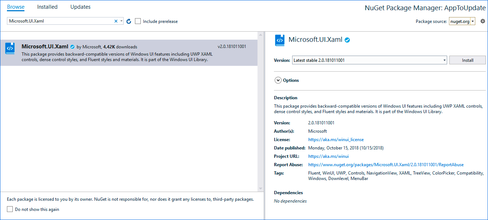

# Update from HamburgerMenu to WinUI NavigationView in MVVM Basic

If you have an UWP project created with WinTS with project type **NavigationPane** and framework **MVVM Basic**  please follow these steps to update to WinUI NavigationView:

## 1. Update target version in project properties

Windows UI library requires 17763 as target version in the project, to start using Windows UI in your project is necessary that you set 17763 as target version.


## 2. Add the Nuget package reference

Add the Windows UI Library Nuget Package Reference (Microsoft.UI.Xaml):



## 3. Changes in App.xaml

Add the WinUI Xaml Resources dictionary to the MergedDictionaries:

```xml
<ResourceDictionary.MergedDictionaries>

    <!--Add WinUI resources dictionary-->
    <XamlControlsResources  xmlns="using:Microsoft.UI.Xaml.Controls"/>
    <!-- ··· -->
    <!--Other resources dictionaries-->

</ResourceDictionary.MergedDictionaries>
```

## 4. Changes in ActivationService.vb

Remove the code to manage back navigation from ActivationService, this code will later be added to the ShellPage.

### VB code you will have to remove:

- `SystemNavigationManager BackRequested` and `NavigationService NavigationFailed` and `Navigated` events handlers registration code inside `ActivateAsync` method.
- `ActivationService_BackRequested` and `Frame_Navigated` methods.
- Remove unused `Imports statements`.

The resulting code should look like this:

(Code in methods: `ActivateFromShareTargetAsync`, `InitializeAsync`, `StartupAsync` and `GetActivationHandlers` might change depending on the pages/features you used. `ActivateFromShareTargetAsync` will appears in ActivationService only if you have added ShareTarger feature.)

```vb
Imports Windows.System
Imports Windows.UI.Core

Imports YourAppName.Activation

Namespace Services
    ' For more information on application activation see https://github.com/Microsoft/WindowsTemplateStudio/blob/master/docs/activation.vb.md
    Friend Class ActivationService
        Private ReadOnly _app As App
        Private ReadOnly _shell As Lazy(Of UIElement)
        Private ReadOnly _defaultNavItem As Type

        Public Sub New(app As App, defaultNavItem As Type, Optional shell As Lazy(Of UIElement) = Nothing)
            _app = app
            _shell = shell
            _defaultNavItem = defaultNavItem
        End Sub

        Public Async Function ActivateAsync(activationArgs As Object) As Task
            If IsInteractive(activationArgs) Then
                ' Initialize things like registering background task before the app is loaded
                Await InitializeAsync()

                ' Do not repeat app initialization when the Window already has content,
                ' just ensure that the window is active
                If Window.Current.Content Is Nothing Then
                    ' Create a Frame to act as the navigation context and navigate to the first page
                    Window.Current.Content = If(_shell?.Value, New Frame())
                End If
            End If

            Dim activationHandler = GetActivationHandlers().FirstOrDefault(Function(h) h.CanHandle(activationArgs))

            If activationHandler IsNot Nothing Then
                Await activationHandler.HandleAsync(activationArgs)
            End If

            If IsInteractive(activationArgs) Then
                Dim defaultHandler = New DefaultLaunchActivationHandler(_defaultNavItem)
                If defaultHandler.CanHandle(activationArgs) Then
                    Await defaultHandler.HandleAsync(activationArgs)
                End If

                ' Ensure the current window is active
                Window.Current.Activate()

                ' Tasks after activation
                Await StartupAsync()
            End If
        End Function

        Private Async Function InitializeAsync() As Task
             ' Here your Initialize actions
        End Function

        Private Async Function StartupAsync() As Task
             ' Here your StartUp actions
        End Function

        Private Iterator Function GetActivationHandlers() As IEnumerable(Of ActivationHandler)
            ' Here your ActivationHandlers
            Exit Function
        End Function

        Private Function IsInteractive(args As Object) As Boolean
            Return TypeOf args Is IActivatedEventArgs
        End Function
    End Class
End Namespace
```

## 5. Changes in _Thickness.xaml

Update and add new Margins that will be used in pages.

### Thickness values you will have to update.

```xml
<Thickness x:Key="MediumLeftRightMargin">24,0,24,0</Thickness>
<Thickness x:Key="MediumLeftTopRightBottomMargin">24,24,24,24</Thickness>
```

### Thickness values you will have to add.

```xml
<!--Medium size margins-->
<Thickness x:Key="MediumTopMargin">0,24,0,0</Thickness>
<Thickness x:Key="MediumBottomMargin">0,0,24,0</Thickness>

<!--Small size margins-->
<Thickness x:Key="SmallLeftMargin">12, 0, 0, 0</Thickness>
<Thickness x:Key="SmallTopMargin">0, 12, 0, 0</Thickness>
<Thickness x:Key="SmallTopBottomMargin">0, 12, 0, 12</Thickness>
<Thickness x:Key="SmallLeftRightMargin">12, 0, 12, 0</Thickness>

<!--Extra Small size margins-->
<Thickness x:Key="ExtraSmallTopMargin">0, 8, 0, 0</Thickness>
```

## 6. Add NavigationViewHeaderBehavior.vb

This behavior allows the NavigationView to hide or customize the NavigationViewHeader depending on the page that is shown, you can read more about this behavior [here](../navigationpane.vb.md). Add the following NavigationViewHeaderBehavior class to the Behaviors folder, if your solution doesn't have a Behaviors folder you will have to add it.

```vb
Imports Microsoft.Xaml.Interactivity

Imports Windows.UI.Xaml
Imports Windows.UI.Xaml.Controls
Imports Windows.UI.Xaml.Navigation

Imports WinUI = Microsoft.UI.Xaml.Controls

Imports YourAppName.Services

Namespace Behaviors
    Public Class NavigationViewHeaderBehavior
        Inherits Behavior(Of WinUI.NavigationView)

        Private Shared _current As NavigationViewHeaderBehavior
        Private _currentPage As Page

        Public Property DefaultHeaderTemplate As DataTemplate

        Public Property DefaultHeader As Object
            Get
                Return GetValue(DefaultHeaderProperty)
            End Get
            Set(value As Object)
                SetValue(DefaultHeaderProperty, value)
            End Set
        End Property

        Public Shared ReadOnly DefaultHeaderProperty As DependencyProperty = DependencyProperty.Register("DefaultHeader", GetType(Object), GetType(NavigationViewHeaderBehavior), New PropertyMetadata(Nothing, Sub(d, e) _current.UpdateHeader()))

        Public Shared Function GetHeaderMode(item As Page) As NavigationViewHeaderMode
            Return CType(item.GetValue(HeaderModeProperty), NavigationViewHeaderMode)
        End Function

        Public Shared Sub SetHeaderMode(item As Page, value As NavigationViewHeaderMode)
            item.SetValue(HeaderModeProperty, value)
        End Sub

        Public Shared ReadOnly HeaderModeProperty As DependencyProperty = DependencyProperty.RegisterAttached("HeaderMode", GetType(Boolean), GetType(NavigationViewHeaderBehavior), New PropertyMetadata(NavigationViewHeaderMode.Always, Sub(d, e) _current.UpdateHeader()))

        Public Shared Function GetHeaderContext(item As Page) As Object
            Return item.GetValue(HeaderContextProperty)
        End Function

        Public Shared Sub SetHeaderContext(item As Page, value As Object)
            item.SetValue(HeaderContextProperty, value)
        End Sub

        Public Shared ReadOnly HeaderContextProperty As DependencyProperty = DependencyProperty.RegisterAttached("HeaderContext", GetType(Object), GetType(NavigationViewHeaderBehavior), New PropertyMetadata(Nothing, Sub(d, e) _current.UpdateHeader()))

        Public Shared Function GetHeaderTemplate(item As Page) As DataTemplate
            Return CType(item.GetValue(HeaderTemplateProperty), DataTemplate)
        End Function

        Public Shared Sub SetHeaderTemplate(item As Page, value As DataTemplate)
            item.SetValue(HeaderTemplateProperty, value)
        End Sub

        Public Shared ReadOnly HeaderTemplateProperty As DependencyProperty = DependencyProperty.RegisterAttached("HeaderTemplate", GetType(DataTemplate), GetType(NavigationViewHeaderBehavior), New PropertyMetadata(Nothing, Sub(d, e) _current.UpdateHeaderTemplate()))

        Protected Overrides Sub OnAttached()
            MyBase.OnAttached()
            _current = Me
            AddHandler NavigationService.Navigated, AddressOf OnNavigated
        End Sub

        Private Sub OnNavigated(sender As Object, e As NavigationEventArgs)
            Dim frame = TryCast(sender, Frame)
            Dim page = TryCast(frame.Content, Page)

            If page IsNot Nothing Then
                _currentPage = page
                UpdateHeader()
                UpdateHeaderTemplate()
            End If
        End Sub

        Private Sub UpdateHeader()
            If _currentPage IsNot Nothing Then
                Dim headerMode = GetHeaderMode(_currentPage)

                If headerMode = NavigationViewHeaderMode.Never Then
                    AssociatedObject.Header = Nothing
                    AssociatedObject.AlwaysShowHeader = False
                Else
                    Dim headerFromPage = GetHeaderContext(_currentPage)

                    If headerFromPage IsNot Nothing Then
                        AssociatedObject.Header = headerFromPage
                    Else
                        AssociatedObject.Header = DefaultHeader
                    End If

                    If headerMode = NavigationViewHeaderMode.Always Then
                        AssociatedObject.AlwaysShowHeader = True
                    Else
                        AssociatedObject.AlwaysShowHeader = False
                    End If
                End If
            End If
        End Sub

        Private Sub UpdateHeaderTemplate()
            If _currentPage IsNot Nothing Then
                Dim headerTemplate = GetHeaderTemplate(_currentPage)
                AssociatedObject.HeaderTemplate = If(headerTemplate, DefaultHeaderTemplate)
            End If
        End Sub
    End Class
End Namespace

```

## 7. Add NavigationViewHeaderMode.vb

Add the NavigationViewHeaderBehavior enum to the Behaviors folder.

```vb
Namespace Behaviors
    Public Enum NavigationViewHeaderMode
        Always
        Never
        Minimal
    End Enum
End Namespace
```

## 8. Add NavHelper.vb

Add this extension class to the **Helpers** folder to the project. This allows the Windows UI NavigationViewItems to contain a Type property that is used for navigation.

```vb
Imports Microsoft.UI.Xaml.Controls

Namespace Helpers
    Public Class NavHelper

        Public Shared Function GetNavigateTo(item As NavigationViewItem) As Type
            Return CType(item.GetValue(NavigateToProperty), Type)
        End Function

        Public Shared Sub SetNavigateTo(item As NavigationViewItem, value As Type)
            item.SetValue(NavigateToProperty, value)
        End Sub

        Public Shared ReadOnly NavigateToProperty As DependencyProperty =
           DependencyProperty.RegisterAttached("NavigateTo", GetType(Type), GetType(NavHelper), New PropertyMetadata(Nothing))
    End Class
End Namespace
```

## 9. Changes in ShellPage.xaml

The updated ShellPage will include the WinUI NavigationView and add the MenuItems directly in Xaml. The NavigationViewItems include an extension property that contains the target page type to navigate in the frame.

### XAML code you will have to remove:

- xml namespaces for `fcu`, `cu`, `controls` and `vm` (viewmodels).
- `NavigationMenuItemDataTemplate` DataTemplate in Page resources.
- `HamburgerMenu` control.

### XAML code you will have to add:

- The following xml namespaces:

```xml
xmlns:winui="using:Microsoft.UI.Xaml.Controls"
xmlns:behaviors="using:YourAppName.Behaviors"
xmlns:helpers="using:YourAppName.Helpers"
xmlns:views="using:YourAppName.Views"
```

- `winui:NavigationView` control.
- `winui:NavigationViewItem` MenuItems inside of the `winui:NavigationView`.
- `NavigationViewHeaderBehavior` behavior inside of the `winui:NavigationView`.

The resulting code should look like this:

```xml
<Page
    x:Class="SampleApp.Views.ShellPage"
    xmlns="http://schemas.microsoft.com/winfx/2006/xaml/presentation"
    xmlns:x="http://schemas.microsoft.com/winfx/2006/xaml"
    xmlns:d="http://schemas.microsoft.com/expression/blend/2008"
    xmlns:mc="http://schemas.openxmlformats.org/markup-compatibility/2006"
    xmlns:winui="using:Microsoft.UI.Xaml.Controls"
    xmlns:behaviors="using:YourAppName.Behaviors"
    xmlns:helpers="using:YourAppName.Helpers"
    xmlns:views="using:YourAppName.Views"
    xmlns:ic="using:Microsoft.Xaml.Interactions.Core"
    xmlns:i="using:Microsoft.Xaml.Interactivity"
    mc:Ignorable="d">

    <i:Interaction.Behaviors>
        <ic:EventTriggerBehavior EventName="Loaded">
            <ic:InvokeCommandAction Command="{x:Bind ViewModel.LoadedCommand}" />
        </ic:EventTriggerBehavior>
    </i:Interaction.Behaviors>

    <winui:NavigationView
        x:Name="navigationView"
        IsBackButtonVisible="Visible"
        IsBackEnabled="{x:Bind ViewModel.IsBackEnabled, Mode=OneWay}"
        SelectedItem="{x:Bind ViewModel.Selected, Mode=OneWay}"
        ItemInvoked="OnItemInvoked"
        Background="{ThemeResource SystemControlBackgroundAltHighBrush}">
        <winui:NavigationView.MenuItems>

            <!-- All your pages -->
            <winui:NavigationViewItem x:Uid="Shell_Main" Icon="Document" helpers:NavHelper.NavigateTo="views:MainPage" />

        </winui:NavigationView.MenuItems>
        <i:Interaction.Behaviors>
            <behaviors:NavigationViewHeaderBehavior
                DefaultHeader="{x:Bind ViewModel.Selected.Content, Mode=OneWay}">
                <behaviors:NavigationViewHeaderBehavior.DefaultHeaderTemplate>
                    <DataTemplate>
                        <Grid>
                            <TextBlock
                                Text="{Binding}"
                                Style="{ThemeResource TitleTextBlockStyle}"
                                Margin="{StaticResource SmallLeftRightMargin}" />
                        </Grid>
                    </DataTemplate>
                </behaviors:NavigationViewHeaderBehavior.DefaultHeaderTemplate>
            </behaviors:NavigationViewHeaderBehavior>
        </i:Interaction.Behaviors>
        <Grid>
            <Frame x:Name="shellFrame" />
        </Grid>
    </winui:NavigationView>
</Page>
```

## 10. Changes in ShellPage.xaml.vb

ShellViewModel will need the WinUI `NavigationView` instance and `KeyboardAccelerators` (explained below), you will have to add it on initialization.

### VB code you will have to update (_Implementation below_):

- Add the `navigationView` control and `KeyboardAccelerators` to ViewModel `Initialize` call.

The resulting code should look like this:

```vb
Imports YourAppName.ViewModels

Namespace Views
    ' TODO WTS: Change the icons and titles for all NavigationViewItems in ShellPage.xaml.
    Public NotInheritable Partial Class ShellPage
      Inherits Page

        Public ReadOnly Property ViewModel As New ShellViewModel

        Public Sub New()
            Me.InitializeComponent()
            DataContext = ViewModel
            ViewModel.Initialize(shellFrame, navigationView, KeyboardAccelerators)
        End Sub

        Private Sub OnItemInvoked(sender As WinUI.NavigationView, args As WinUI.NavigationViewItemInvokedEventArgs)
            ' Workaround for Issue https://github.com/Microsoft/WindowsTemplateStudio/issues/2774
            ' Using EventTriggerBehavior does not work on WinUI NavigationView ItemInvoked event in Release mode.
            ViewModel.ItemInvokedCommand.Execute(args)
        End Sub
    End Class
End Namespace

```

## 11. Changes in ShellViewModel.vb

ShellViewModel's complexity will be reduced significantly, these are the changes that you will have to implement on the class.

### VB code you will have to remove:

- the following const properties: `Panoramic`, `Wide`, `Narrow`, `WideStateMinWindowWidth`, `PanoramicStateMinWindowWidth`.
- private fields `_lastSelectedItem` and `_itemInvokedCommand`
- `IsPaneOpen` observable property.
- `DisplayMode` observable property.
- ObservableCollections properties for `PrimaryItems` and `SecondaryItems`.
- `OpenPaneCommand`.
- `ItemSelectedCommand` and handler method `ItemSelected`.
- `StateChangedCommand` and handler method `GoToState`.
- `Navigate` and `ChangeSelected` methods.
- Remove unused Imports statements.

### VB code you will have to add _(implementation below)_:

- Add the following new usings statements:

```vb
Imports System.Collections.Generic
Imports Windows.System
Imports Windows.UI.Xaml.Input
Imports WinUI = Microsoft.UI.Xaml.Controls
```

- Add `_keyboardAccelerators`, `_navigationView`, `AltLeftKeyboardAccelerator`, `BackKeyboardAccelerator`, `_loadedCommand`, `LoadedCommand` and `IsBackEnabled` members.
- `ItemInvokedCommand` and handler method `OnItemInvoked`.
- `OnLoaded`, `IsMenuItemForPageType`, `BuildKeyboardAccelerator` and `OnKeyboardAcceleratorInvoked` methods.

### VB code you will have to update _(implementation below)_:

- `Selected` property DataType from `object` to `WinUI.NavigationViewItem`.
- `Initialize` method with the implementation below.
- `Frame_Navigated` method with the implementation below.

The resulting code should look like this:

```vb
Imports Windows.System
Imports Windows.UI.Xaml.Controls
Imports Windows.UI.Xaml.Navigation

Imports WinUI = Microsoft.UI.Xaml.Controls

Imports YourAppName.Helpers
Imports YourAppName.Services
Imports YourAppName.Views

Namespace ViewModels

    Public Class ShellViewModel
        Inherits Observable

        Private ReadOnly _altLeftKeyboardAccelerator As KeyboardAccelerator = BuildKeyboardAccelerator(VirtualKey.Left, VirtualKeyModifiers.Menu)
        Private ReadOnly _backKeyboardAccelerator As KeyboardAccelerator = BuildKeyboardAccelerator(VirtualKey.GoBack)

        Private _isBackEnabled As Boolean
        Private _keyboardAccelerators As IList(Of KeyboardAccelerator)
        Private _navigationView As WinUI.NavigationView

        Private _selected As WinUI.NavigationViewItem

        Private _loadedCommand As ICommand
        Private _itemInvokedCommand As ICommand

        Public Property IsBackEnabled As Boolean
            Get
                Return _isBackEnabled
            End Get

            Set(value As Boolean)
                [Set](_isBackEnabled, value)
            End Set
        End Property

        Public Property Selected As WinUI.NavigationViewItem
            Get
                Return _selected
            End Get

            Set(value As WinUI.NavigationViewItem)
                [Set](_selected, value)
            End Set
        End Property

        Public ReadOnly Property LoadedCommand As ICommand
            Get
                If _loadedCommand Is Nothing Then
                    _loadedCommand = New RelayCommand(AddressOf OnLoaded)
                End If

                Return _loadedCommand
            End Get
        End Property

        Public ReadOnly Property ItemInvokedCommand As ICommand
            Get
                If _itemInvokedCommand Is Nothing Then
                    _itemInvokedCommand = New RelayCommand(Of WinUI.NavigationViewItemInvokedEventArgs)(AddressOf OnItemInvoked)
                End If

                Return _itemInvokedCommand
            End Get
        End Property

        Public Sub Initialize(frame As Frame, navigationView As WinUI.NavigationView, keyboardAccelerators As IList(Of KeyboardAccelerator))
            _navigationView = navigationView
            _keyboardAccelerators = keyboardAccelerators
            NavigationService.Frame = frame
            AddHandler NavigationService.Navigated, AddressOf Frame_Navigated
            AddHandler _navigationView.BackRequested, AddressOf OnBackRequested
        End Sub

        Private Sub OnLoaded()
            ' Keyboard accelerators are added here to avoid showing 'Alt + left' tooltip on the page.
            ' More info on tracking issue https://github.com/Microsoft/microsoft-ui-xaml/issues/8
            _keyboardAccelerators.Add(_altLeftKeyboardAccelerator)
            _keyboardAccelerators.Add(_backKeyboardAccelerator)
        End Sub

        Private Sub OnBackRequested(sender As WinUI.NavigationView, args As WinUI.NavigationViewBackRequestedEventArgs)
            NavigationService.GoBack()
        End Sub

        Private Sub OnItemInvoked(args As WinUI.NavigationViewItemInvokedEventArgs)
            If args.IsSettingsInvoked Then
                NavigationService.Navigate(GetType(SettingsPage))
                Return
            End If

            Dim item = _navigationView.MenuItems.OfType(Of WinUI.NavigationViewItem)().First(Function(menuItem) CStr(menuItem.Content) = CStr(args.InvokedItem))
            Dim pageType = TryCast(item.GetValue(NavHelper.NavigateToProperty), Type)
            NavigationService.Navigate(pageType)
        End Sub

        Private Sub Frame_Navigated(sender As Object, e As NavigationEventArgs)
            IsBackEnabled = NavigationService.CanGoBack
            If e.SourcePageType = GetType(SettingsPage) Then
                Selected = TryCast(_navigationView.SettingsItem, WinUI.NavigationViewItem)
                Return
            End If

            Selected = _navigationView.MenuItems.OfType(Of WinUI.NavigationViewItem)().FirstOrDefault(Function(menuItem) IsMenuItemForPageType(menuItem, e.SourcePageType))
        End Sub

        Private Function IsMenuItemForPageType(menuItem As WinUI.NavigationViewItem, sourcePageType As Type) As Boolean
            Dim pageType = TryCast(menuItem.GetValue(NavHelper.NavigateToProperty), Type)
            Return pageType = sourcePageType
        End Function

        Private Function BuildKeyboardAccelerator(key As VirtualKey, Optional modifiers As VirtualKeyModifiers? = Nothing) As KeyboardAccelerator
            Dim keyboardAccelerator = New KeyboardAccelerator() With {
                .Key = key
            }

            If modifiers.HasValue Then
                keyboardAccelerator.Modifiers = modifiers.Value
            End If

            AddHandler keyboardAccelerator.Invoked, AddressOf OnKeyboardAcceleratorInvoked
            Return keyboardAccelerator
        End Function

        Private Sub OnKeyboardAcceleratorInvoked(sender As KeyboardAccelerator, args As KeyboardAcceleratorInvokedEventArgs)
            Dim result = NavigationService.GoBack()
            args.Handled = result
        End Sub
    End Class
End Namespace
```

## 12. Changes in NavigationService

### VB code you will have to update:

- GoBack method implementation.

The resulting method code should look like this:

```vb
Public Function GoBack() As Boolean
    If CanGoBack Then
        Frame.GoBack()
        Return True
    End If

    Return False
End Function
```

## 13. Remove ShellNavigationItem.vb

ShellNavigationItem from ViewModels folder is no longer used and you should remove it from the project.

## 14. Update XAML code for all pages

The pages do no longer need the TitlePage TextBlock and the Adaptive triggers, because the page title will be displayed on the NavigationView HeaderTemplate and the responsive behaviors will be added by NavigationView control.

### XAML code you will have to remove:

- **xml namespace aliases** for fcu and cu.
- Textblock **TitlePage**
- ContentArea Grid **RowDefinitions**
- VisualStateManager **VisualStateGroups**.
- **Grid.Row="1"** property  in the content Grid.

The resulting code should look like this:

```xml
<Page
    x:Class="SampleApp.Views.MainPage"
    xmlns="http://schemas.microsoft.com/winfx/2006/xaml/presentation"
    xmlns:x="http://schemas.microsoft.com/winfx/2006/xaml"
    xmlns:d="http://schemas.microsoft.com/expression/blend/2008"
    xmlns:mc="http://schemas.openxmlformats.org/markup-compatibility/2006"
    Style="{StaticResource PageStyle}"
    mc:Ignorable="d">
    <Grid
        x:Name="ContentArea"
        Margin="{StaticResource MediumLeftRightMargin}">
        <Grid
            Background="{ThemeResource SystemControlPageBackgroundChromeLowBrush}">
            <!--The SystemControlPageBackgroundChromeLowBrush background represents where you should place your content.
                Place your content here.-->
        </Grid>
    </Grid>
</Page>
```

## 15. Update Navigation View item name for all pages in Resources.resw

As NavigationItems and their names are defined in xaml now, you need to add `.Content` to each of the navigation view item names.
(_for example `Shell_Main` should be changed to `Shell_Main.Content`_)

## 16. Settings Page

If your project contains a SettingsPage you must perform the following steps:

- On **ShellPage.xaml** change **IsSettingsVisible** property to true.
- On **ShellViewModel.vb** go to **OnItemInvoked** method and add to the beginning:

```vb
 If args.IsSettingsInvoked Then
    NavigationService.Navigate(GetType(SettingsPage))
    Return
End If
```

- On **ShellViewModel.vb** go to **Frame_Navigated** method and add to the beginning:

```vb
If e.SourcePageType = GetType(SettingsPage) Then
    Selected = TryCast(_navigationView.SettingsItem, WinUI.NavigationViewItem)
    Return
End If
```
