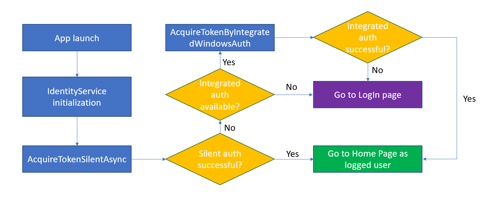

# Identity

**Table of Contents**

- [Introduction](#introduction)
- [Authentication Endpoints](#authentication-endpoints)
- [Understanding the authentication flow](#understanding-the-authentication-flow)
  - [Silent LogIn](#silent-login)
  - [Interactive LogIn](#interactive-login)
- [Further resticting access to authorized users](#further-resticting-access-to-authorized-users)
- [Understanding the code](#understanding-the-code)
  - [Forced Login code](#forced-login-code)
  - [Optional Login code](#optional-login-code)
- [Calling the Microsoft.Graph](#calling-the-microsoft.graph)
- [Terminology](#terminology)
- [Additional resources](#additional-resources)

## Introduction

The Identity features add user authentication to your app and enable you to restrict your app (Forced Login) or provide restricted content (Optional Login) to authenticated users.

Both Forced Login and Optional Login use the [Microsoft.Identity.Client](https://www.nuget.org/packages/Microsoft.Identity.Client) (MSAL) nuget package to authenticate the user using Azure Active Directory.

Once the user has been authenticated, the app will call the Microsoft Graph to retrieve user information. This info is displayed on the Navigation View (for project types Navigation Pane and Horizontal Navigation Pane), and also on the SettingsPage that also allows the user to log out.

## Authentication Endpoints

You can choose between different ways to initialize the IdentityService, restricting hereby the allowed account types.

1. InitializeWithAadAndPersonalMsAccounts() **(Default)** - allows Azure Active Directory Accounts and Personal Microsoft Accounts
2. InitializeWithAadMultipleOrgs() - allows Azure Active Directory Accounts from any organization
3. InitializeWithAadSingleOrg() - allows Azure Active Directory Accounts from the specified organization

By choosing options 2 or 3 you can enable Windows Integrated Auth for domain joined machines. For more info regarding intergrated auth see [Integrated Windows Authentication](https://github.com/AzureAD/microsoft-authentication-library-for-dotnet/wiki/Integrated-Windows-Authentication).

## Understanding the authentication flow

The authentication process is initialized on app activation in the ActivationService (App.xaml.cs in Prism). First of all the IdentityService tries to get an AccessToken silently from the cache. This AccessToken is then passed to the Microsoft Graph to get user information.

If silently requesting the token from the cache fails, the interactive authentication process is triggered:

**Forced Login**

Apps with the Forced Login feature will be redirected to a LoginPage that can be used as a landing page and restricts the access to the rest of the pages.

**Optional Login**

Apps with Optional Login feature will show a LogIn button on the NavigationView (if available) and in the SettingsPage.
While the user is not logged in only unrestricted pages are shown.

The following graphics explain the silent and interactive login process:

### Silent LogIn



### Interactive LogIn


## Further resticting access to authorized users

If you want to further restrict app access, the IdentityService provides a method called IsAuthorized() where you can include further authorization checks (i.e. check permissions in a database).

In Forced Login apps unauthorized users cannot log into the app, in Optional Login apps unauthorized users can login but will not see restricted pages.

## Understanding the code

### IdentityService (Core project)

This class is responsible for obtaining the AccessToken from the cache or via Windows Integrated or Interactive Auth. The class uses the MSAL Nuget library to connect with Azure Active Directory. The app includes a ClientID that is for testing purposes only. It has to be replaced by a new one before going to production following the steps provided in https://docs.microsoft.com/azure/active-directory/develop/quickstart-register-app

### MicrosoftGraphService (Core project)

This class calls the Microsoft Graph to obtain the user information and the user photo. It can be extended adding methods that get info from other Microsoft Graph services.

### UserDataService

This class consumes the MicrosoftGraphService and is responsible for storing the user information in the cache.

### Forced Login code

Forced login adds a LoginPage with a button that allows the user to interactively login calling the IdentityService. When the user is logged in, the apps navigates to the ShellPage that gives access to the rest of the pages. When the user logs out, the LoginPage is shown again.

If the app is activated from activations other than LaunchActivation (for example DeepLinking or ToastNotification) the activation flow is intercepted by the IdentityService to ensure the user is logged in before redirecting to the requested page.

### Optional Login code

Optional login allows the user to log in from the SettingsPage and the NavigationView (if available).

To restrict the access to a page and make it invisible and inaccessible for un-authenticated and un-authorized users you have to add the "Restricted" attibute to the page and limit its visiblity on the ShellPage as shown below. (The MainPage and the SettingsPage should not be restricted):

#### 1. Add the **Restricted** Attribute to the Views CodeBehind code

PageName.xaml.cs

```csharp
namespace YourAppNamespace.Views
{
    [Restricted]
    public sealed partial class PageName : Page
    {
        public PageName()
        {
        }
    }
}
```

#### 2. Bind the NavViewItems Visibility to the IsAuthorized property

ShellPage.xaml

```xml
<!--
Find MenuItems definition in page xaml code
-->
<winui:NavigationView.MenuItems>
    <!--
    Add Visibility to hide restricted pages.
    -->
    <winui:NavigationViewItem
        x:Uid="Shell_PageName"
        Icon="Document"
        helpers:NavHelper.NavigateTo="views:PageName"
        Visibility="{x:Bind ViewModel.IsAuthorized, Mode=OneWay}" />
</winui:NavigationView.MenuItems>
```

## Calling the Microsoft.Graph

The MicrosoftGraphService class in the core project allows you to retrieve information of the user from the Microsoft Graph, calling the following endpoint using a HttpClient.

_https://graph.microsoft.com/v1.0/_

All calls need to add the AccessToken as an authentication header.
If your app has a lot of interaction with the Graph, consider using the [Microsoft Graph Client Library](https://www.nuget.org/packages/Microsoft.Graph/).

## Terminology

In the context of authentication in general, there are a few concepts to keep in
mind:

| Term                    | Definition                                                                                                   |
|-------------------------|--------------------------------------------------------------------------------------------------------------|
| JWT                     | <ul><li>JavaScript Web Token</li><li>A digitally signed, period-delimited string of data</li><li>Must be cryptographically validated by receiving application (usually an API call via HTTPS)</li></ul>|
| Access Token            | <ul><li>The JWT returned by the auth provider, after the user has successfully authenticated</li><li>Passed to apps and services using HTTP Authorization header</li><li>Validated by the remote API, service, etc</li></ul>|
| Client ID               | <ul><li>GUID assigned when app is registered in the AAD portal</li><li>Required for AAD authentication</li></ul>|
| Client Secret           | <ul><li>A confidential key for server-side apps that act on behalf of a user or as a client independent of any user</li><li>Must be kept secure at all times</li></ul>|
| Integrated Auth         | <ul><li>Also called Windows Integrated Authentication (WIA) silent authentication, or pass-through authentication</li><li>Uses the logged-in user’s domain credentials (Kerberos ticket) to silently authenticate the user via AAD</li></ul>|
| Kerberos                | <ul><li>A network authentication standard and protocol used by Active Directory and AzureAD</li></ul>|
| Auth Endpoint           | <ul><li>The URI the app uses to prompt the user to log in</li></ul>|
| Microsoft Graph         | <ul><li>Microsoft’s web API surface for all things M365 and AzureAD</li><li>Not required for AAD authentication</li></ul>|
| Azure AD (AAD)          | <ul><li>Microsoft’s hosted Active Directory service</li><li>Required for AAD authentication</li></ul>|
| Microsoft Account (MSA) | <ul><li>Consumer accounts used across Microsoft’s products and services (Xbox Live, Outlook.com, etc.)</li><li>Formerly called Passport and Windows LiveID</li></ul>|
| MSAL                    | <ul><li>Microsoft Authentication Library</li><li>Microsoft-owned, open-source .NET library for wrapping OIDC implementation specifically for AAD and consumer Microsoft accounts</li></ul>|
| Azure B2B               | <ul><li>Business-to-business</li><li>B2B supports both consumer Microsoft accounts and AAD accounts from any tenant</li><li>Provides user policy and security controls identical to internal AAD</li></ul>|
| Azure B2C               | <ul><li>Business-to-consumer</li><li>B2C supports AAD, consumer Microsoft accounts, and external account providers (e.g. Google, Facebook)</li><li>Serves as a middleman or proxy between AAD and external account providers</li><li>Uses a separate, segregated directory from B2B and internal AAD</li></ul>|
| OIDC                    | <ul><li>OpenID Connect</li><li>An open standard used by various authentication providers, including AAD</li></ul>|
| OAuth2                  | <ul><li>The previous open authentication standard; deprecated and superseded by OIDC</li></ul>|
| OpenID                  | <ul><li>The original open auth standard; deprecated and superseded by OAuth2</li></ul>|

## Additional resources

- [About Microsoft Identity Platform](https://docs.microsoft.com/azure/active-directory/develop/about-microsoft-identity-platform)
- [About V2](https://docs.microsoft.com/azure/active-directory/develop/v2-overview)
- [MSAL.NET wiki](https://github.com/AzureAD/microsoft-authentication-library-for-dotnet/wiki)
- [Microsoft Graph explorer](https://developer.microsoft.com/en-us/graph/graph-explorer)
