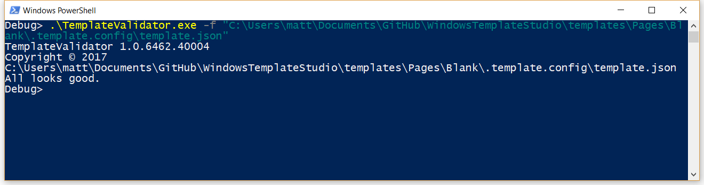
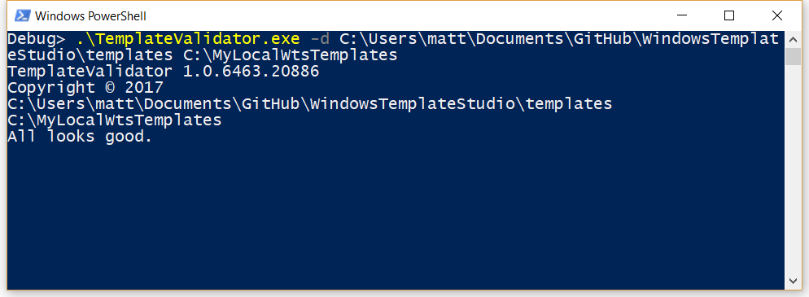

# Understanding the Templates

Templates are used to generate the code. In Windows Template Studio we have the following kinds of templates: Frameworks, Projects Types, Pages, Features, Services and Testing.

For example, consider the following scenarios:

* **Scenario #1**: you want to generate a project to create a target app which uses the Split View (hamburger) menu, is based on MVVM Light framework, with some pages (Home, Products -a master detail page-, Find Us -a map page-, etc. ) and including some extra features like local storage handling, background execution...
* **Scenario #2** you want to create as in *Scenario #1* but without depending on an external framework and adding Live Tiles support.

The Window Template Studio allow you to combine different templates to generate the project you want, using your preferred framework, and using the features you most like. Moreover, the templates available in Windows Template Studio are extensible.

## Interested in contributing

Do you want to contribute? Here are our [contribution guidelines](../CONTRIBUTING.md).

## Template Authoring

### The MxN Issue

Windows Template Studio works as a shopping basket where a developer can choose one of the available Frameworks, one of the available projects Project Types, and then add the Pages and Features wanted for the target application. This leads to a complexity issue. Consider we have 3 frameworks (Fx) and 3 project types (Pj), then we will have 9 combinations, that is *Fx x Pj* app configurations. Now, consider we want to have 6 different types of Pages (P), all supported among the different app configurations, so we will need to maintain 9x6 = 54 pages, that is, *Fx x Pj x P* pages, with basically the same code. The same happens for Features (F), considering 6 types of features, we will have 9x6 = 54 features to maintain.

Creating templates linearly is unmanageable, we would require to maintain Fx x Pj x (P + F) *[3 x 3 x (6 + 6) = 108]* different templates just to be able to combine all together under our preferences, but if the page types and/or features grow, then the number templates to maintain grow faster. This is what we call **The MxN issue**.

To avoid the MxN issue, we have designed the Templates as composable items (frameworks, projects, pages and features), starting from the template definition from [dotnet Template Engine](https://github.com/dotnet/templating) and extending it  to allow to define compositions and post-actions to reduce the template proliferation. The drawback is that the generation becomes more complex, but infinitely more maintainable in the long term.

### Multiple Language Support

The MxN issue is further complicated by support for multiple languages. Windows Template Studio supports creating projects in C# and VB.Net. Each language requires it's own set of templates potentially duplicating the number of templates needed. In reality it's not quite as many as double as we don't support use of the Caliburn.Micro or Prism frameworks with VB.Net.

## Templates authoring principles

We follow these principles for template authoring:

1. **Templates are composable**. In general, the templates should be composable with the existing frameworks and project types. That is, a certain page template should be available to be generated no matter the target framework and project type.
1. **Reduce code duplication as much as possible**. As far as possible, avoid to have templates with the same code for different frameworks and/or project types.
1. **Balance between maintainability and complexity.** Avoiding code duplication benefits the maintainability in long term and is always a benefit. At the same time, reducing code duplication leads to more complexity to handle the composition and the required actions to finish a proper generation. We need to ensure that advanced developers are able to contribute authoring templates so, we need to ensure the right balance between code reusability and templates complexity.
1. **Output takes priority over template simplicity.** When authoring templates it can be tempting to make compromises over the generated project output because it makes the templates simpler. Avoid this. The final output in the generated project is the most important thing and it is always better to put more effort into template construction if it leads to higher quality code being generated.

## Templates repository structure

A template is just code (some source files and folders structure) with some metadata which drives how the code is generated. The template metadata contains informational data (name, description, licensing, remarks, programming language, type, guids, etc.) as well as data used to replace matching text in the source content by the actual values (think of a class name). The templates definition is based on [dotnet Template Engine](https://github.com/dotnet/templating), you can visit their repo for a deep understanding on how the Template Engine works.

The [Templates Repository](../templates) has the following structure:

* [_catalog](../templates/_catalog): this folder contains the catalog of available Frameworks and Project Types, including the required information and metadata (descriptions, icons, images, etc.) to be displayed in the Wizard. You can consider all the content within the *_catalog* folder as metadata for frameworks and project types.
* [Uwp](_templates/Uwp): this folder contains all templates used for UWP platform projects
  * [_composition](../templates/Uwp/_composition): this folder contains the partial code templates that will be generated when certain constraints are met, including framework specific templates.
  * [Projects](../templates/Uwp/Projects): Project templates which define the actual folder structure, source files and auxiliary files to create a base project.
  * [Pages](../templates/Uwp/Pages): Page templates define the source files needed to create a page of a certain type.
  * [Features](../templates/Uwp/Features): Feature templates with the sources required to add different features and / or capabilities to the target app.
  * [Services](../templates/Uwp/Services): Service templates with the sources required to add different services to the target app.
  * [Testing](../templates/Uwp/Testing): Testing templates with the sources required to add testing projects to the target solution.

## Anatomy of templates

As mentioned, a basic [dotnet Template Engine](https://github.com/dotnet/templating) template is defined by the following elements:

* **Metadata**: a json file within the *".template.config"* folder  information which defines the template and its properties. The metadata includes the replacements to be done.
* **Folder Structure**: A folder structure that will be maintained after the generation is done.
* **Files**: Text files, basically, the source code, where replacements are made.

The metadata drives how the generation is done, let's see a template content sample:

``` layout

├───.template.config
│       description.md      //Rich template description in markdown. Displayed in the wizard.
│       icon.xaml           //SVG XAML definition for the template icon (.png or .jpg are accepted as well).
│       template.json       //Template definition json file
│
├───Strings
│   └───en-us
│           Resources_postaction.resw //Post-Action to be applied after main generation of this template.
│
├───ViewModels
│       BlankViewViewModel.cs         //Source file
│
└───Views
        BlankViewPage.xaml            //Source file
        BlankViewPage.xaml.cs         //Source file
```

If we generate this template using "MyTest" as page name, the result will be as follows:

``` layout

├───Strings
│   └───en-us
│           Resources.resw
│
├───ViewModels
│       MyTestViewModel.cs
│
└───Views
        MyTestPage.xaml
        MyTestPage.xaml.cs
```

You can observe that the folder structure is maintained but in the source files the "BlankView" word has been replaced by "MyTest" (the actual value for the *sourceName* parameter).

The replacements are done based on the configuration established in the `template.json` file. Let's have a look to it:

``` json
{
  "$schema": "http://json.schemastore.org/template",
  "author": "Microsoft",
  "classifications": [
    "Universal"
  ],
  "name": "Blank",                                //This is the displayed name in the wizard.
  "shortName": "Blank",
  "groupIdentity": "wts.Page.Blank",              //Used for filtering and grouping in the wizard
  "identity": "wts.Page.Blank",                   //Must be unique
  "description": "This is the most basic page.",  //This is the short description displayed in the wizard.
  "tags": {                                       //Tags are used to filter and handled the composition
    "language": "C#",
    "type": "item",
    "wts.type": "page",
    "wts.framework": "MVVMBasic|MVVMLight",       //Frameworks where this template can be used.
    "wts.platform": "Uwp",                        //Platform where this template can be used
    "wts.version": "1.0.0",
    "wts.displayOrder": "1",                      //This tag is used to order the templates in the wizard.
    "wts.rightClickEnabled":"true",               //If set to 'true' then this feature or page is available from right click on an existing project.
    "wts.isHidden": "false",                      //If set to 'true' then not shown in the wizard. Used for dependencies that can't be selected on their own.
    "wts.outputToParent": "true",                 //If set to 'true' then this will be generated one folder above the usual outputfolder. Use Param_ProjectName to compose                                                      folder names
    "wts.casing.sourceName":"kebab|camel|pascal", // Allows to add casing variations from templates sourceName to parameters ( corresponding parameter name will be wts.sourceName.casing.kebab)
    "wts.casing.rootNamespace":"kebab|camel|pascal" // Allows to add casing variations from templates sourceName to parameters ( corresponding parameter name will be wts.rootNamespace.casing.kebab)     
  },
  "sourceName": "BlankView",                      //The generation engine will replace any occurrence of "BlankView" by the parameter provided in the source file name.
  "preferNameDirectory": true,
  "PrimaryOutputs": [                             //The primary outputs are the list of items that are returned to the caller after the generation.
    {
      "path": "Views/BlankViewPage.xaml"
    },
    {
      "path": "Views/BlankViewPage.xaml.cs"
    },
    {
      "path": "ViewModels/BlankViewViewModel.cs"
    }
  ],
  "symbols": {                                    //Symbols define a collection of replacements to be done while generating.
     "wts.projectName": {
      "type": "parameter",
      "replaces": "Param_ProjectName",
      "fileRename": "Param_ProjectName"
    },
    "rootNamespace": {
      "type": "parameter",
      "replaces": "RootNamespace"                //Each instance of "RootNamespace" in the source files will be replaced by the actual value passed in the "rootNamespace" parameter.
    },
    "itemNamespace": {
      "type": "parameter",
      "replaces": "ItemNamespace"
    },
    "baseclass": {
      "type": "parameter",
      "replaces": "System.ComponentModel.INotifyPropertyChanged"
    },
    "setter": {
      "type": "parameter",
      "replaces": "Set"
    }
  }
}
```

Further documentation on the contents of the `template.json` file can be found on the [dotnet templating wiki](https://github.com/dotnet/templating/wiki/%22Runnable-Project%22-Templates#identity-optional)

### Template Layouts

Project templates can define a default layout of pages to be considered in the wizard. To do so, you need to add a `Layout.json` file within the `.template.config` folder.

By using template layouts, you can determine what pages are automatically added to a certain project type and if those pages are mandatory or can be removed. In other words, layout definition provides a way to pre-configure pages associated to a certain project type.

Layout.json

``` json
[
    {
        "name": "Main",
        "templateGroupIdentity": "wts.Page.Blank",
        "readonly": "true"
    }
]
```

### Export Parameters

A template can define an "export parameter" that will be handled by the `Composer` by extracting the replacement parameter value from one template) and providing it as parameter to the following templates. Here is a sample of how an export parameter is defined:

``` json
  "tags": {
    "language": "C#",
    "type": "item",
    "wts.type": "composition",
    "wts.version": "1.0.0",
    "wts.compositionFilter": "$framework == MVVMBasic & wts.type==page",
    "wts.export.baseclass": "Observable",
    "wts.export.setter": "Set"
  },
```

This template is defining two export parameters **baseclass** and **setter**. Those parameters will be provided to other templates where they will be used as the values for symbol replacements.

### Filtering supported templates

It's possible to filter the displayed templates based on installed Visual Studio workloads.
This is done by adding the tag `wts.requiredVsWorkload` and specifying the ID of the required workload.
This tag is optional. If specified, the template will only be displayed if the required workload is installed.
This tag cannot be used with frameworks or project types.

## Composable Templates

As we already have mentioned, templates can be composed to maximize the code reusability. Consider, for example,the Blank page template, the page's source code will remain the same no matter the project type it is used in. Moreover, there will be very few changes in the page source code depending on which framework we rely on. The idea behind having composable templates is to reuse as much as possible the existing code for a certain page or feature no matter the project type or framework used.

Creating composable templates is like when you are developing software and try to generalize something; it fits within the 80-20 rule, meaning that the 80% of the code is common among the callers and easy to be generalized, but the 20% have more dependencies, specific details, etc. and, by the way, it is more complex to be generalized. Considering this, we have two groups of templates in the repository:

1. **Standard templates**: *the 80 part*, these templates are the common part of the source code, corresponding with the shared source code for projects, pages and features. This templates live in the `Projects`, `Pages`, `Features`, `Services` and `Testing` folders of our Templates repository. Through the wizard, a user can select which project type, which pages and which features wants, those selections can be shown as a user adding items to a "generation basket".
1. **Composition templates**: *the 20 part*, these templates are thought to include the specific details required by a concrete template (a page or feature) which is going to be generated in a certain context. The context is determined by the combination of project type and framework selected by the user. Required composition templates are added to the "generation basket" automatically by the `Composer`. The composition templates live in the project `_composition` folder of the Templates repository.

The structure of files and folders within the `_composition` folder is just for organization, to exactly determine which *composition templates* are required to be added to the generation basket, the `Composer` evaluates all the templates available in the `_composition` folder, applying the **composition filter** defined in the `template.json` file (tag `wts.compositionFilter`). All the templates with composition filters resulting in positive matches are added to the generation basket. The following is a sample of composition filter.

``` json
  "tags": {
    "language": "C#",
    "type": "item",
    "wts.type": "composition",
    "wts.platform": "Uwp",
    "wts.version": "1.0.0",
    "wts.compositionFilter": "$framework == CodeBehind|MVVMBasic & identity == wts.Proj.Blank",
    "wts.compositionOrder" : "1"
 },
 ```

In this case, the template which have this configuration will be added to the generation basket when the following conditions are meet:
* The selected framework for the current generation is CodeBehind OR MVVMBasic
* There is a template within the generation basket whose `identity` property is "wts.Proj.Blank".

In other words, this template is designed to be added to the generation basket when we are generating a Blank Project Type with the CodeBehind or MVVMBasic framework.
The wts.compositionOrder can be used to establish the order in which of composition templates are generated where necessary.

We have a basic pseudo-language to define the composition filters. The composition filters must match the following structure:

```pseudo

  <operand field> <operator> <literal> [& <operand field> <operator> <literal options>[...]]

Where

* <operand field> := <queryable property> | <context parameter>
* <literal> := <literal> [|<literal>]
* <queryable property> -> template configuration property (`template.json`) among the following:
  - `name`
  - `identity`
  - `groupIdentity`
  - Any defined tag, i.e `language`, `type`, `language`, `wts.framework`, etc.
* <operators>
  - == -> Equals Equality
  - != -> Not equals
* <context parameter>
  - $framework -> current generation framework.
  - $projectType -> current generation project type.
  - $page -> current selection includes a page with the specified Id.
  - $feature -> current selection includes a feature with the specified Id.

```

Finally, all the templates (*Standard* and *Composition*) are generated using the [dotnet Template Engine](https://github.com/dotnet/templating) standard generation. The standard generation does not support merging code from multiple files to one. For this, we need to take advantage of another mechanism: **Post-Actions**.

## Post Actions

Post-Actions are designed to complement the standard generation enabling certain actions to be executed over the generated files once the generation is done.

Currently we support the following types of [Post-Actions](../code/src/Core/PostActions):
- Defined by template output type:
  * **Add Item To Project**: this post-action is executed for templates with outputtype item to add the "PrimaryOutputs" to the target Visual Studio project (.csproj). The "PrimaryOutputs" are defined in the template.json file.
  * **Add Project To Solution**: this post-action is executed for templates with outputtype project to add the a generated project to the current Visual Studio solution.

- Defined by the template:
  * **Add Reference To Project** this post-action is executed to add a reference from one project to another project.
  * **Add Nuget Reference To Project**: this post-action is executed to add a nuget reference to the project.
  * **Generate Test Certificate**: generate the test certificate for the UWP application and configure it in the application manifest.

- Other postactions:
  * **Merge**: merges the source code from one file into another. This Post-Action requires a special (_postaction) configuration in the templates files.
  * **SearchAndReplace**: searches for the source code defined in the postaction file and replaces it with the specified code. This Post-Action requires a special (_searchreplace) configuration in the templates files.

  * **Sort Namespaces**: this post action re-orders the `using` statements at the top of the generated C# source files and the `import` statements in VB files.
  * **Set Default Solution Configuration**: sets the default solution configuration in the Visual Studio sln file. With this post-action we change the default solution configuration from Debug|ARM to Debug|x86.

### Merge Post-Action

If a template includes source files with the **_postaction** suffix, the Post-Action engine will process these files at the end of generation of that template.

For example, consider a SplitView project type with MVVM Basic framework, and adding several pages to the project. At the end, all the pages must be registered in the navigation and added to the navigation menu, some of the final generated code will look like:

```xml

//MVVM Basic, ShellPage.xaml
...
        <NavigationView.MenuItems>
            <!--
              TODO WTS: Change the symbols for each item as appropriate for your app
              More on Segoe UI Symbol icons: https://docs.microsoft.com/windows/uwp/style/segoe-ui-symbol-font
              Or to use an IconElement instead of a Symbol see https://github.com/Microsoft/WindowsTemplateStudio/blob/master/docs/projectTypes/navigationpane.md
              Edit String/en-US/Resources.resw: Add a menu item title for each page
            -->
            <NavigationViewItem x:Uid="Shell_Main" Icon="Document" helpers:NavHelper.NavigateTo="views:MainPage" />
            <NavigationViewItem x:Uid="Shell_Map" Icon="Document" helpers:NavHelper.NavigateTo="views:MapPage" />
            <NavigationViewItem x:Uid="Shell_MasterDetail" Icon="Document" helpers:NavHelper.NavigateTo="views:MasterDetailPage" />
            <NavigationViewItem x:Uid="Shell_WebView" Icon="Document" helpers:NavHelper.NavigateTo="views:WebViewPage" />
            <NavigationViewItem x:Uid="Shell_Tabbed" Icon="Document" helpers:NavHelper.NavigateTo="views:TabbedPage" />
        </NavigationView.MenuItems>
...

```

During the generation, each page must add the required code to register itself in the *navigation items*. To achieve this, we rely on the Merge Post-Action to identify files that must be merged to generate the code above. Let see the details of the composition template defined for that purpose.

The `template.json` is defined as follows:

```json

{
  "author": "Microsoft",
  "classifications": [
    "Universal"
  ],
  "name": "MVVMBasic.Project.SplitView.AddNavigationViewItem",
  "tags": {
    "language": "C#",
    "type": "item",
    "wts.type": "composition",
    "wts.platform" : "Uwp",
    "wts.version": "1.0.0",
    "wts.compositionFilter": "wts.type == page & identity != wts.Page.Settings & $framework == MVVMBasic & $projectType == SplitView"
  },

```

As you can see in the composition filter, this template will be applied when the context framework is *MVVMBasic* and the project type is *SplitView* and there is a template in the generation basket with the type equals to page and identity not equal to *wts.Page.Settings*

Here is the template layout:

```layout

├───.template.config
│       template.json
│
└───ViewModels
        ShellPage_postaction.xaml //This indicates that the content of this file must be handled by the Merge Post-Action

```

Here is the content of the ShellPage_postaction.xaml:

```xml

<Page
    xmlns:mc="http://schemas.openxmlformats.org/markup-compatibility/2006"
    mc:Ignorable="d">

    <NavigationView
        Background="{ThemeResource SystemControlBackgroundAltHighBrush}">
        <NavigationView.MenuItems>
            <!--^^-->
            <!--{[{-->
            <NavigationViewItem x:Uid="Shell_wts.ItemName" Icon="Document" helpers:NavHelper.NavigateTo="views:wts.ItemNamePage" />
            <!--}]}-->
        </NavigationView.MenuItems>
    </NavigationView>
</Page>

```

The merge post action will do the following:
1. Locate a file called "ShellPage_postaction.xaml" within the generated code.
1. Using a basic source code matching, the post-action will locate content in the `_postaction` file that is not included in the `ShellPage.xaml` file and will insert it in the correct place. In this case:
    * Locate the page tag
    * Then a NavigationView tag
    * Then the NavigationView.MenuItems tag
    * The symbols `//^^` indicates that the merge must be done at the end, just before the closing `</NavigationView.MenuItems>`, without this directive the line would be inserted just below the opening `<NavigationView.MenuItems>`.
1. Once the place to insert the code has been found, the content contained between `{[{` and `}]}` is added in to the original source file.
1. If any of the above directives are not found the merge is aborted and an merge failure is reported.

### Global Merge Post-Action

The global merge postactions work as the normal merge postaction, with the only difference that they are executed once the generation is finished.
You have to use global postactions whenever you need to include changes from various elements into one item generated at the same time.
An example is the `BackgroundTaskService`.
We use the same strategy to integrate methods from Chart and Grid Page into the SampleData Service from right click.

The format for global postactions is `<DestinationFileName>$<FeatureName>_gpostaction.<DestinationFileExtension>` (for example: BackgroundTaskService$BackgroundTaskFeature_gpostaction.cs).
This allows generation of 1 gpostaction file per BackgroundTask selected and merge of all files once the generation has finished.

### Merges Directives

There are different merge directives to drive the code merging. Currently:

* MacroBeforeMode `//^^`: Insert before the next match, instead of after the last match
* MacroStartGroup `//{[{` and MarcoEndGroup `}]}`: The content between `{[{` and `}]}` is inserted.
* MacroStartDelete `//{--{` and MacroEndDelete = `//}--}`: The content between the directives will be removed if it exists within the merge target. If the content does not exist (or has already been deleted as part of merging another file) this will be silently ignored.
* MacroStartDocumentation `//{**` and MacroEndDocumentation `//**}`: The content between `{**` and `**}` is not inserted but shown in the _postaction file. This can be used give the user feedback about was the postaction intended to do when the postaction fails or when integrating right click output manually.
* MacroStartOptionalContext `{??{` and MacroEndOptionalContext `}??}`: The content between `{??{` and `}??}` is optional, if the line is not found the next line is taken as context line.

_The above merge directives all use the C# comment form (`//`) but if included in a VB file should use the VB equivalent (`'`)_

### Merge Resource Dictionary PostActions

When the _postaction file contains a resource dictionary instead of the *basic* merge postaction a resource dictionary postaction is executed.
This postaction does not work with directives but based on the x:keys contained in the source and _postaction files.

The postaction works in three steps:
1. Locate the source resource dictionary file. (Imagine the postaction file is called Styles/Button_postaction.xaml, the source file would be Styles/Button.xaml)
2. If the file is not found the whole resource dictionary contained in the postaction file is copied to the source file.
3. If the file is found, each element from _postaction file is copied if not already there. In case the key is already defined in the source resource dictionary and the elements are different, a warning is shown.

## Supporting VB.Net and C# versions of Templates

We aim to offer all functionality for apps created using C# and VB.Net. The exception to this rule is that we do not provide VB versions when a third party framework only offers documentation or support in C#.

The expectation is that the C# version of a template will be created first and the VB.Net version created after.

The script [List-CSharp-Templates-Without-VisualBasic-Equivalents.ps1](https://github.com/Microsoft/WindowsTemplateStudio/blob/dev/_utils/List-CSharp-Templates-Without-VisualBasic-Equivalents.ps1) can identify C# templates without VB.Net equivalents. For this to work it relies on the C# and VB versions having comparable template folder structures and that they follow the naming conventions already in use. This is particularly important for composition templates. Because VB.Net supports fewer frameworks it may be possible to produce the same output for the VB version of an item with fewer composition templates. This should be avoided as doing so will cause the above script to produce incorrect results.

It is assumed that non-code files used by different language versions of the same template will be identical. If one needs to be modified, change the one in the C# template and then run the script [Synchronize-Files-Used-By-VisualBasic-Templates.ps1](https://github.com/Microsoft/WindowsTemplateStudio/blob/dev/_utils/Synchronize-Files-Used-By-VisualBasic-Templates.ps1) and this will copy the file to the equivalent VB locations.

Additionally, there is an automated test called `EnsureProjectsGeneratedWithDifferentLanguagesAreEquivalentAsync` that will generate an app using both language versions of supported templates and then use reflection of the generated apps to check for differences.

Because AppVeyor does not support building VB apps, this test must be run manually. When testing VB versions of templates you should also run the test `GenerateAllPagesAndFeaturesAndCheckWithVBStyleAsync` which also must be run manually.

## Testing and verifying template contents

The tool **TemplateValidator.exe** exists to help template authors verify their templates are correctly structured and to identify common errors. It can verify the contents of an individual `template.json` file or the contents of multiple directories containing templates.
It's use is encouraged to help avoid any problems or unintended consequences that may be missed during manual testing of a new template. It is not a substitute for thorough manual testing of new templates and the automated tests for generating and building projects using all templates.

### Testing individual template.json files

TemplateValidator must be passed the `-f` flag to put it in file mode and then the path to the file you wish to validate.
When validating an individual template file it will look for missing required elements, invalid values, and common typos.



If, as in the above image the file contains no issues the message "All looks good." will be displayed. If any issues are identified these will be listed.

### Testing directories containing template files

TemplateValidator must be passed the `-d` flag to put it in directory mode and then the paths to one or more directories containing templates.
When validating template directories, the contents of templates are analyzed individually and collectively. This allows for the identification of missing files, values reused across templates that should be unique, and missing dependencies.



The above image shows the use of the tool to look at two root directories. It lists the values it was passed and any issues it finds or the "All looks good." message.
Any issues that start with "WARNING" are recommendations that should be addressed in any new templates.

### Automated testing of template validation

The Templates.Test project includes tests to run all the checks from the TemplateValidator tool as part of the automated tests for the solution.

## Authoring templates tooling

### Visual Studio Code Snippets
We've created some Visual Studio Code Snippets to help creating the template.json files.

#### Adding code Snippets to Visual Studio Code
 - Open Preferences: Configure User Snippets (Ctrl + Shift + P, type snippets).
 - Open Json.json on language files list.
 - Open and copy the code snippets on [WTS code snippets file](.//..//_utils//code-snippets.json).
 - Paste those code snippets on the opened Json.json file.

#### Using the code snippets

After creating an empty template.json file, type wts.template and click Enter, the code snippet will add a template json with different variables to complete, you can use the tab key to navigate between them.
There are also code snippets to add Tags, PrimaryOutputs, Symbols and Post Actions.


## Table of Contents

* [Installing / Using the extension](getting-started-extension.md)
* [Using and extending your file->new](getting-started-endusers.md)
* [Concepts of Windows Template Studio](readme.md)
* [Getting started with the generator codebase](getting-started-developers.md)
* [**Authoring Templates**](templates.md)
