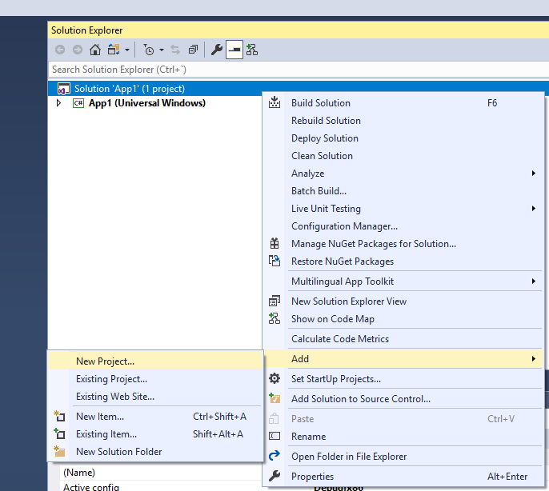
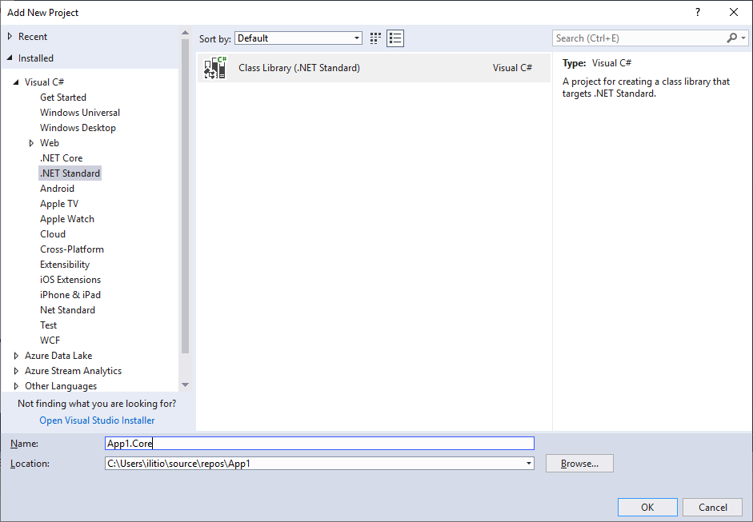
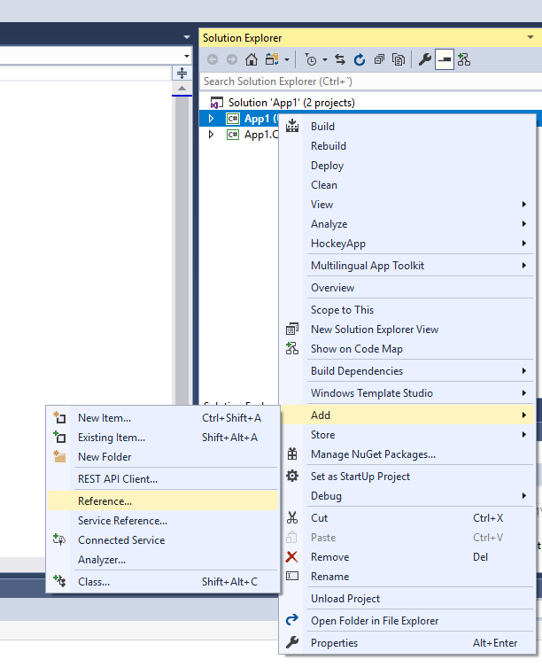
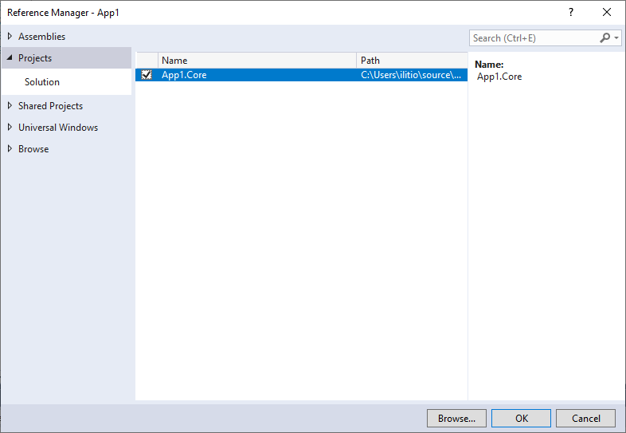

# Update from single project to multi-project solution

If you created your project with version 1.x or 2.x of WinTS and have no core project please follow these steps to add a .NET Standard core project to your solution.

## 1. Add a .NET Standard Class Library project to your solution

From the context menu of your solution file click "Add -> New Project" and choose "Class Library (.Net Standard)" from the .Net Standard Category

Name the project **YourAppName.Core**. If your project is called App1, the correct name would be App1.Core

## 2. Add a reference to the core project on your Uwp project

From the context menu of your Uwp project choose "Add -> Reference" and check the YourAppName.Core project from the projects category.

After adding the reference, save your changes.

## 3. Move platform independent logic to the core project

There are some classes and NuGet packages that were created in the Uwp project in version 1.x/2.x and now have been moved to the core project. If you find them in your project, move them manually to the core project. Remember to adapt the namespaces too.

Classes that should be moved to the core project are:

- Helpers/Json.cs
- Helpers/Singleton.cs
- Models/DataPoint.cs
- Models/SampleImage.cs
- Models/SampleOrder.cs
- Services/SampleDataService.cs

NuGet Packages that should be moved to the core project are:

- Newtonsoft.json

Move other model/helper classes that are not platform dependant from the Uwp project to the core project too.
