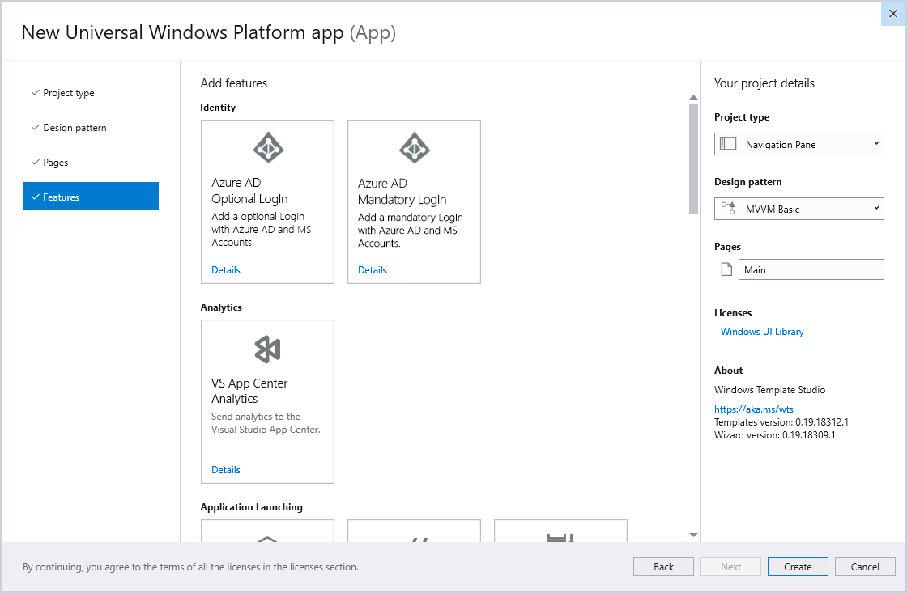
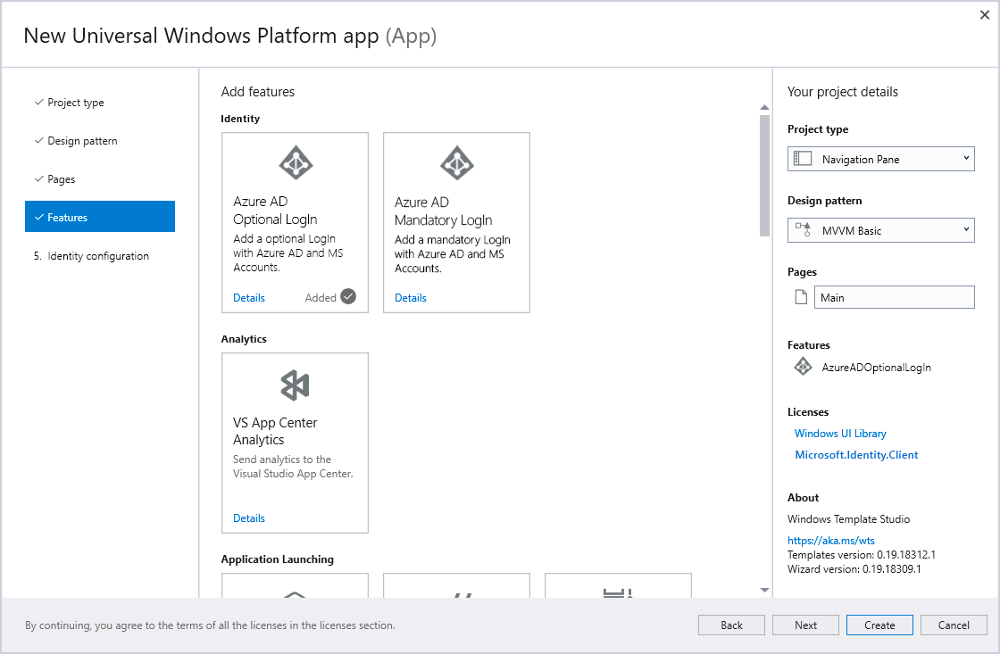
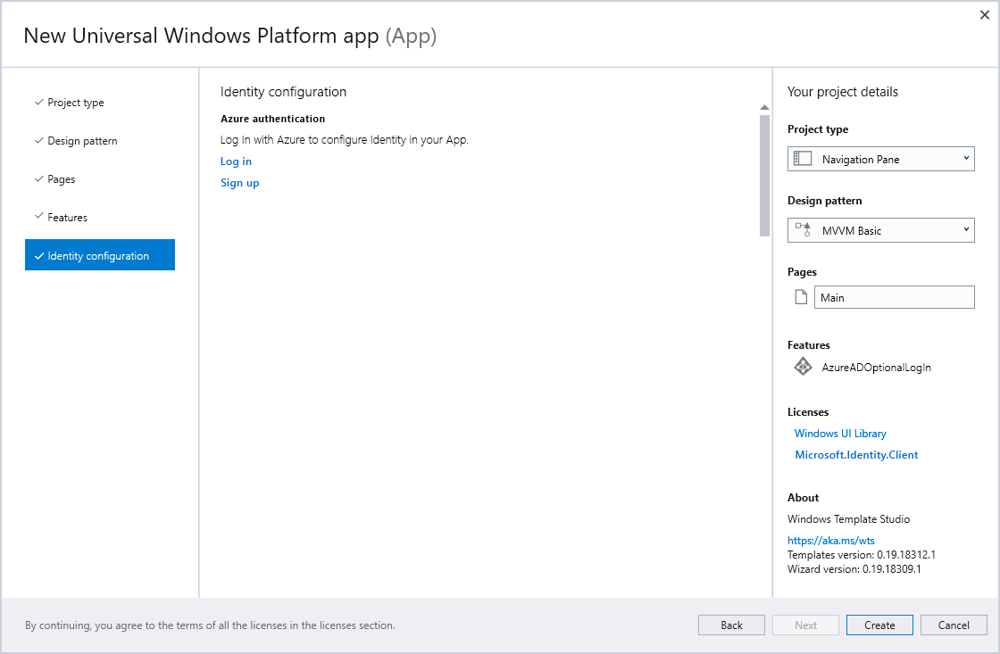
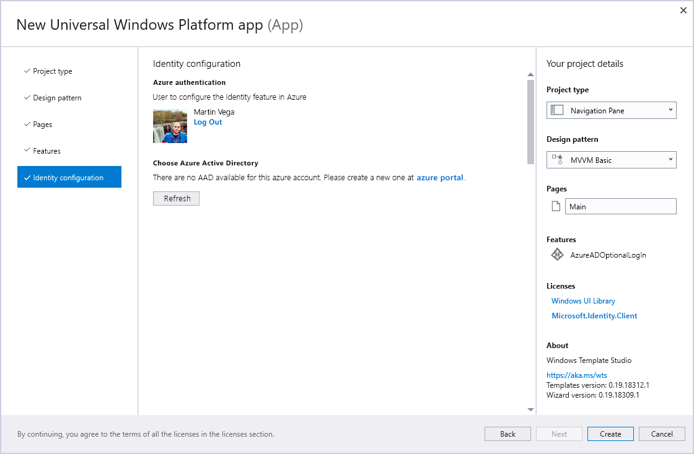
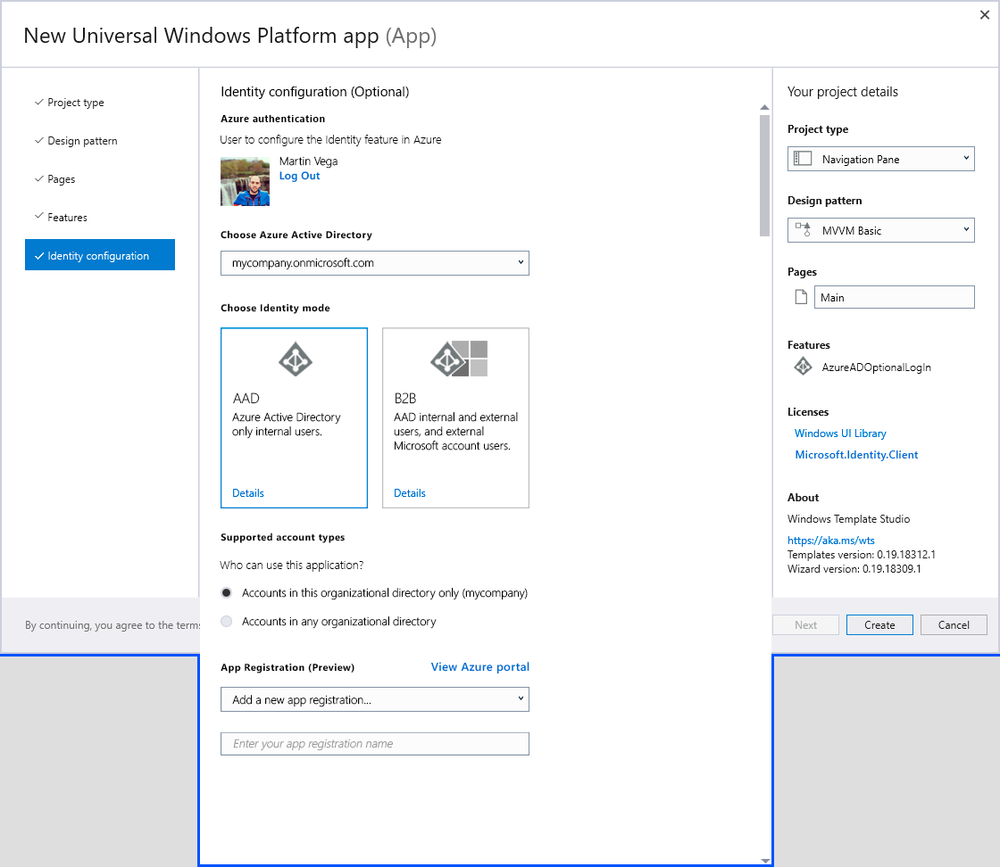

# Specs for Identity feature configuration in wizard

## Summary

The goal is adding two different features (optional and forced login) that allow developers to integrate authentication from the generated app.
The app will use [Microsoft Identity Platform v.2.0](https://docs.microsoft.com/azure/active-directory/develop/v2-overview) with the Microsoft Identity Client (MSAL) [nuget package](https://www.nuget.org/packages/Microsoft.Identity.Client/).
When a identity feature will be selected, a new step being available in Wizard to configure the identity with Azure Active Directory.

## Optional Login and Forced Login templates

### 1. Select service

 - New Identity services category.
 - Two new login services, one for forced login in the app, one for optional login in the app. The difference between those two features is how the generated app will provide login/logout to the end user.
 - The two services must be mutually exclusive, if you add one you cannot add the other.

### 2. One of the identity services added

 - New step “Identity configuration” in wizard is added that allows to configure the identity services selected.
 - Next button available.
 - Microsoft.Identity.Client (MSAL) license added.
 - At this point, if you choose to create (without configuring identity) we would generate the app with client_id set to xxxx and a TODO that tells you the steps necessary on Azure to create the application. The same thing happens if you do not finish the identity configuration explained below.
 
 ## Identity configuration

### 1. Azure Log In or Sign Up

 - If you click Log In, this will show a new pop-up window to log in with Azure.
 - If you click Sign up, this will open azure registration portal in a web browser.

### 2. Logged in but there is no Azure Subscriptions

 - Option to create a subscription on the azure portal.
 - Refresh button fetch for new subscriptions.
 - If you click on LogOut, this will log out and come back to login or singup page.

### 3.1 Chose existing App Registration

 - First Azure Active directory tenant selected by default.
 - App registrations in combobox will be filtered by the selected Azure Active Directory.
 - To create a new app select Create New App Registration in the combobox.
 - If you choose AAD you could login using integrated auth from your app. We will not allow selection of integrated auth in the wizard but include a comment in the generated code to remove complexity on configuration time.

### 3.2 Create a new App Registration

 - Enter the app registration name.
 - Enter the supported account types.
 - Creation will happen when you hit Create on Wizard.

